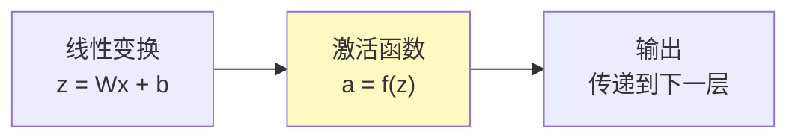
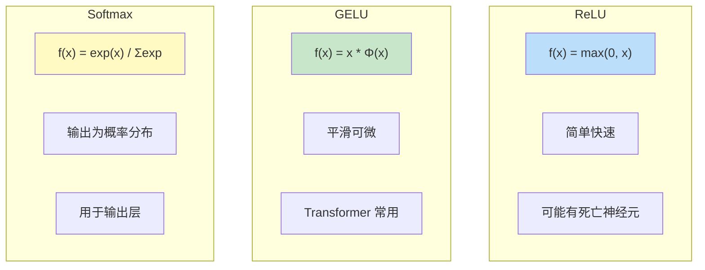
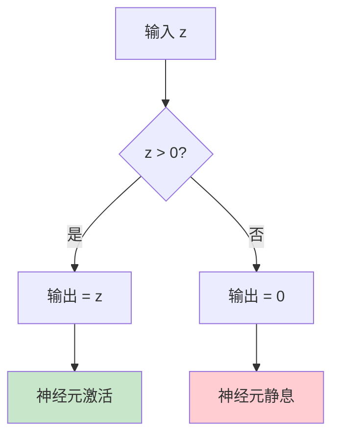
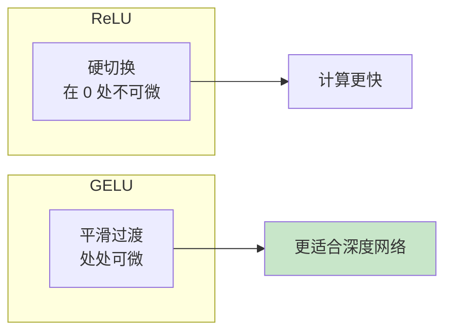
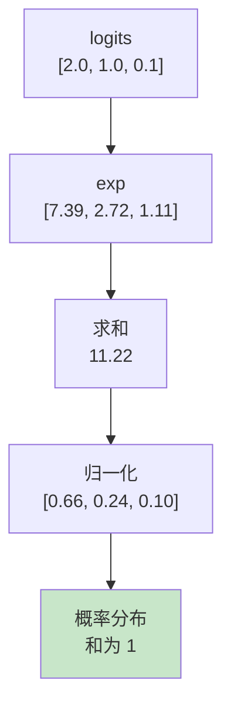
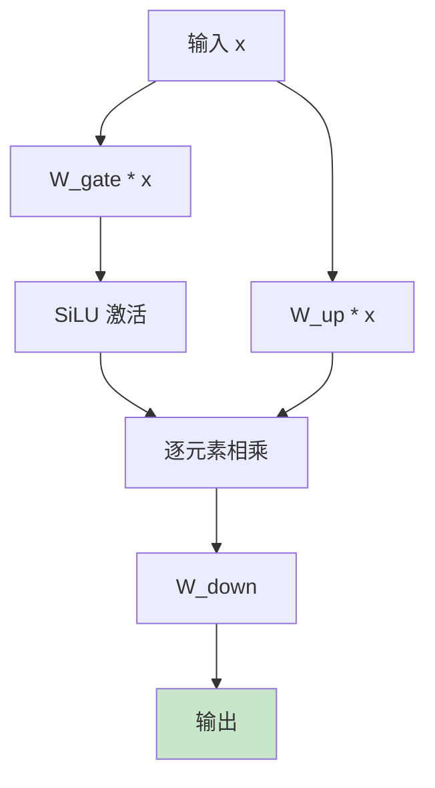

# Activation Function 流程图解

> 通过可视化图表理解激活函数的工作原理

## 激活函数在神经网络中的位置

## 常见激活函数对比

## ReLU 工作流程

## GELU vs ReLU

## Softmax 计算流程

## FFN 中的激活函数

## SwiGLU 结构

## 图解说明

### 激活函数选择

| 场景 | 推荐 | 原因 |
|------|------|------|
| FFN (经典) | ReLU | 简单快速 |
| FFN (现代) | GELU | 更平滑 |
| FFN (LLaMA) | SwiGLU | 性能最好 |
| 输出层 | Softmax | 概率分布 |

### 关键特性

- **非线性**：使网络能学习复杂模式
- **梯度流**：影响训练稳定性
- **计算效率**：影响推理速度
