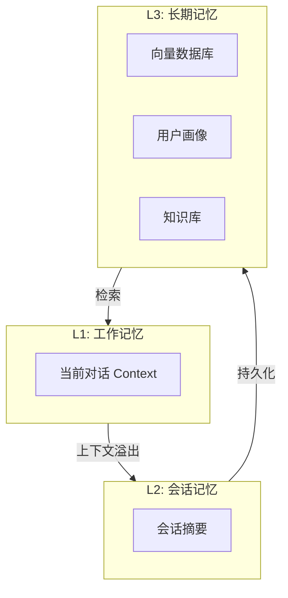

# 记忆系统流程图

## 分层记忆架构



## 记忆写入流程

```
┌─────────────────────────────────────────────────────────────────┐
│                     记忆写入流程                                  │
├─────────────────────────────────────────────────────────────────┤
│                                                                 │
│   用户消息: "我最近在学 Python，觉得很有趣"                      │
│         │                                                       │
│         ▼                                                       │
│   ┌─────────────────────────────────────────────────────────┐   │
│   │  Step 1: 信息提取                                        │   │
│   │  - 用户在学习 Python                                     │   │
│   │  - 用户觉得 Python 有趣                                  │   │
│   └─────────────────────────────────────────────────────────┘   │
│         │                                                       │
│         ▼                                                       │
│   ┌─────────────────────────────────────────────────────────┐   │
│   │  Step 2: 去重检查                                        │   │
│   │  向量相似度搜索 → 是否已存在类似记忆？                     │   │
│   └─────────────────────────────────────────────────────────┘   │
│         │                                                       │
│         ├─── 重复 ───▶ 更新/合并现有记忆                       │
│         │                                                       │
│         └─── 新信息 ───▶ Step 3                                │
│                              │                                  │
│                              ▼                                  │
│   ┌─────────────────────────────────────────────────────────┐   │
│   │  Step 3: 重要性评分                                      │   │
│   │  新颖性 × 相关性 × 情感影响 = 重要性分数                 │   │
│   └─────────────────────────────────────────────────────────┘   │
│                              │                                  │
│                              ▼                                  │
│   ┌─────────────────────────────────────────────────────────┐   │
│   │  Step 4: 存储到向量数据库                                │   │
│   │  {                                                       │   │
│   │    "content": "用户在学习Python，觉得有趣",              │   │
│   │    "embedding": [0.1, 0.2, ...],                         │   │
│   │    "importance": 0.8,                                    │   │
│   │    "timestamp": "2024-01-15"                             │   │
│   │  }                                                       │   │
│   └─────────────────────────────────────────────────────────┘   │
│                                                                 │
└─────────────────────────────────────────────────────────────────┘
```

## 记忆检索流程

```
┌─────────────────────────────────────────────────────────────────┐
│                     记忆检索流程                                  │
├─────────────────────────────────────────────────────────────────┤
│                                                                 │
│   当前问题: "推荐一些编程学习资源"                               │
│         │                                                       │
│         ▼                                                       │
│   ┌─────────────────────────────────────────────────────────┐   │
│   │  Step 1: 生成查询向量                                    │   │
│   │  query_embedding = embed("推荐编程学习资源")             │   │
│   └─────────────────────────────────────────────────────────┘   │
│         │                                                       │
│         ▼                                                       │
│   ┌─────────────────────────────────────────────────────────┐   │
│   │  Step 2: 向量相似度搜索                                  │   │
│   │                                                          │   │
│   │  记忆库:                                                 │   │
│   │  ┌─────────────────────────────────────────────┐        │   │
│   │  │ 记忆1: "用户会Python"          sim=0.85    │ ← 相关  │   │
│   │  │ 记忆2: "用户喜欢户外运动"       sim=0.32   │        │   │
│   │  │ 记忆3: "用户是初学者"           sim=0.78    │ ← 相关  │   │
│   │  │ 记忆4: "用户住在北京"           sim=0.21   │        │   │
│   │  │ 记忆5: "用户觉得Python有趣"     sim=0.72    │ ← 相关  │   │
│   │  └─────────────────────────────────────────────┘        │   │
│   └─────────────────────────────────────────────────────────┘   │
│         │                                                       │
│         ▼                                                       │
│   ┌─────────────────────────────────────────────────────────┐   │
│   │  Step 3: MMR 多样性重排                                  │   │
│   │  避免返回过于相似的回忆                                  │   │
│   └─────────────────────────────────────────────────────────┘   │
│         │                                                       │
│         ▼                                                       │
│   ┌─────────────────────────────────────────────────────────┐   │
│   │  Step 4: 构建上下文                                      │   │
│   │                                                          │   │
│   │  "用户背景: 会Python、是初学者、觉得编程有趣"             │   │
│   │  + "用户学习偏好: ..."                                   │   │
│   └─────────────────────────────────────────────────────────┘   │
│         │                                                       │
│         ▼                                                       │
│   ┌─────────────────────────────────────────────────────────┐   │
│   │  Step 5: 注入 LLM 提示                                   │   │
│   │                                                          │   │
│   │  System: 你是一个助手。用户背景：...                     │   │
│   │  User: 推荐一些编程学习资源                              │   │
│   └─────────────────────────────────────────────────────────┘   │
│                                                                 │
└─────────────────────────────────────────────────────────────────┘
```

## 记忆压缩策略

```
┌─────────────────────────────────────────────────────────────────┐
│                     记忆压缩                                      │
├─────────────────────────────────────────────────────────────────┤
│                                                                 │
│   原始对话 (100 条消息, ~50000 tokens)                          │
│                                                                 │
│   策略 1: 滑动窗口                                              │
│   ┌─────────────────────────────────────────────────────────┐   │
│   │ [旧消息...] [保留最近20条] [当前]                        │   │
│   │ 丢弃超出窗口的消息                                        │   │
│   │ 压缩后: ~10000 tokens                                    │   │
│   └─────────────────────────────────────────────────────────┘   │
│                                                                 │
│   策略 2: 摘要压缩                                              │
│   ┌─────────────────────────────────────────────────────────┐   │
│   │ [旧消息] → LLM 摘要 → [摘要文本]                        │   │
│   │ [摘要] + [最近消息] + [当前]                             │   │
│   │ 压缩后: ~5000 tokens                                     │   │
│   └─────────────────────────────────────────────────────────┘   │
│                                                                 │
│   策略 3: 层次化记忆                                            │
│   ┌─────────────────────────────────────────────────────────┐   │
│   │                                                          │   │
│   │   [全局摘要 1条]                                         │   │
│   │       ↓                                                  │   │
│   │   [章节摘要 10条]                                        │   │
│   │       ↓                                                  │   │
│   │   [最近原始消息 20条]                                    │   │
│   │                                                          │   │
│   │   检索时按需展开                                          │   │
│   └─────────────────────────────────────────────────────────┘   │
│                                                                 │
└─────────────────────────────────────────────────────────────────┘
```

## 向量数据库检索

```
┌─────────────────────────────────────────────────────────────────┐
│                     向量检索流程                                  │
├─────────────────────────────────────────────────────────────────┤
│                                                                 │
│   查询: "用户喜欢什么？"                                        │
│         │                                                       │
│         ▼                                                       │
│   Embedding 模型                                                │
│   ┌─────────────────────────────────────────────────────────┐   │
│   │ "用户喜欢什么？" → [0.2, 0.5, 0.1, 0.8, ...]           │   │
│   └─────────────────────────────────────────────────────────┘   │
│         │                                                       │
│         ▼                                                       │
│   向量数据库 (FAISS/Milvus/Pinecone)                           │
│   ┌─────────────────────────────────────────────────────────┐   │
│   │                                                          │   │
│   │   存储的记忆向量:                                        │   │
│   │   ┌─────────┬────────────────────┬──────────┐           │   │
│   │   │ ID      │ Vector             │ Metadata │           │   │
│   │   ├─────────┼────────────────────┼──────────┤           │   │
│   │   │ mem_001 │ [0.3, 0.6, ...]    │ 喜欢咖啡 │           │   │
│   │   │ mem_002 │ [0.1, 0.2, ...]    │ 喜欢编程 │           │   │
│   │   │ mem_003 │ [0.5, 0.4, ...]    │ 住在北京 │           │   │
│   │   │ ...     │ ...                │ ...      │           │   │
│   │   └─────────┴────────────────────┴──────────┘           │   │
│   │                                                          │   │
│   │   余弦相似度计算:                                        │   │
│   │   sim(query, mem_001) = 0.85  ← 高相关                  │   │
│   │   sim(query, mem_002) = 0.72                            │   │
│   │   sim(query, mem_003) = 0.31                            │   │
│   │                                                          │   │
│   └─────────────────────────────────────────────────────────┘   │
│         │                                                       │
│         ▼                                                       │
│   返回 Top-K 结果                                               │
│   ┌─────────────────────────────────────────────────────────┐   │
│   │ 1. "用户喜欢喝咖啡" (0.85)                               │   │
│   │ 2. "用户喜欢编程" (0.72)                                 │   │
│   │ 3. "用户喜欢户外运动" (0.65)                             │   │
│   └─────────────────────────────────────────────────────────┘   │
│                                                                 │
└─────────────────────────────────────────────────────────────────┘
```
