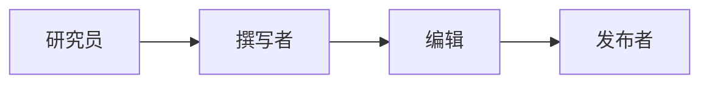

# 多智能体协作流程图

## 顺序协作



## 层级协作

```
┌─────────────────────────────────────────────────────────────────┐
│                     层级协作结构                                  │
├─────────────────────────────────────────────────────────────────┤
│                                                                 │
│                        ┌─────────────┐                         │
│                        │   主控      │                         │
│                        │   Agent     │                         │
│                        └──────┬──────┘                         │
│                               │                                 │
│              ┌────────────────┼────────────────┐               │
│              │                │                │               │
│              ▼                ▼                ▼               │
│       ┌────────────┐   ┌────────────┐   ┌────────────┐        │
│       │  规划      │   │  执行      │   │  检查      │        │
│       │  Agent     │   │  Agent     │   │  Agent     │        │
│       └─────┬──────┘   └─────┬──────┘   └─────┬──────┘        │
│             │                │                │                │
│             │         ┌──────┴──────┐        │                │
│             │         │             │        │                │
│             ▼         ▼             ▼        ▼                │
│       ┌──────────────────────────────────────────────┐        │
│       │              共享状态/工作区                  │        │
│       └──────────────────────────────────────────────┘        │
│                               │                                 │
│                               ▼                                 │
│                        ┌─────────────┐                         │
│                        │   整合      │                         │
│                        │   结果      │                         │
│                        └─────────────┘                         │
│                                                                 │
└─────────────────────────────────────────────────────────────────┘
```

## 并行协作

```
┌─────────────────────────────────────────────────────────────────┐
│                     并行协作                                      │
├─────────────────────────────────────────────────────────────────┤
│                                                                 │
│   任务: 分析多个文档                                             │
│                                                                 │
│                        ┌─────────────┐                         │
│                        │  分发任务    │                         │
│                        └──────┬──────┘                         │
│                               │                                 │
│           ┌───────────────────┼───────────────────┐            │
│           │                   │                   │            │
│           ▼                   ▼                   ▼            │
│    ┌────────────┐      ┌────────────┐      ┌────────────┐     │
│    │  Agent 1   │      │  Agent 2   │      │  Agent 3   │     │
│    │ 分析文档A  │      │ 分析文档B  │      │ 分析文档C  │     │
│    └─────┬──────┘      └─────┬──────┘      └─────┬──────┘     │
│          │                   │                   │             │
│          └───────────────────┼───────────────────┘             │
│                              │                                  │
│                              ▼                                  │
│                       ┌────────────┐                           │
│                       │  汇总结果  │                           │
│                       └────────────┘                           │
│                                                                 │
│   优点: 并行执行，速度快                                         │
│   条件: 子任务之间无依赖                                         │
│                                                                 │
└─────────────────────────────────────────────────────────────────┘
```

## 辩论协作

```
┌─────────────────────────────────────────────────────────────────┐
│                     辩论协作流程                                  │
├─────────────────────────────────────────────────────────────────┤
│                                                                 │
│   ┌─────────────────────────────────────────────────────────┐   │
│   │  问题: "使用什么数据库方案？"                             │   │
│   └─────────────────────────────────────────────────────────┘   │
│                              │                                  │
│                              ▼                                  │
│   ┌──────────────────────────────────────────────��──────────┐   │
│   │                    第一轮辩论                            │   │
│   │  ┌───────────────┐  ┌───────────────┐  ┌─────────────┐ │   │
│   │  │ Agent A       │  │ Agent B       │  │ Agent C     │ │   │
│   │  │ "推荐 MySQL"  │  │ "推荐 MongoDB"│  │ "推荐 PG"   │ │   │
│   │  └───────────────┘  └───────────────┘  └─────────────┘ │   │
│   └─────────────────────────────────────────────────────────┘   │
│                              │                                  │
│                              ▼                                  │
│   ┌─────────────────────────────────────────────────────────┐   │
│   │                    第二轮辩论                            │   │
│   │  看到其他观点后，每个 Agent 更新自己的立场               │   │
│   │  Agent A: "考虑到并发需求，我改为推荐 PostgreSQL"        │   │
│   │  Agent B: "坚持 MongoDB，因为..."                       │   │
│   │  Agent C: "同意 PostgreSQL 是更好的选择"                │   │
│   └─────────────────────────────────────────────────────────┘   │
│                              │                                  │
│                              ▼                                  │
│   ┌─────────────────────────────────────────────────────────┐   │
│   │                    第三轮 - 收敛                         │   │
│   │  Agent A: PostgreSQL                                     │   │
│   │  Agent B: MongoDB (仍坚持)                               │   │
│   │  Agent C: PostgreSQL                                     │   │
│   └─────────────────────────────────────────────────────────┘   │
│                              │                                  │
│                              ▼                                  │
│   ┌─────────────────────────────────────────────────────────┐   │
│   │  最终决策: PostgreSQL (2票) > MongoDB (1票)             │   │
│   └─────────────────────────────────────────────────────────┘   │
│                                                                 │
└─────────────────────────────────────────────────────────────────┘
```

## 通信模式

```
┌─────────────────────────────────────────────────────────────────┐
│                     通信模式对比                                  │
├─────────────────────────────────────────────────────────────────┤
│                                                                 │
│   直接消息:                                                     │
│   ┌─────────────────────────────────────────────────────────┐   │
│   │                                                         │   │
│   │   Agent A ─────────────────────▶ Agent B               │   │
│   │            消息: "请分析这个数据"                        │   │
│   │                                                         │   │
│   │   Agent B ─────────────────────▶ Agent A               │   │
│   │            消息: "分析结果是..."                         │   │
│   │                                                         │   │
│   └─────────────────────────────────────────────────────────┘   │
│                                                                 │
│   共享黑板:                                                     │
│   ┌─────────────────────────────────────────────────────────┐   │
│   │                                                         │   │
│   │                   ┌───────────────┐                    │   │
│   │                   │   Blackboard   │                    │   │
│   │                   │ ┌───────────┐ │                    │   │
│   │   Agent A ───────▶│ │ 任务状态  │ │◀────── Agent B    │   │
│   │   写入结果        │ │ 中间结果  │ │      读取结果     │   │
│   │                   │ │ 待办事项  │ │                    │   │
│   │                   │ └───────────┘ │                    │   │
│   │                   └───────────────┘                    │   │
│   │                                                         │   │
│   └─────────────────────────────────────────────────────────┘   │
│                                                                 │
│   发布订阅:                                                     │
│   ┌─────────────────────────────────────────────────────────┐   │
│   │                                                         │   │
│   │   Agent A                 EventBus                     │   │
│   │     │                       │                         │   │
│   │     │─── publish(event) ───▶│                         │   │
│   │     │                       │─── notify ───▶ Agent B  │   │
│   │     │                       │─── notify ───▶ Agent C  │   │
│   │     │                       │─── notify ───▶ Agent D  │   │
│   │                                                         │   │
│   └─────────────────────────────────────────────────────────┘   │
│                                                                 │
└─────────────────────────────────────────────────────────────────┘
```

## 状态同步

```
┌─────────────────────────────────────────────────────────────────┐
│                     状态同步流程                                  │
├─────────────────────────────────────────────────────────────────┤
│                                                                 │
│   Time 1:                                                       │
│   ┌────────────────────────────────────────────────────────┐    │
│   │ Agent A: working on task_1                              │    │
│   │ Agent B: idle                                           │    │
│   │ Agent C: working on task_2                              │    │
│   │ Shared State: {task_1: "in_progress", task_2: "done"}   │    │
│   └────────────────────────────────────────────────────────┘    │
│                              │                                  │
│                              ▼                                  │
│   Time 2: (Agent A 完成 task_1)                                 │
│   ┌────────────────────────────────────────────────────────┐    │
│   │ Agent A: idle (broadcast completion)                    │    │
│   │ Agent B: starts task_3 (saw task_1 done)               │    │
│   │ Agent C: idle                                           │    │
│   │ Shared State: {task_1: "done", task_2: "done",          │    │
│   │                task_3: "in_progress"}                   │    │
│   └────────────────────────────────────────────────────────┘    │
│                                                                 │
└─────────────────────────────────────────────────────────────────┘
```
