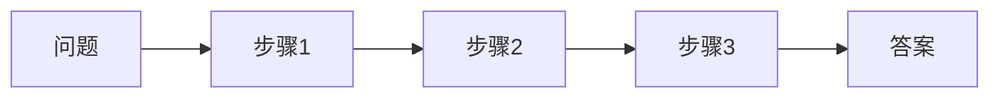
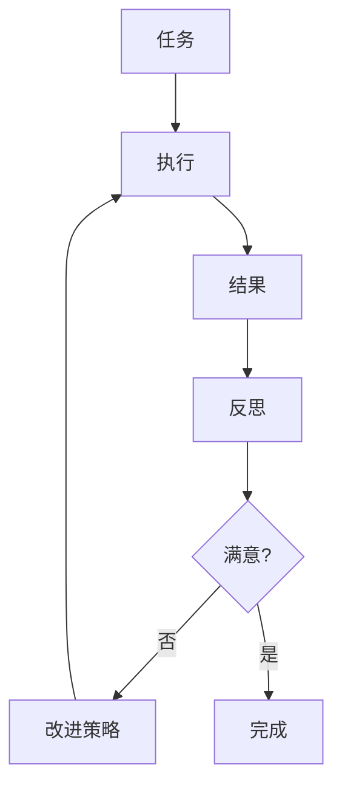

# 规划与推理流程图

## Chain-of-Thought 流程



## Tree-of-Thought 搜索

```
┌─────────────────────────────────────────────────────────────────┐
│                     ToT 搜索树                                   │
├─────────────────────────────────────────────────────────────────┤
│                                                                 │
│                          ┌─────────┐                           │
│                          │  问题   │                           │
│                          └────┬────┘                           │
│                               │                                 │
│              ┌────────────────┼────────────────┐               │
│              ▼                ▼                ▼               │
│         ┌─────────┐     ┌─────────┐     ┌─────────┐           │
│         │ 思路 A  │     │ 思路 B  │     │ 思路 C  │           │
│         │ 评分:8  │     │ 评分:6  │     │ 评分:7  │           │
│         └────┬────┘     └────┬────┘     └────┬────┘           │
│              │                │                │                │
│         ┌────┴────┐          │           ┌────┴────┐           │
│         ▼         ▼          │           ▼         ▼           │
│    ┌────────┐ ┌────────┐     │      ┌────────┐ ┌────────┐     │
│    │ A.1    │ │ A.2    │     │      │ C.1    │ │ C.2    │     │
│    │评分:9  │ │评分:7  │     │      │评分:8  │ │评分:6  │     │
│    └────┬───┘ └────────┘     │      └────┬───┘ └────────┘     │
│         │      [剪枝]         │           │     [剪枝]         │
│         ▼                     │           ▼                    │
│    ┌────────┐                 │      ┌────────┐                │
│    │ 答案   │                 │      │ 答案   │                │
│    └────────┘                 │      └────────┘                │
│                               │                                 │
│   选择 A.1 的答案 (最高分)                                      │
│                                                                 │
└─────────────────────────────────────────────────────────────────┘
```

## Self-Consistency 投票

```
┌─────────────────────────────────────────────────────────────────┐
│                     Self-Consistency                             │
├─────────────────────────────────────────────────────────────────┤
│                                                                 │
│   问题: 25 × 4 + 10 = ?                                        │
│                                                                 │
│   采样 5 条推理路径:                                            │
│                                                                 │
│   路径 1:                                                       │
│   ┌───────────────────────────────────────────────────────┐     │
│   │ 25 × 4 = 100, 100 + 10 = 110 ✓                       │     │
│   └───────────────────────────────────────────────────────┘     │
│                                                                 │
│   路径 2:                                                       │
│   ┌───────────────────────────────────────────────────────┐     │
│   │ 4 × 25 = 100, 加上 10 等于 110 ✓                      │     │
│   └───────────────────────────────────────────────────────┘     │
│                                                                 │
│   路径 3:                                                       │
│   ┌───────────────────────────────────────────────────────┐     │
│   │ 25 × 4 + 10 = 100 + 10 = 110 ✓                       │     │
│   └───────────────────────────────────────────────────────┘     │
│                                                                 │
│   路径 4:                                                       │
│   ┌───────────────────────────────────────────────────────┐     │
│   │ 25 × 4 = 100, 答案是 100 ✗ (漏了+10)                  │     │
│   └───────────────────────────────────────────────────────┘     │
│                                                                 │
│   路径 5:                                                       │
│   ┌───────────────────────────────────────────────────────┐     │
│   │ 先算 4+10=14, 25×14=350 ✗ (运算顺序错误)              │     │
│   └───────────────────────────────────────────────────────┘     │
│                                                                 │
│   投票结果: 110 (3票) > 100 (1票) > 350 (1票)                  │
│   最终答案: 110                                                 │
│                                                                 │
└─────────────────────────────────────────────────────────────────┘
```

## 任务分解

```
┌─────────────────────────────────────────────────────────────────┐
│                     任务分解示例                                  │
├─────────────────────────────────────────────────────────────────┤
│                                                                 │
│   主任务: 准备演讲                                              │
│                                                                 │
│   ┌─────────────────────────────────────────────────────────┐   │
│   │                     主任务                               │   │
│   │                   准备演讲                               │   │
│   └─────────────────────────────────────────────────────────┘   │
│                              │                                  │
│            ┌─────────────────┼─────────────────┐                │
│            ▼                 ▼                 ▼                │
│   ┌─────────────┐   ┌─────────────┐   ┌─────────────┐          │
│   │  确定主题   │   │  制作 PPT   │   │  练习演讲   │          │
│   └──────┬──────┘   └──────┬──────┘   └──────┬──────┘          │
│          │                 │                 │                  │
│    ┌─────┴─────┐     ┌─────┴─────┐     ┌─────┴─────┐          │
│    ▼           ▼     ▼           ▼     ▼           ▼          │
│ ┌──────┐  ┌──────┐ ┌──────┐ ┌──────┐ ┌──────┐ ┌──────┐        │
│ │调研  │  │确定  │ │设计  │ │填充  │ │计时  │ │录音  │        │
│ │受众  │  │核心  │ │框架  │ │内容  │ │练习  │ │检查  │        │
│ │需求  │  │观点  │ │风格  │ │图文  │ │      │ │改进  │        │
│ └──────┘  └──────┘ └──────┘ └──────┘ └──────┘ └──────┘        │
│                                                                 │
│   依赖关系: 确定主题 → 制作PPT → 练习演讲                       │
│   执行顺序: 从左到右，从上到下                                   │
│                                                                 │
└─────────────────────────────────────────────────────────────────┘
```

## 反思循环



## 规划-执行循环

```
┌─────────────────────────────────────────────────────────────────┐
│                     规划-执行循环                                │
├─────────────────────────────────────────────────────────────────┤
│                                                                 │
│   ┌─────────────────────────────────────────────────────────┐   │
│   │                      规划阶段                            │   │
│   │  ┌─────────┐   ┌─────────┐   ┌─────────┐               │   │
│   │  │ 分析任务 │ → │ 分解任务 │ → │ 制定计划 │               │   │
│   │  └─────────┘   └─────────┘   └─────────┘               │   │
│   └─────────────────────────────────────────────────────────┘   │
│                              │                                  │
│                              ▼                                  │
│   ┌─────────────────────────────────────────────────────────┐   │
│   │                      执行阶段                            │   │
│   │  ┌─────────┐   ┌─────────┐   ┌─────────┐               │   │
│   │  │执行步骤1│ → │执行步骤2│ → │执行步骤N│               │   │
│   │  └─────────┘   └─────────┘   └─────────┘               │   │
│   └─────────────────────────────────────────────────────────┘   │
│                              │                                  │
│                              ▼                                  │
│   ┌─────────────────────────────────────────────────────────┐   │
│   │                      监控阶段                            │   │
│   │  ┌─────────────────────────────────────────────────┐   │   │
│   │  │ 检查进度 → 发现问题 → 调整计划 → 继续执行        │   │   │
│   │  └─────────────────────────────────────────────────┘   │   │
│   └─────────────────────────────────────────────────────────┘   │
│                              │                                  │
│                              ▼                                  │
│   ┌─────────────────────────────────────────────────────────┐   │
│   │                      完成阶段                            │   │
│   │  ┌─────────┐   ┌─────────┐   ┌─────────┐               │   │
│   │  │验证结果 │ → │整合输出 │ → │返回答案 │               │   │
│   │  └─────────┘   └─────────┘   └─────────┘               │   │
│   └─────────────────────────────────────────────────────────┘   │
│                                                                 │
└─────────────────────────────────────────────────────────────────┘
```
