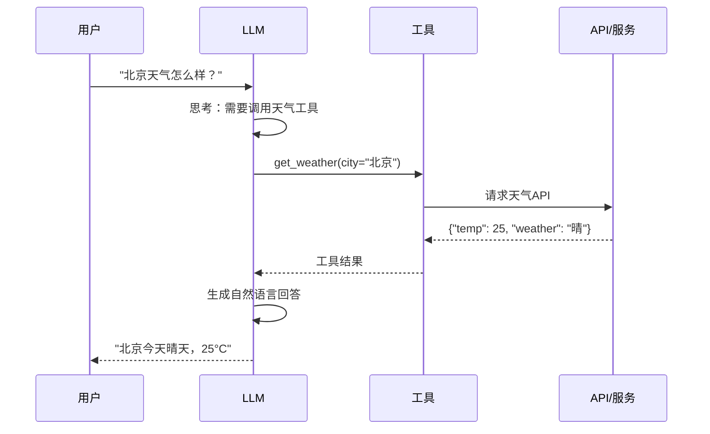

# 工具调用流程图

## 基本调用流程



## ReAct 循环

```
┌─────────────────────────────────────────────────────────────────┐
│                     ReAct 循环                                   │
├─────────────────────────────────────────────────────────────────┤
│                                                                 │
│   ┌─────────────────────────────────────────────────────────┐   │
│   │                      问题                                │   │
│   │            "马斯克的公司市值是多少？"                    │   │
│   └─────────────────────────────────────────────────────────┘   │
│                              │                                  │
│                              ▼                                  │
│   ┌─────────────────────────────────────────────────────────┐   │
│   │  Thought 1: 需要先确定马斯克有哪些公司                   │   │
│   │  Action 1: search("Elon Musk companies")                │   │
│   └─────────────────────────────────────────────────────────┘   │
│                              │                                  │
│                              ▼                                  │
│   ┌─────────────────────────────────────────────────────────┐   │
│   │  Observation 1: Tesla, SpaceX, X, Neuralink...         │   │
│   └─────────────────────────────────────────────────────────┘   │
│                              │                                  │
│                              ▼                                  │
│   ┌─────────────────────────────────────────────────────────┐   │
│   │  Thought 2: Tesla是上市公司，需要查市值                  │   │
│   │  Action 2: search("Tesla market cap 2024")              │   │
│   └─────────────────────────────────────────────────────────┘   │
│                              │                                  │
│                              ▼                                  │
│   ┌─────────────────────────────────────────────────────────┐   │
│   │  Observation 2: Tesla市值约5000亿美元                   │   │
│   └─────────────────────────────────────────────────────────┘   │
│                              │                                  │
│                              ▼                                  │
│   ┌─────────────────────────────────────────────────────────┐   │
│   │  Thought 3: 我现在可以回答了                             │   │
│   │  Final Answer: 马斯克的主要公司Tesla市值约5000亿美元...  │   │
│   └─────────────────────────────────────────────────────────┘   │
│                                                                 │
└─────────────────────────────────────────────────────────────────┘
```

## Function Calling 架构

```
┌─────────────────────────────────────────────────────────────────────────┐
│                     Function Calling 架构                                │
├─────────────────────────────────────────────────────────────────────────┤
│                                                                         │
│   客户端                                                                 │
│   ┌─────────────────────────────────────────────────────────────────┐   │
│   │  1. 构建请求                                                     │   │
│   │     - messages: 对话历史                                         │   │
│   │     - tools: 工具定义列表                                        │   │
│   └─────────────────────────────────────────────────────────────────┘   │
│                                    │                                    │
│                                    ▼                                    │
│   ┌─────────────────────────────────────────────────────────────────┐   │
│   │  2. 发送到 LLM API                                               │   │
│   │     POST /v1/chat/completions                                    │   │
│   └─────────────────────────────────────────────────────────────────┘   │
│                                    │                                    │
│                                    ▼                                    │
│   LLM 服务端                                                            │
│   ┌─────────────────────────────────────────────────────────────────┐   │
│   │  3. 处理请求                                                     │   │
│   │     - 注入工具定义到系统提示                                     │   │
│   │     - LLM 推理                                                   │   │
│   │     - 解析工具调用意图                                           │   │
│   └─────────────────────────────────────────────────────────────────┘   │
│                                    │                                    │
│                                    ▼                                    │
│   ┌─────────────────────────────────────────────────────────────────┐   │
│   │  4. 返回响应                                                     │   │
│   │     - tool_calls: 工具调用请求                                   │   │
│   │     - 或 content: 直接回答                                       │   │
│   └─────────────────────────────────────────────────────────────────┘   │
│                                    │                                    │
│                                    ▼                                    │
│   客户端                                                                 │
│   ┌─────────────────────────────────────────────────────────────────┐   │
│   │  5. 执行工具调用                                                 │   │
│   │     - 解析 tool_calls                                            │   │
│   │     - 调用实际工具/API                                           │   │
│   │     - 获取结果                                                   │   │
│   └─────────────────────────────────────────────────────────────────┘   │
│                                    │                                    │
│                                    ▼                                    │
│   ┌─────────────────────────────────────────────────────────────────┐   │
│   │  6. 继续对话                                                     │   │
│   │     - 添加 tool message                                          │   │
│   │     - 再次调用 LLM                                               │   │
│   │     - 获取最终回答                                               │   │
│   └─────────────────────────────────────────────────────────────────┘   │
│                                                                         │
└─────────────────────────────────────────────────────────────────────────┘
```

## 并行工具调用

```
┌─────────────────────────────────────────────────────────────────┐
│                     并行工具调用                                  │
├─────────────────────────────────────────────────────────────────┤
│                                                                 │
│   问题: "比较北京、上海、广州的天气"                             │
│                                                                 │
│   串行调用 (慢):                                                │
│   ┌─────────────────────────────────────────────────────────┐   │
│   │ get_weather("北京") ──▶ get_weather("上海")            │   │
│   │                          ──▶ get_weather("广州")        │   │
│   │ 总时间: 3 × API延迟                                      │   │
│   └─────────────────────────────────────────────────────────┘   │
│                                                                 │
│   并行调用 (快):                                                │
│   ┌─────────────────────────────────────────────────────────┐   │
│   │ ┌─ get_weather("北京")  ──┐                            │   │
│   │ ├─ get_weather("上海")  ──┼──▶ 合并结果 ──▶ 回答       │   │
│   │ └─ get_weather("广州")  ──┘                            │   │
│   │ 总时间: 1 × API延迟                                      │   │
│   └─────────────────────────────────────────────────────────┘   │
│                                                                 │
│   条件: 调用之间没有依赖关系                                    │
│                                                                 │
└─────────────────────────────────────────────────────────────────┘
```

## 工具选择流程

```
┌─────────────────────────────────────────────────────────────────┐
│                     工具选择决策树                                │
├─────────────────────────────────────────────────────────────────┤
│                                                                 │
│                      用户问题                                   │
│                         │                                       │
│                         ▼                                       │
│              ┌─────────────────────┐                           │
│              │  需要外部信息/操作?  │                           │
│              └──────────┬──────────┘                           │
│                    │           │                                │
│                   否          是                                │
│                    │           │                                │
│                    ▼           ▼                                │
│              直接回答    ┌────────────────┐                     │
│                            │  匹配可用工具   │                   │
│                            └───────┬────────┘                   │
│                                    │                            │
│                                    ▼                            │
│                         ┌────────────────────┐                 │
│                         │  多个工具匹配?      │                 │
│                         └─────────┬──────────┘                 │
│                              │         │                        │
│                             否        是                        │
│                              │         │                        │
│                              ▼         ▼                        │
│                         使用该工具   排序选择                    │
│                                       │                        │
│                                       ▼                        │
│                              ┌─────────────────┐               │
│                              │ 相关性 × 成功率 │               │
│                              └────────┬────────┘               │
│                                       │                        │
│                                       ▼                        │
│                                   选择最优                      │
│                                                                 │
└─────────────────────────────────────────────────────────────────┘
```

## 错误处理流程

```
┌─────────────────────────────────────────────────────────────────┐
│                     错误处理                                      │
├─────────────────────────────────────────────────────────────────┤
│                                                                 │
│   工具调用                                                       │
│       │                                                         │
│       ▼                                                         │
│   ┌─────────────────┐                                          │
│   │   执行成功?      │                                          │
│   └────────┬────────┘                                          │
│        │         │                                              │
│       是        否                                              │
│        │         │                                              │
│        ▼         ▼                                              │
│   返回结果   ┌─────────────────┐                               │
│              │   错误类型?      │                               │
│              └────────┬────────┘                               │
│                   │         │                                   │
│            参数错误     其他错误                                 │
│                   │         │                                   │
│                   ▼         ▼                                   │
│           ┌───────────┐  ┌───────────┐                         │
│           │ LLM修正参数│  │ 重试/回退 │                         │
│           └─────┬─────┘  └─────┬─────┘                         │
│                 │              │                                │
│                 ▼              ▼                                │
│           重新调用       尝试备用方案                            │
│                 │              │                                │
│                 └──────┬───────┘                                │
│                        │                                        │
│                        ▼                                        │
│              ┌─────────────────┐                               │
│              │ 超过重试次数?    │                               │
│              └────────┬────────┘                               │
│                   │         │                                   │
│                  否        是                                   │
│                   │         │                                   │
│                   ▼         ▼                                   │
│               继续重试    返回错误信息                           │
│                                                                 │
└─────────────────────────────────────────────────────────────────┘
```
