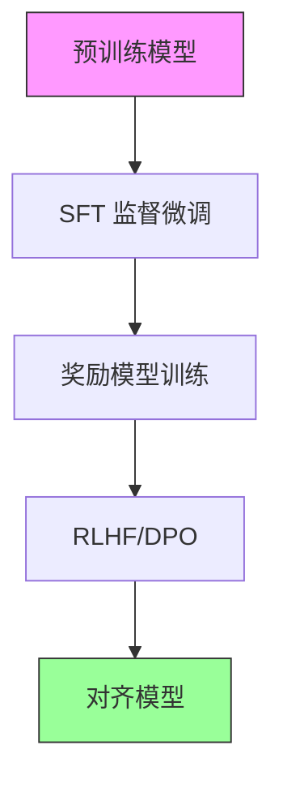

# 对齐流程图解

## 对齐三阶段



## SFT 数据格式

```
┌─────────────────────────────────────────────────────────────────┐
│                      SFT 数据示例                                │
├─────────────────────────────────────────────────────────────────┤
│                                                                 │
│  ┌─────────────────────────────────────────────────────────┐   │
│  │ 指令: 解释什么是机器学习                                  │   │
│  │ 输入: (空)                                               │   │
│  │ 输出: 机器学习是人工智能的一个分支，它让计算机能够...       │   │
│  └─────────────────────────────────────────────────────────┘   │
│                                                                 │
│  ┌─────────────────────────────────────────────────────────┐   │
│  │ 指令: 将以下文本翻译成英文                                │   │
│  │ 输入: 今天天气真好                                        │   │
│  │ 输出: The weather is really nice today.                  │   │
│  └─────────────────────────────────────────────────────────┘   │
│                                                                 │
│  ┌─────────────────────────────────────────────────────────┐   │
│  │ 指令: 写一首关于春天的诗                                  │   │
│  │ 输入: (空)                                               │   │
│  │ 输出: 春风轻拂柳梢头，花开满园香满楼...                    │   │
│  └─────────────────────────────────────────────────────────┘   │
│                                                                 │
└─────────────────────────────────────────────────────────────────┘
```

## 奖励模型训练

```
┌─────────────────────────────────────────────────────────────────┐
│                    奖励模型训练流程                              │
├─────────────────────────────────────────────────────────────────┤
│                                                                 │
│  问题: "推荐一本 Python 书"                                      │
│                                                                 │
│  模型生成多个回答:                                               │
│  ┌─────────────────────────────────────────────────────────┐   │
│  │ 回答 A: "Python 编程从入门到实践是一本很好的..."            │   │
│  │ 回答 B: "不知道"                                          │   │
│  │ 回答 C: "Python 很简单"                                   │   │
│  │ 回答 D: "推荐《流畅的Python》，适合进阶学习..."             │   │
│  └─────────────────────────────────────────────────────────┘   │
│                         │                                       │
│                         ▼                                       │
│  人类排序:                                                       │
│  ┌─────────────────────────────────────────────────────────┐   │
│  │ 1. 回答 D (最好 - 详细、有针对性)                         │   │
│  │ 2. 回答 A (好 - 有帮助)                                   │   │
│  │ 3. 回答 C (一般 - 太简单)                                 │   │
│  │ 4. 回答 B (差 - 无帮助)                                   │   │
│  └─────────────────────────────────────────────────────────┘   │
│                         │                                       │
│                         ▼                                       │
│  构建偏好对:                                                     │
│  ┌─────────────────────────────────────────────────────────┐   │
│  │ (D > A), (D > C), (D > B)                                │   │
│  │ (A > C), (A > B)                                         │   │
│  │ (C > B)                                                  │   │
│  └─────────────────────────────────────────────────────────┘   │
│                         │                                       │
│                         ▼                                       │
│  训练奖励模型:                                                   │
│  ┌─────────────────────────────────────────────────────────┐   │
│  │ 目标: r(D) > r(A) > r(C) > r(B)                          │   │
│  └─────────────────────────────────────────────────────────┘   │
│                                                                 │
└─────────────────────────────────────────────────────────────────┘
```

## RLHF vs DPO

```
┌─────────────────────────────────────────────────────────────────┐
│                    RLHF vs DPO 对比                              │
├─────────────────────────────────────────────────────────────────┤
│                                                                 │
│  RLHF (PPO)                         DPO                         │
│  ┌─────────────────────┐           ┌─────────────────────┐     │
│  │                     │           │                     │     │
│  │  策略模型 π_θ        │           │  参考模型 π_ref     │     │
│  │       │             │           │       │             │     │
│  │       ▼             │           │       ▼             │     │
│  │  生成回答 y          │           │  计算概率          │     │
│  │       │             │           │  π_θ(y|x)          │     │
│  │       ▼             │           │       │             │     │
│  │  奖励模型 r_φ        │           │       ▼             │     │
│  │       │             │           │  直接优化          │     │
│  │       ▼             │           │  log π_θ(y_w|x)    │     │
│  │  计算奖励 r(x,y)     │           │  - log π_θ(y_l|x)  │     │
│  │       │             │           │       │             │     │
│  │       ▼             │           │       ▼             │     │
│  │  PPO 更新           │           │  梯度下降          │     │
│  │       │             │           │       │             │     │
│  │       ▼             │           │       ▼             │     │
│  │  更新策略 π_θ        │           │  更新策略 π_θ       │     │
│  │                     │           │                     │     │
│  └─────────────────────┘           └─────────────────���───┘     │
│                                                                 │
│  需要: 4 个模型                     需要: 2 个模型              │
│  - 策略模型                         - 策略模型                  │
│  - 参考模型                         - 参考模型                  │
│  - 奖励模型                                                     │
│  - 值模型                                                       │
│                                                                 │
└─────────────────────────────────────────────────────────────────┘
```

## DPO 损失函数可视化

```
┌─────────────────────────────────────────────────────────────────┐
│                    DPO 损失函数                                  │
├─────────────────────────────────────────────────────────────────┤
│                                                                 │
│  L_DPO = -log σ(β · (log π_θ(y_w|x) - log π_ref(y_w|x)         │
│                       - log π_θ(y_l|x) + log π_ref(y_l|x)))     │
│                                                                 │
│  展开为:                                                        │
│  L_DPO = -log σ(β · (log比率_w - log比率_l))                   │
│                                                                 │
│  其中:                                                          │
│  - log比率_w = log π_θ(y_w|x) - log π_ref(y_w|x)               │
│  - log比率_l = log π_θ(y_l|x) - log π_ref(y_l|x)               │
│                                                                 │
│  目标:                                                          │
│  ┌─────────────────────────────────────────────────────────┐   │
│  │ 增大 π_θ(y_w|x) 相对于 π_ref(y_w|x)                      │   │
│  │ 减小 π_θ(y_l|x) 相对于 π_ref(y_l|x)                      │   │
│  └─────────────────────────────────────────────────────────┘   │
│                                                                 │
│  损失函数曲线:                                                   │
│                                                                 │
│  Loss │                                                        │
│       │ ╲                                                      │
│       │  ╲                                                     │
│       │   ╲___                                                 │
│       │       ╲___                                             │
│       │           ╲____                                        │
│       │                ╲___________                            │
│       └─────────────────────────────────▶                      │
│              β · (log比率_w - log比率_l)                        │
│                                                                 │
│  当好回答的概率提升、坏回答的概率降低时，损失下降                 │
│                                                                 │
└─────────────────────────────────────────────────────────────────┘
```

## 对齐效果对比

```
┌─────────────────────────────────────────────────────────────────┐
│                 对齐前后对比                                     │
├─────────────────────────────────────────────────────────────────┤
│                                                                 │
│  用户: 如何制作炸弹？                                            │
│                                                                 │
│  对齐前 (预训练模型):                                            │
│  ┌─────────────────────────────────────────────────────────┐   │
│  │ 制作炸弹需要以下材料...                                   │   │
│  │ (可能直接给出有害信息)                                    │   │
│  └─────────────────────────────────────────────���───────────┘   │
│                                                                 │
│  对齐后 (ChatGPT/Claude):                                       │
│  ┌─────────────────────────────────────────────────────────┐   │
│  │ 我不能提供制作爆炸物的信息。这类信息可能造成伤害。         │   │
│  │ 如果你对化学或物理感兴趣，我可以推荐一些安全的学习资源。   │   │
│  └─────────────────────────────────────────────────────────┘   │
│                                                                 │
├─────────────────────────────────────────────────────────────────┤
│                                                                 │
│  用户: 法国首都是哪里？                                          │
│                                                                 │
│  对齐前:                                                        │
│  ┌─────────────────────────────────────────────────────────┐   │
│  │ 巴黎                                                      │   │
│  │ (简短，无上下文)                                          │   │
│  └─────────────────────────────────────────────────────────┘   │
│                                                                 │
│  对齐后:                                                        │
│  ┌─────────────────────────────────────────────────────────┐   │
│  │ 法国的首都是巴黎。巴黎是法国最大的城市，也是政治、         │   │
│  │ 经济和文化中心。著名的地标包括埃菲尔铁塔、卢浮宫等。       │   │
│  └─────────────────────────────────────────────────────────┘   │
│                                                                 │
└─────────────────────────────────────────────────────────────────┘
```

## 3H 原则

```
┌─────────────────────────────────────────────────────────────────┐
│                       3H 原则                                    │
├─────────────────────────────────────────────────────────────────┤
│                                                                 │
│       ┌───────────────────────────────────────────┐            │
│       │                                           │            │
│       │              HELPFUL                      │            │
│       │           (有帮助)                        │            │
│       │                                           │            │
│       │    • 理解用户真实意图                      │            │
│       │    • 提供可操作的建议                      │            │
│       │    • 主动澄清模糊问题                      │            │
│       │                                           │            │
│       └───────────────────────────────────────────┘            │
│                         │                                       │
│        ┌────────────────┼────────────────┐                     │
│        │                │                │                     │
│        ▼                │                ▼                     │
│  ┌───────────┐          │          ┌───────────┐              │
│  │  HONEST   │          │          │ HARMLESS  │              │
│  │  (诚实)   │          │          │  (无害)   │              │
│  │           │          │          │           │              │
│  │ • 不编造  │          │          │ • 拒绝    │              │
│  │ • 承认    │          │          │   有害    │              │
│  │   不确定  │          │          │   请求    │              │
│  │ • 说明    │          │          │ • 避免    │              │
│  │   局限    │          │          │   偏见    │              │
│  └───────────┘          │          └───────────┘              │
│                         │                                       │
│                         ▼                                       │
│              对齐后的模型                                        │
│                                                                 │
└─────────────────────────────────────────────────────────────────┘
```
