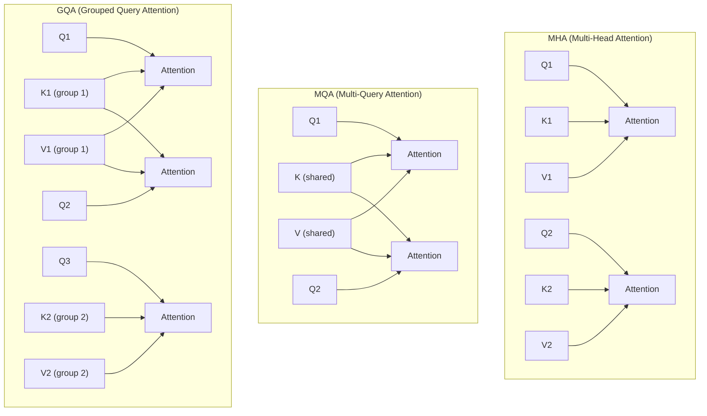

# 注意力变体流程图解

## MHA vs MQA vs GQA



## KV Cache 对比

```
┌─────────────────────────────────────────────────────────────────┐
│                    KV Cache 大小对比                             │
├─────────────────────────────────────────────────────────────────┤
│                                                                 │
│  假设: 32 个头, 每头维度 128, 序列长度 4096                      │
│                                                                 │
│  MHA (32 组 KV):                                                │
│  ┌────────────────────────────────────────────────────────────┐│
│  │████████████████████████████████████████████████████████████││
│  │ 2 × 4096 × 32 × 128 × 2 bytes = 64 MB                      ││
│  └────────────────────────────────────────────────────────────┘│
│                                                                 │
│  GQA (8 组 KV, LLaMA 2):                                        │
│  ┌────────────────────────────────────────────────────────────┐│
│  │████████████████████████████████████████                    ││
│  │ 2 × 4096 × 8 × 128 × 2 bytes = 16 MB                       ││
│  └────────────────────────────────────────────────────────────┘│
│  节省 75%                                                       │
│                                                                 │
│  MQA (1 组 KV):                                                 │
│  ┌────────────────────────────────────────────────────────────┐│
│  │████████                                                    ││
│  │ 2 × 4096 × 1 × 128 × 2 bytes = 2 MB                        ││
│  └────────────────────────────────────────────────────────────┘│
│  节省 97%                                                       │
│                                                                 │
└─────────────────────────────────────────────────────────────────┘
```

## Flash Attention 分块计算

```
┌─────────────────────────────────────────────────────────────────┐
│                    Flash Attention 分块策略                      │
├─────────────────────────────────────────────────────────────────┤
│                                                                 │
│  Q, K, V 分块:                                                  │
│                                                                 │
│  Q: [Q1 | Q2 | Q3 | Q4]                                        │
│  K: [K1 | K2 | K3 | K4]                                        │
│  V: [V1 | V2 | V3 | V4]                                        │
│                                                                 │
│  分块计算 (以 Q1 为例):                                          │
│  ┌─────────────────────────────────────────────────────────┐   │
│  │                                                         │   │
│  │     K1    K2    K3    K4                                │   │
│  │    ┌───┐┌───┐┌───┐┌───┐                                │   │
│  │ Q1 │ ✓ ││ ✓ ││ ✓ ││ ✓ │  → 增量更新 O1                 │   │
│  │    └───┘└───┘└───┘└───┘                                │   │
│  │                                                         │   │
│  │ 算法:                                                   │   │
│  │ 1. 加载 Q1 到 SRAM                                      │   │
│  │ 2. for each K_j, V_j:                                   │   │
│  │    a. 加载 K_j, V_j 到 SRAM                             │   │
│  │    b. 计算 S_1j = Q1 @ K_j^T                            │   │
│  │    c. 在线 softmax 更新                                  │   │
│  │    d. 累积更新 O1                                       │   │
│  │ 3. 写入 O1 到 HBM                                       │   │
│  │                                                         │   │
│  └─────────────────────────────────────────────────────────┘   │
│                                                                 │
│  关键: 不需要存储完整的 S = QK^T 矩阵                            │
│                                                                 │
└───��─────────────────────────────────────────────────────────────┘
```

## 内存访问对比

```
┌─────────────────────────────────────────────────────────────────┐
│                    内存访问模式对比                              │
├─────────────────────────────────────────────────────────────────┤
│                                                                 │
│  标准注意力:                                                    │
│  ┌─────────────────────────────────────────────────────────┐   │
│  │ HBM                                                      │   │
│  │ ┌─────┐ ┌─────┐ ┌─────────────┐ ┌─────┐ ┌─────┐        │   │
│  │ │  Q  │ │  K  │ │ S = QK^T    │ │Softmax│ │  O  │        │   │
│  │ └──┬──┘ └──┬──┘ └──────┬──────┘ └──┬──┘ └──┬──┘        │   │
│  │    │       │           │           │       │            │   │
│  │    └───────┴───────────┴───────────┴───────┘            │   │
│  │              多次 HBM 读写 (O(N²))                       │   │
│  └─────────────────────────────────────────────────────────┘   │
│                                                                 │
│  Flash Attention:                                               │
│  ┌─────────────────────────────────────────────────────────┐   │
│  │ HBM                    SRAM                              │   │
│  │ ┌─────┐               ┌───────────────────┐             │   │
│  │ │  Q  │ ───────────▶  │ Q_block, K_block  │             │   │
│  │ └─────┘               │ V_block, S_local  │             │   │
│  │ ┌─────┐               │ O_block (累积)    │             │   │
│  │ │  K  │ ───────────▶  └─────────┬─────────┘             │   │
│  │ └─────┘                         │                       │   │
│  │ ┌─────┐                         │                       │   │
│  │ │  V  │ ───────────▶            │                       │   │
│  │ └─────┘                         ▼                       │   │
│  │ ┌─────┐◀─────────────────────────                       │   │
│  │ │  O  │  一次写入                                         │   │
│  │ └─────┘                                                  │   │
│  │              最小化 HBM 读写 (O(N))                       │   │
│  └─────────────────────────────────────────────────────────┘   │
│                                                                 │
└─────────────────────────────────────────────────────────────────┘
```

## Sliding Window Attention

```
┌─────────────────────────────────────────────────────────────────┐
│                    Sliding Window Attention                     │
├─────────────────────────────────────────────────────────────────┤
│                                                                 │
│  窗口大小 = 3                                                    │
│                                                                 │
│  位置:   0   1   2   3   4   5   6   7   8   9                  │
│                                                                 │
│  注意力掩码:                                                     │
│        0 1 2 3 4 5 6 7 8 9                                      │
│    0 [● ○ ○ × × × × × × ×]                                      │
│    1 [● ● ○ ○ × × × × × ×]                                      │
│    2 [● ● ● ○ ○ × × × × ×]                                      │
│    3 [× ● ● ● ○ ○ × × × ×]                                      │
│    4 [× × ● ● ● ○ ○ × × ×]                                      │
│    5 [× × × ● ● ● ○ ○ × ×]                                      │
│    6 [× × × × ● ● ● ○ ○ ×]                                      │
│    7 [× × × × × ● ● ● ○ ○]                                      │
│    8 [× × × × × × ● ● ● ○]                                      │
│    9 [× × × × × × × ● ● ●]                                      │
│                                                                 │
│  ● = 可以关注  ○ = 边界  × = 不能关注                           │
│                                                                 │
│  复杂度: O(N × W) 而不是 O(N²)                                  │
│  其中 W 是窗口大小                                              │
│                                                                 │
└─────────────────────────────────────────────────────────────────┘
```

## 实际应用���择

```
┌─────────────────────────────────────────────────────────────────┐
│                    如何选择注意力变体                            │
├─────────────────────────────────────────────────────────────────┤
│                                                                 │
│  训练阶段:                                                      │
│  ┌─────────────────────────────────────────────────────────┐   │
│  │ 推荐使用 Flash Attention                                 │   │
│  │ - 加速训练 2-4x                                          │   │
│  │ - 支持更长序列                                           │   │
│  │ - 精度完全相同                                           │   │
│  └─────────────────────────────────────────────────────────┘   │
│                                                                 │
│  推理阶段:                                                      │
│  ┌─────────────────────────────────────────────────────────┐   │
│  │ 短序列 (< 4K): MHA 或 GQA                                │   │
│  │ 中等序列 (4K-32K): GQA + Flash Attention                 │   │
│  │ 长序列 (> 32K): GQA + Flash Attention + Sliding Window   │   │
│  └─────────────────────────────────────────────────────────┘   │
│                                                                 │
│  模型选择:                                                      │
│  ┌─────────────────────────────────────────────────────────┐   │
│  │ LLaMA 2/3: GQA (8 组 KV)                                 │   │
│  │ Mistral: GQA + Sliding Window                            │   │
│  │ 自定义模型: 根据资源选择                                  │   │
│  └─────────────────────────────────────────────────────────┘   │
│                                                                 │
└─────────────────────────────────────────────────────────────────┘
```
