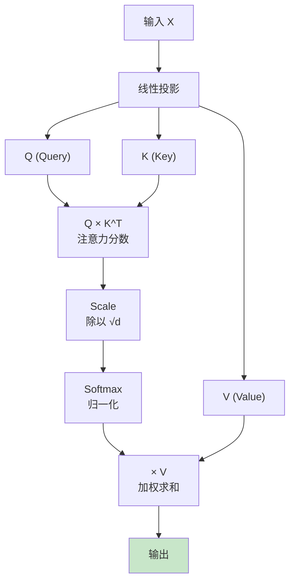
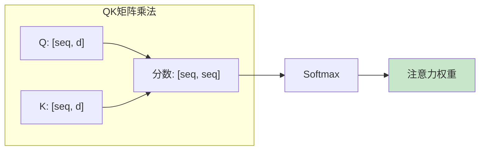
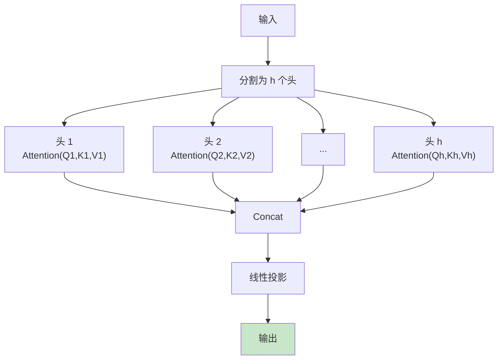
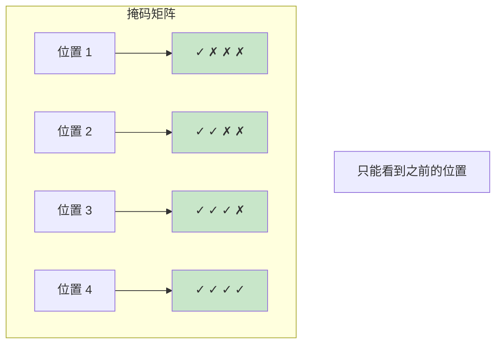
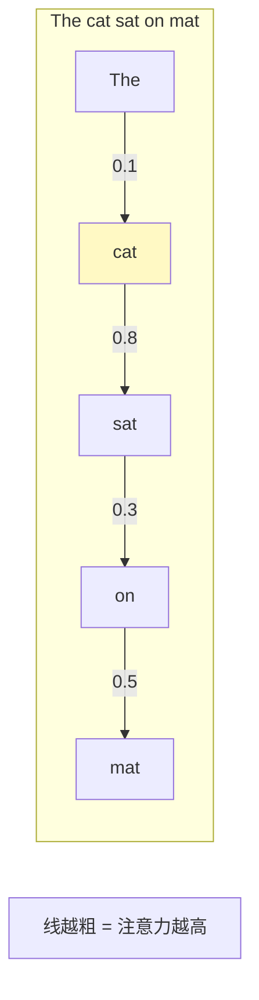
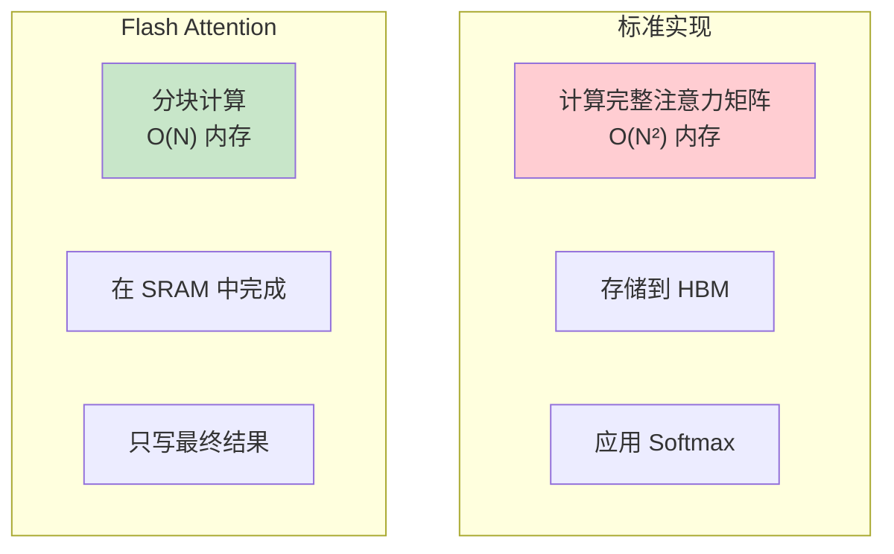

# Attention 流程图解

> 通过可视化图表理解注意力机制的工作流程

## 自注意力核心流程

## 注意力分数计算

## 多头注意力

## 因果掩码

## 注意力可视化

## Flash Attention 优化

## 图解说明

### 注意力公式

$$\text{Attention}(Q, K, V) = \text{softmax}\left(\frac{QK^T}{\sqrt{d_k}}\right) V$$

### 关键概念

| 概念 | 说明 |
|------|------|
| Query | 查询向量，"我在找什么" |
| Key | 键向量，"我是什么" |
| Value | 值向量，"我的内容" |
| 头数 | 并行注意力的数量 |

### 计算复杂度

- 时间: O(N² × d)
- 空间: O(N²) (标准) / O(N) (Flash)
