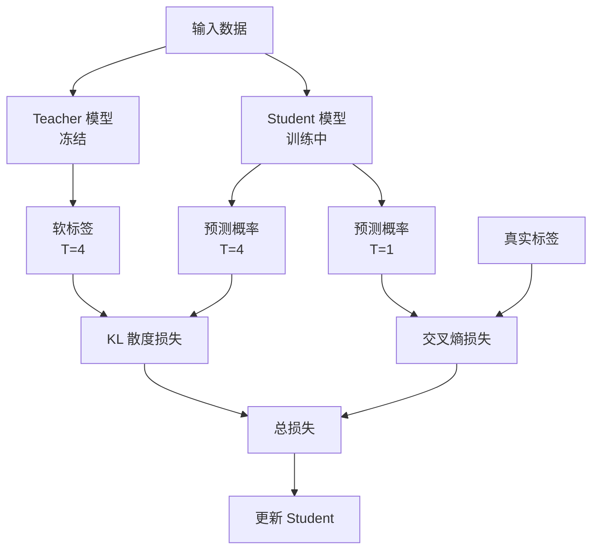

# 知识蒸馏流程图

## 蒸馏训练架构



## 软标签 vs 硬标签

```
┌─────────────────────────────────────────────────────────────────┐
│                     标签对比                                     │
├─────────────────────────────────────────────────────────────────┤
│                                                                 │
│   输入图片：一只狗                                               │
│                                                                 │
│   硬标签（传统训练）                                             │
│   ┌─────────────────────────────────────────────────────┐       │
│   │ 猫 │ 狗 │ 狼 │ 马 │ 兔 │                           │       │
│   │ 0  │ 1  │ 0  │ 0  │ 0  │                           │       │
│   └─────────────────────────────────────────────────────┘       │
│   只知道"这是狗"                                                 │
│                                                                 │
│   软标签（Teacher 输出）                                         │
│   ┌─────────────────────────────────────────────────────┐       │
│   │ 猫 │ 狗 │ 狼 │ 马 │ 兔 │                           │       │
│   │0.02│0.88│0.07│0.02│0.01│                           │       │
│   └─────────────────────────────────────────────────────┘       │
│   知道"这是狗，但也像狼，不太像猫"                                 │
│                                                                 │
│   软标签包含更多信息！                                            │
│                                                                 │
└─────────────────────────────────────────────────────────────────┘
```

## 温度效果

```
┌─────────────────────────────────────────────────────────────────┐
│                     温度对分布的影响                              │
├─────────────────────────────────────────────────────────────────┤
│                                                                 │
│   Logits: [10, 3, 1, 0.5]                                       │
│                                                                 │
│   T = 1 (标准 softmax)                                          │
│   ████████████████████████████████████████████ 0.999            │
│   █ 0.001                                                       │
│   │ 0.000                                                       │
│   │ 0.000                                                       │
│   → 几乎是硬标签                                                 │
│                                                                 │
│   T = 2                                                         │
│   ████████████████████████████ 0.95                             │
│   ████ 0.04                                                     │
│   █ 0.008                                                       │
│   │ 0.002                                                       │
│   → 开始展现软信息                                               │
│                                                                 │
│   T = 5                                                         │
│   ████████████████████ 0.75                                     │
│   ████████ 0.18                                                 │
│   ███ 0.05                                                      │
│   ██ 0.02                                                       │
│   → 明显的软分布，包含类别间关系                                  │
│                                                                 │
│   T = 20                                                        │
│   ████████████ 0.45                                             │
│   ██████████ 0.30                                               │
│   ████████ 0.15                                                 │
│   ██████ 0.10                                                   │
│   → 太软，信息被稀释                                             │
│                                                                 │
└─────────────────────────────────────────────────────────────────┘
```

## 蒸馏流程

```
┌─────────────────────────────────────────────────────────────────┐
│                     蒸馏训练完整流程                              │
├─────────────────────────────────────────────────────────────────┤
│                                                                 │
│   Step 1: 准备 Teacher                                          │
│   ┌──────────────────────────────────────────────────────────┐  │
│   │  训练好的大模型 → 冻结参数 → 作为"知识源"                   │  │
│   └──────────────────────────────────────────────────────────┘  │
│                              │                                  │
│                              ▼                                  │
│   Step 2: 准备数据                                              │
│   ┌──────────────────────────────────────────────────────────┐  │
│   │  原始训练数据 或 合成数据 或 Teacher 生成数据              │  │
│   └──────────────────────────────────────────────────────────┘  │
│                              │                                  │
│                              ▼                                  │
│   Step 3: Teacher 推理                                          │
│   ┌──────────────────────────────────────────────────────────┐  │
│   │  数据 → Teacher → 软标签（高温 softmax）                   │  │
│   └──────────────────────────────────────────────────────────┘  │
│                              │                                  │
│                              ▼                                  │
│   Step 4: 训练 Student                                          │
│   ┌──────────────────────────────────────────────────────────┐  │
│   │  数据 → Student → 预测                                    │  │
│   │      ↓                                                    │  │
│   │  损失 = α·蒸馏损失 + (1-α)·任务损失                        │  │
│   │      ↓                                                    │  │
│   │  反向传播，更新 Student                                    │  │
│   └──────────────────────────────────────────────────────────┘  │
│                              │                                  │
│                              ▼                                  │
│   Step 5: 部署 Student                                          │
│   ┌──────────────────────────────────────────────────────────┐  │
│   │  小模型，接近大模型能力，低延迟，低成本                     │  │
│   └──────────────────────────────────────────────────────────┘  │
│                                                                 │
└─────────────────────────────────────────────────────────────────┘
```

## 蒸馏变体对比

```
┌─────────────────────────────────────────────────────────────────┐
│                     蒸馏方法对比                                  │
├─────────────────────────────────────────────────────────────────┤
│                                                                 │
│   标准 KD (Hinton 2015)                                         │
│   ┌───────────────────────────────────────────────┐             │
│   │  Teacher 输出 ───▶ Student 匹配软标签          │             │
│   └───────────────────────────────────────────────┘             │
│                                                                 │
│   中间层蒸馏 (Hint Learning)                                     │
│   ┌───────────────────────────────────────────────┐             │
│   │  Teacher 中间层 ───▶ Student 中间层对齐        │             │
│   └───────────────────────────────────────────────┘             │
│                                                                 │
│   注意力蒸馏 (DistilBERT)                                        │
│   ┌───────────────────────────────────────────────┐             │
│   │  Teacher 注意力图 ───▶ Student 注意力图对齐    │             │
│   └───────────────────────────────────────────────┘             │
│                                                                 │
│   渐进式蒸馏                                                      │
│   ┌───────────────────────────────────────────────┐             │
│   │  多阶段蒸馏，逐步增加蒸馏权重                   │             │
│   │  Teacher ───▶ Large Student ───▶ Small Student│             │
│   └───────────────────────────────────────────────┘             │
│                                                                 │
│   自蒸馏                                                         │
│   ┌───────────────────────────────────────────────┐             │
│   │  模型 ───▶ 自己蒸馏自己（软标签正则化）         │             │
│   └───────────────────────────────────────────────┘             │
│                                                                 │
└─────────────────────────────────────────────────────────────────┘
```

## LLM 蒸馏示例

```
┌─────────────────────────────────────────────────────────────────┐
│                     Alpaca 蒸馏流程                              │
├─────────────────────────────────────────────────────────────────┤
│                                                                 │
│   ┌──────────────────────────────────────────────────────────┐  │
│   │  GPT-4 (Teacher)                                         │  │
│   │  175B+ 参数，能力超强                                     │  │
│   └──────────────────────────────────────────────────────────┘  │
│                              │                                  │
│                              ▼                                  │
│   ┌──────────────────────────────────────────────────────────┐  │
│   │  生成 52K 指令-回答对                                     │  │
│   │  输入："解释什么是机器学习"                               │  │
│   │  输出："机器学习是一种人工智能..."                        │  │
│   └──────────────────────────────────────────────────────────┘  │
│                              │                                  │
│                              ▼                                  │
│   ┌──────────────────────────────────────────────────────────┐  │
│   │  LLaMA 7B (Student)                                      │  │
│   │  用 GPT-4 生成的数据微调                                  │  │
│   └──────────────────────────────────────────────────────────┘  │
│                              │                                  │
│                              ▼                                  │
│   ┌──────────────────────────────────────────────────────────┐  │
│   │  Alpaca 7B                                               │  │
│   │  能力接近 GPT-4 的部分功能                                │  │
│   │  但小 25 倍，可以本地运行                                 │  │
│   └──────────────────────────────────────────────────────────┘  │
│                                                                 │
└─────────────────────────────────────────────────────────────────┘
```
