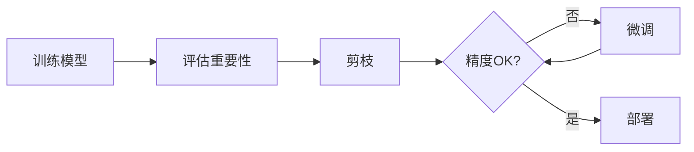

# 剪枝流程图

## 剪枝三步曲



## 非结构化 vs 结构化剪枝

```
┌─────────────────────────────────────────────────────────────────┐
│                     剪枝类型对比                                  │
├─────────────────────────────────────────────────────────────────┤
│                                                                 │
│   原始权重矩阵 (4×4)                                             │
│   ┌─────────────────────────────────────────┐                   │
│   │  2.5   0.01  -1.8   0.001               │                   │
│   │ -0.02  3.1    0.005  0.8                │                   │
│   │  1.2  -0.001  2.9   -0.03               │                   │
│   │  0.008  0.9  -0.009  1.5                │                   │
│   └─────────────────────────────────────────┘                   │
│                                                                 │
│   非结构化剪枝 (50%稀疏)                                         │
│   ┌─────────────────────────────────────────┐                   │
│   │  2.5   0      -1.8   0                  │                   │
│   │  0     3.1    0      0.8                │                   │
│   │  1.2   0      2.9    0                  │                   │
│   │  0     0.9    0      1.5                │                   │
│   └─────────────────────────────────────────┘                   │
│   特点：随机位置置零，需要稀疏计算支持                              │
│                                                                 │
│   结构化剪枝 (删除通道1)                                          │
│   ┌─────────────────────────────────────────┐                   │
│   │  2.5   -1.8                              │                   │
│   │ -0.02   0.8                              │                   │
│   │  1.2    2.9                              │                   │
│   │  0.008  1.5                              │                   │
│   └─────────────────────────────────────────┘                   │
│   特点：整列删除，标准硬件即可加速                                  │
│                                                                 │
└─────────────────────────────────────────────────────────────────┘
```

## 剪枝粒度

```
┌─────────────────────────────────────────────────────────────────┐
│                     剪枝粒度层级                                  │
├─────────────────────────────────────────────────────────────────┤
│                                                                 │
│   层级 (最粗)                                                    │
│   ┌────────────────────────────────────────────────────────┐    │
│   │  Layer 1  │  Layer 2  │  Layer 3  │  Layer 4  │       │    │
│   │           │           │  [删除]   │           │       │    │
│   └────────────────────────────────────────────────────────┘    │
│                              ↑                                  │
│   通道级                  整层删除                              │
│   ┌────────────────────────────────────────────────────────┐    │
│   │  Conv    │  Conv    │  Conv    │  Conv    │            │    │
│   │  Ch 1    │  Ch 2    │  Ch 3    │  Ch 4    │            │    │
│   │          │  [删除]  │          │  [删除]  │            │    │
│   └────────────────────────────────────────────────────────┘    │
│                              ↑                                  │
│   内核级                  整个通道删除                           │
│   ┌────────────────────────────────────────────────────────┐    │
│   │  K1 K2  │  K3 K4  │  K5 K6  │  K7 K8  │                │    │
│   │     [K2删除]       │     [K6删除]       │                │    │
│   └────────────────────────────────────────────────────────┘    │
│                              ↑                                  │
│   权重级 (最细)              内核块删除                          │
│   ┌────────────────────────────────────────────────────────┐    │
│   │  a 0 c 0  │  e 0 g h  │  i 0 k 0  │  m 0 o p  │        │    │
│   │  0 b 0 d  │  0 f 0 0  │  j 0 l 0  │  0 n 0 0  │        │    │
│   └────────────────────────────────────────────────────────┘    │
│                              ↑                                  │
│                         单个权重删除                             │
│                                                                 │
│   加速效果: 权重级 < 内核级 < 通道级 < 层级                       │
│   精度保持: 层级 < 通道级 < 内核级 < 权重级                       │
│                                                                 │
└─────────────────────────────────────────────────────────────────┘
```

## 迭代剪枝流程

```
┌───────────────────────────────────────────────���─────────────────┐
│                     迭代剪枝                                      │
├─────────────────────────────────────────────────────────────────┤
│                                                                 │
│   训练完整模型                                                   │
│       │                                                         │
│       ▼                                                         │
│   ┌─────────┐    ┌─────────┐    ┌─────────┐    ┌─────────┐     │
│   │ 剪枝 10%│───▶│ 微调    │───▶│ 剪枝 10%│───▶│ 微调    │     │
│   └─────────┘    └─────────┘    └─────────┘    └─────────┘     │
│       │              │              │              │            │
│       └──────────────┴──────────────┴──────────────┘            │
│                              │                                  │
│                              ▼                                  │
│                      重复直到目标稀疏度                           │
│                              │                                  │
│                              ▼                                  │
│                       最终稀疏模型                               │
│                                                                 │
│   优点：精度损失小                                               │
│   缺点：耗时长                                                   │
│                                                                 │
└─────────────────────────────────────────────────────────────────┘
```

## 渐进剪枝调度

```
┌─────────────────────────────────────────────────────────────────┐
│                     稀疏度调度曲线                                │
├─────────────────────────────────────────────────────────────────┤
│                                                                 │
│   稀疏度                                                         │
│   100% │                                      ●●●●●             │
│        │                                 ●●●●                   │
│    80% │                            ●●●●                        │
│        │                        ●●●●                            │
│    60% │                    ●●●●                                │
│        │                ●●●●                                    │
│    40% │            ●●●●                                        │
│        │        ●●●●                                            │
│    20% │    ●●●●                                                │
│        │ ●●●●                                                   │
│     0% │●                                                       │
│        └──────────────────────────────────────────────────▶     │
│        0              训练步数                              T    │
│                                                                 │
│   三次方调度: s(t) = s_i + (s_f - s_i)(1 - (1 - t/T)³)          │
│   特点: 开始慢，中间加速，最后平滑                                 │
│                                                                 │
└─────────────────────────────────────────────────────────────────┘
```

## 彩票假说

```
┌─────────────────────────────────────────────────────────────────┐
│                     彩票假说                                      │
├─────────────────────────────────────────────────────────────────┤
│                                                                 │
│   原始大网络                                                     │
│   ┌─────────────────────────────────────────────────────────┐   │
│   │  ●─○─●─○─○─●─●─○─●─○─●─○─○─●─●─●─○─●─○─○─●─●          │   │
│   │  │   │   │   │   │   │   │   │   │   │   │   │          │   │
│   │  ●─○─●─○─○─●─●─○─●─○─●─○─○─●─●─●─○─●─○─○─●─●          │   │
│   │  │   │   │   │   │   │   │   │   │   │   │   │          │   │
│   │  ●─○─●─○─○─●─●─○─●─○─●─○─○─●─●─●─○─●─○─○─●─●          │   │
│   └─────────────────────────────────────────────────────────┘   │
│                              │                                  │
│                              ▼                                  │
│   剪枝后发现的"中奖彩票"（小网络）                                │
│   ┌─────────────────────────────────────────────────────────┐   │
│   │  ●────●──────●●────●──────●●●────●──────●●              │   │
│   │  │         │         │         │         │               │   │
│   │  ●────●──────●●────●──────●●●────●──────●●              │   │
│   │  │         │         │         │         │               │   │
│   │  ●────●──────●●────●──────●●●────●──────●●              │   │
│   └─────────────────────────────────────────────────────────┘   │
│                                                                 │
│   关键发现：                                                     │
│   1. 这个小网络从头训练也能达到原网络性能                          │
│   2. 删除其他连接反而是"噪音"                                     │
│   3. 剪枝 = 发现隐含的好结构                                      │
│                                                                 │
└─────────────────────────────────────────────────────────────────┘
```

## LLM 剪枝 (Wanda)

```
┌─────────────────────────────────────────────────────────────────┐
│                     Wanda 剪枝方法                                │
├─────────────────────────────────────────────────────────────────┤
│                                                                 │
│   传统方法: 需要微调                                             │
│   ┌───────────────────────────────────────────────────────┐     │
│   │  训练 LLM ──▶ 剪枝 ──▶ 微调(昂贵!) ──▶ 部署          │     │
│   └───────────────────────────────────────────────────────┘     │
│                                                                 │
│   Wanda: 无需微调                                               │
│   ┌───────────────────────────────────────────────────────┐     │
│   │  训练 LLM ──▶ 剪枝(利用激活值) ──▶ 直接部署           │     │
│   └───────────────────────────────────────────────────────┘     │
│                                                                 │
│   重要性计算:                                                    │
│   ┌───────────────────────────────────────────────────────┐     │
│   │  分数 = |权重| × 输入激活的范数                        │     │
│   │                                                       │     │
│   │  不仅看权重大小，还看这个权重处理什么样的输入           │     │
│   └───────────────────────────────────────────────────────┘     │
│                                                                 │
│   效果: 50% 稀疏度，无需微调，性能接近原始                        │
│                                                                 │
└─────────────────────────────────────────────────────────────────┘
```
