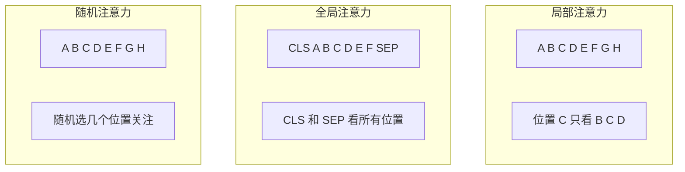

# 稀疏注意力流程图

## 稠密 vs 稀疏注意力

```
┌─────────────────────────────────────────────────────────────────┐
│                     注意力矩阵对比                                │
├─────────────────────────────────────────────────────────────────┤
│                                                                 │
│   稠密注意力 (O(n²))                                            │
│   ┌────────────────────────────────────────┐                    │
│   │ █ █ █ █ █ █ █ █ █ █ █ █ █ █ █ █ │                    │
│   │ █ █ █ █ █ █ █ █ █ █ █ █ █ █ █ █ │                    │
│   │ █ █ █ █ █ █ █ █ █ █ █ █ █ █ █ █ │                    │
│   │ █ █ █ █ █ █ █ █ █ █ █ █ █ █ █ █ │                    │
│   │ █ █ █ █ █ █ █ █ █ █ █ █ █ █ █ █ │  每个位置都计算      │
│   │ █ █ █ █ █ █ █ █ █ █ █ █ █ █ █ █ │  16×16 = 256 次     │
│   │ █ █ █ █ █ █ █ █ █ █ █ █ █ █ █ █ │                    │
│   │ █ █ █ █ █ █ █ █ █ █ █ █ █ █ █ █ │                    │
│   └────────────────────────────────────────┘                    │
│                                                                 │
│   稀疏注意力 (O(n))                                              │
│   ┌────────────────────────────────────────┐                    │
│   │ █ █     █         █         █     │                    │
│   │   █ █ █           █           █    │                    │
│   │     █ █ █         █         █      │                    │
│   │       █ █ █       █       █        │                    │
│   │         █ █ █     █     █          │  大部分为 0         │
│   │           █ █ █   █   █            │  只计算约 48 次     │
│   │             █ █ █ █ █              │  减少 5 倍以上      │
│   │               █ █ █                │                    │
│   └────────────────────────────────────────┘                    │
│                                                                 │
└─────────────────────────────────────────────────────────────────┘
```

## 三种稀疏模式



## Longformer 注意力模式

```
┌─────────────────────────────────────────────────────────────────┐
│                     Longformer 组合模式                          │
├─────────────────────────────────────────────────────────────────┤
│                                                                 │
│   输入: [CLS] The quick brown fox jumps [SEP]                   │
│          ↑                                       ↑              │
│        全局                                    全局             │
│                                                                 │
│   注意力矩阵组合:                                                │
│                                                                 │
│   局部滑动窗口 (w=3):           全局注意力:                      │
│   ┌─────────────────────┐      ┌─────────────────────┐         │
│   │ █ █ █              │      │ █ █ █ █ █ █ █ █ █  │         │
│   │ █ █ █              │      │                     │         │
│   │   █ █ █            │      │                     │         │
│   │     █ █ █          │  +   │                     │         │
│   │       █ █ █        │      │                     │         │
│   │         █ █ █      │      │                     │         │
│   │           █ █ █    │      │                     │         │
│   │             █ █ █  │      │ █ █ █ █ █ █ █ █ █  │         │
│   └─────────────────────┘      └─────────────────────┘         │
│                                                                 │
│   最终: 局部 + 全局                                             │
│   ┌─────────────────────┐                                       │
│   │ █ █ █ █ █ █ █ █ █  │  CLS 看全部                           │
│   │ █ █ █              │                                       │
│   │   █ █ █            │                                       │
│   │     █ █ █          │                                       │
│   │       █ █ █        │                                       │
│   │         █ █ █      │                                       │
│   │           █ █ █    │                                       │
│   │ █ █ █ █ █ █ █ █ █  │  SEP 看全部                           │
│   └─────────────────────┘                                       │
│                                                                 │
└─────────────────────────────────────────────────────────────────┘
```

## BigBird 注意力模式

```
┌─────────────────────────────────────────────────────────────────┐
│                     BigBird 组合模式                             │
├─────────────────────────────────────────────────────────────────┤
│                                                                 │
│   随机 + 局部 + 全局 = 近似完整注意��                            │
│                                                                 │
│   随机注意力:                  局部窗口:                        │
│   ┌─────────────────────┐      ┌─────────────────────┐         │
│   │ █     █     █      │      │ █ █ █              │         │
│   │   █     █     █    │      │ █ █ █              │         │
│   │ █     █     █      │      │   █ █ █            │         │
│   │     █     █     █  │  +   │     █ █ █          │         │
│   │ █     █     █      │      │       █ █ █        │         │
│   │   █     █     █    │      │         █ █ █      │         │
│   │ █     █     █      │      │           █ █ █    │         │
│   │     █     █     █  │      │             █ █ █  │         │
│   └─────────────────────┘      └─────────────────────┘         │
│                                                                 │
│   全局注意力:                  最终组合:                        │
│   ┌─────────────────────┐      ┌─────────────────────┐         │
│   │ █ █ █ █ █ █ █ █ █  │      │ █ █ █ █ █ █ █ █ █  │         │
│   │ █                  │      │ █ █ █ █     █      │         │
│   │ █                  │      │ █ █ █ █     █      │         │
│   │ █       ...        │  =   │ █   █ █ █     █    │         │
│   │ █                  │      │ █     █ █ █ █      │         │
│   │ █                  │      │ █   █   █ █ █ █    │         │
│   │ █                  │      │ █       █ █ █ █ █  │         │
│   │ █ █ █ █ █ █ █ █ █  │      │ █ █ █ █ █ █ █ █ █  │         │
│   └─────────────────────┘      └─────────────────────┘         │
│                                                                 │
│   理论保证: 这种组合是完整注意力的良好近似                        │
│   复杂度: O(n√n) 而不是 O(n²)                                   │
│                                                                 │
└─────────────────────────────────────────────────────────────────┘
```

## 扩张注意力 (LongNet)

```
┌─────────────────────────────────────────────────────────────────┐
│                     扩张注意力                                    │
├─────────────────────────────────────────────────────────────────┤
│                                                                 │
│   序列: [A, B, C, D, E, F, G, H, I, J, K, L, M, N, O, P]        │
│                                                                 │
│   不同扩张率捕获不同距离信息:                                     │
│                                                                 │
│   d=1 (密集):                                                   │
│   [A, B, C, D, E, F, G, H, I, J, K, L, M, N, O, P]             │
│    ↑  ↑  ↑  ↑  ↑  ↑  ↑  ↑  ↑  ↑  ↑  ↑  ↑  ↑  ↑  ↑              │
│   全部采样                                                       │
│                                                                 │
│   d=2 (跳1个):                                                  │
│   [A, _, C, _, E, _, G, _, I, _, K, _, M, _, O, _]             │
│    ↑     ↑     ↑     ↑     ↑     ↑     ↑     ↑                 │
│   间隔采样                                                       │
│                                                                 │
│   d=4 (跳3个):                                                  │
│   [A, _, _, _, E, _, _, _, I, _, _, _, M, _, _, _]             │
│    ↑           ↑           ↑           ↑                        │
│   更稀疏采样                                                     │
│                                                                 │
│   距离近 → 密集采样 (小 d)                                       │
│   距离远 → 稀疏采样 (大 d)                                       │
│                                                                 │
│   效果: 感受野随层数指数增长，计算量线性                          │
│                                                                 │
└─────────────────────────────────────────────────────────────────┘
```

## 复杂度对比

```
┌─────────────────────────────────────────────────────────────────┐
│                     复杂度对比                                    │
├─────────────────────────────────────────────────────────────────┤
│                                                                 │
│   计算量                                                        │
│   │                                                             │
│   │                                           标准 O(n²)        │
│   │                                        ●●●●●●●●●●●           │
│   │                                    ●●●●●●●●●●●●●●●●           │
│   │                                ●●●●●●●●●●●●●●●●●●●●           │
│   │                            ●●●●●●●●●●●●●●●●●●●●●●●           │
│   │                        ●●●●●●●●●●●●●●●●●●●●●●●●●●           │
│   │                    ●●●●●●●●●●●●●●●●●●●●●●●●●●●●●           │
│   │  BigBird O(n√n)  ●●●●●●●●●●●●●●●●●●●●●●●●●●●●●●●           │
│   │              ●●●●●●●●●●●●●●●●●●●●●●●●●●●●●●●●●●●           │
│   │          ●●●●●●●●●●●●●●●●●●●●●●●●●●●●●●●●●●●●●●           │
│   │      ●●●●●●●●●●●●●●●●●●●●●●●●●●●●●●●●●●●●●●●●●           │
│   │  ●●●●●●●●●●●●●●●●●●●●●●●●●●●●●●●●●●●●●●●●●●●●●           │
│   │ LongNet/局部 O(n)●●●●●●●●●●●●●●●●●●●●●●●●●●●●●●●●           │
│   │ ●●●●●●●●●●●●●●●●●●●●●●●●●●●●●●●●●●●●●●●●●●●●●●●           │
│   └──────────────────────────────────────────────────────▶      │
│   0        序列长度 n                                        64K │
│                                                                 │
│   关键: 稀疏注意力让长序列处理成为可能                            │
│                                                                 │
└─────────────────────────────────────────────────────────────────┘
```

## 感受野扩展

```
┌─────────────────────────────────────────────────────────────────┐
│                     堆叠扩展感受野                                │
├─────────────────────────────────────────────────────────────────┤
│                                                                 │
│   单层窗口注意力 (w=3):                                          │
│   位置 X 的感受野: [X-3, X-2, X-1, X, X+1, X+2, X+3]            │
│   感受野大小: 7                                                  │
│                                                                 │
│   两层堆叠:                                                      │
│   ┌───────────────────────────────────────────────────────┐     │
│   │ Layer 1: ... [X-3, X-2, X-1, X, X+1, X+2, X+3] ...   │     │
│   │                ↓↓ ↓ ↓ ↓ ↓ ↓                          │     │
│   │ Layer 2: ... [X-6, ..., X, ..., X+6] ...            │     │
│   └───────────────────────────────────────────────────────┘     │
│   感受野大小: 13                                                 │
│                                                                 │
│   L 层堆叠:                                                      │
│   感受野大小 ≈ L × w                                             │
│                                                                 │
│   12 层窗口=512:                                                 │
│   感受野 = 12 × 512 = 6144                                       │
│   可以处理约 6K 的长距离依赖                                     │
│                                                                 │
└─────────────────────────────────────────────────────────────────┘
```
