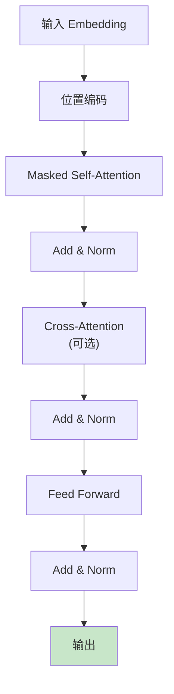
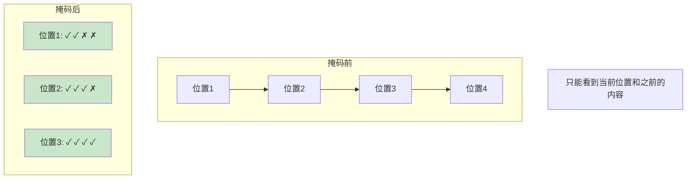
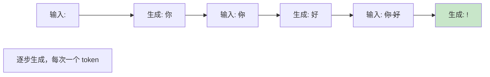
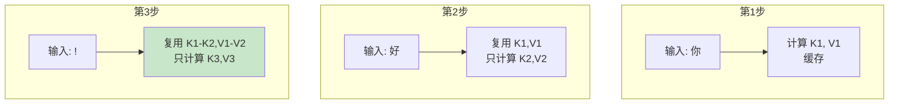
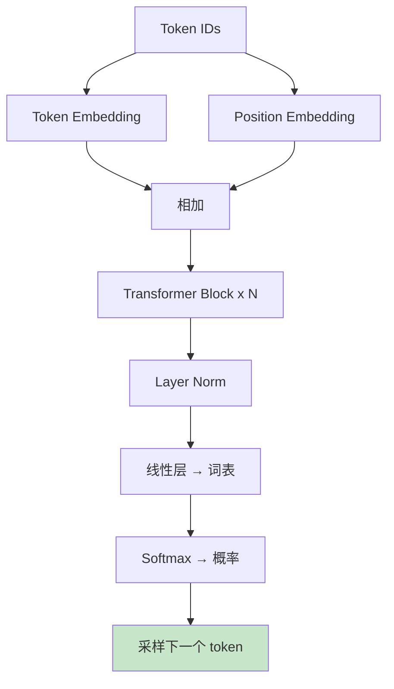
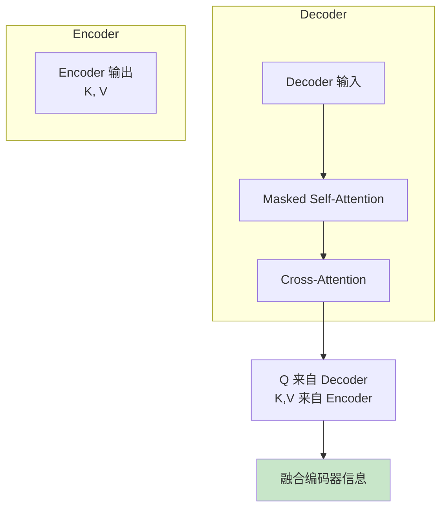

# Decoder 流程图解

> 通过可视化图表理解 Transformer Decoder 的工作流程

## Decoder 整体架构

## 因果掩码机制

## 自回归生成流程

## KV Cache 工作原理

## GPT Decoder 结构

## Cross-Attention (Encoder-Decoder)

## 图解说明

### 关键特性

| 特性 | 说明 |
|------|------|
| 因果掩码 | 只能看到之前的内容 |
| 自回归 | 逐步生成 |
| KV Cache | 缓存避免重复计算 |

### 典型配置

| 模型 | 层数 | 隐藏维度 | 注意力头 |
|------|------|----------|----------|
| GPT-2 Small | 12 | 768 | 12 |
| GPT-2 Medium | 24 | 1024 | 16 |
| GPT-3 | 96 | 12288 | 96 |

### 应用场景

- 文本生成
- 代码补全
- 对话系统
- 翻译 (Encoder-Decoder)
