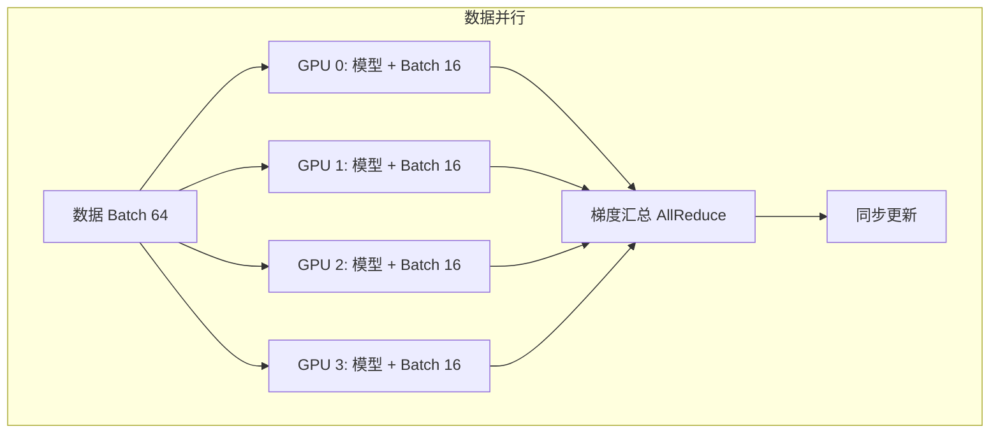
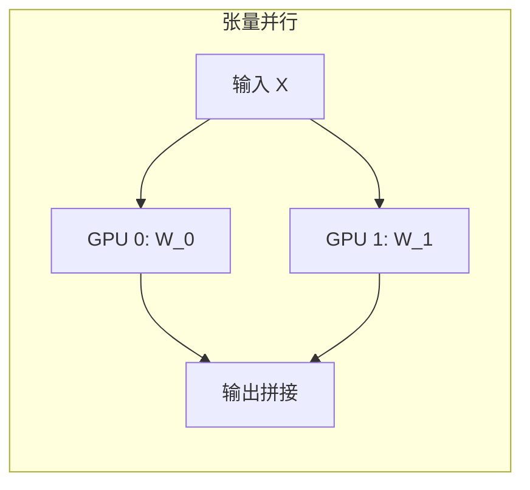
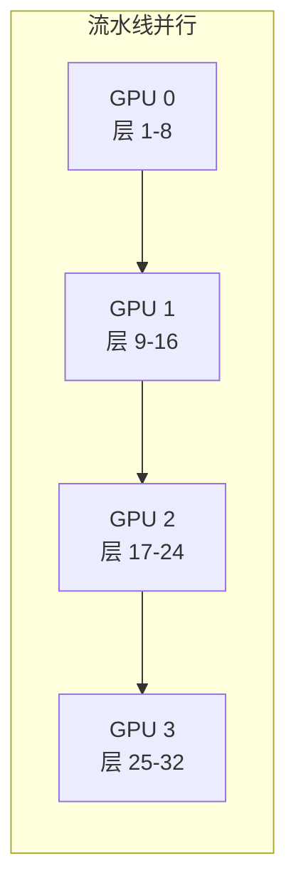
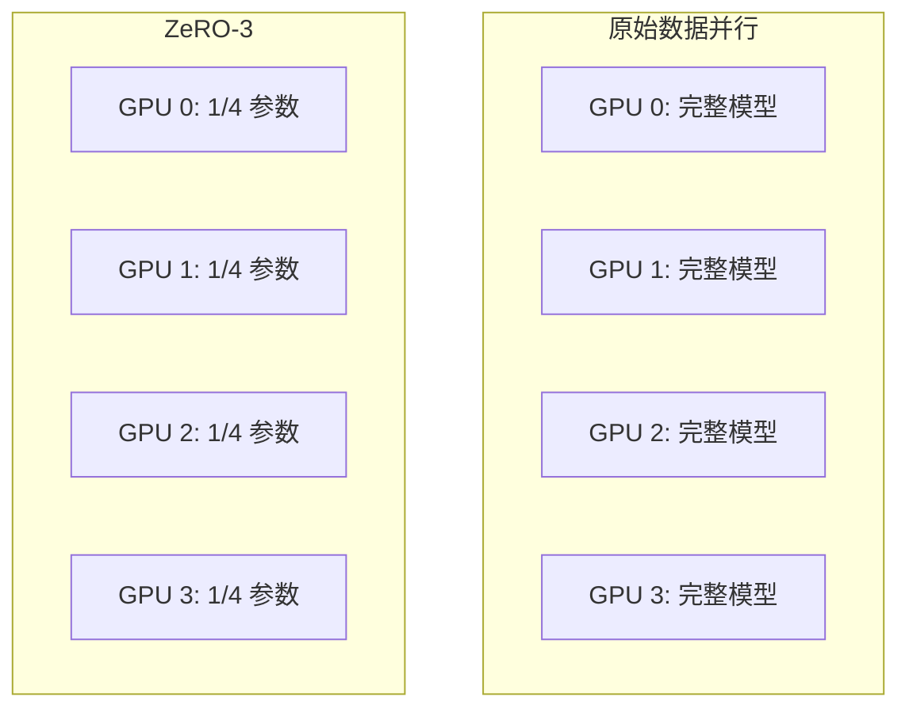

# 分布式训练流程图

## 三种并行策略对比







## ZeRO 内存优化



## 3D 并行架构

```
┌─────────────────────────────────────────────────────────────────────────┐
│                           3D 并行示意                                    │
├─────────────────────────────────────────────────────────────────────────┤
│                                                                         │
│   数据并行（DP）= 2                                                       │
│   张量并行（TP）= 2                                                       │
│   流水线并行（PP）= 2                                                     │
│   总 GPU = 2 × 2 × 2 = 8                                                 │
│                                                                         │
│   ┌─────────────────────────────────────────────────────────────────┐   │
│   │                    Pipeline Stage 0                             │   │
│   │   ┌─────────────────────┐    ┌─────────────────────┐           │   │
│   │   │      TP Group 0     │    │      TP Group 1     │           │   │
│   │   │  ┌─────┐   ┌─────┐  │    │  ┌─────┐   ┌─────┐  │           │   │
│   │   │  │GPU 0│   │GPU 1│  │    │  │GPU 2│   │GPU 3│  │           │   │
│   │   │  │DP 0 │   │DP 1 │  │    │  │DP 0 │   │DP 1 │  │           │   │
│   │   │  └─────┘   └─────┘  │    │  └─────┘   └─────┘  │           │   │
│   │   └─────────────────────┘    └─────────────────────┘           │   │
│   └─────────────────────────────────────────────────────────────────┘   │
│                                    │                                    │
│                                    ▼                                    │
│   ┌─────────────────────────────────────────────────────────────────┐   │
│   │                    Pipeline Stage 1                             │   │
│   │   ┌─────────────────────┐    ┌─────────────────────┐           │   │
│   │   │      TP Group 0     │    │      TP Group 1     │           │   │
│   │   │  ┌─────┐   ┌─────┐  │    │  ┌─────┐   ┌─────┐  │           │   │
│   │   │  │GPU 4│   │GPU 5│  │    │  │GPU 6│   │GPU 7│  │           │   │
│   │   │  │DP 0 │   │DP 1 │  │    │  │DP 0 │   │DP 1 │  │           │   │
│   │   │  └─────┘   └─────┘  │    │  └─────┘   └─────┘  │           │   │
│   │   └─────────────────────┘    └─────────────────────┘           │   │
│   └─────────────────────────────────────────────────────────────────┘   │
│                                                                         │
└─────────────────────────────────────────────────────────────────────────┘
```

## AllReduce 通信模式

```
┌─────────────────────────────────────────────────────────────────────────┐
│                      Ring AllReduce                                     │
├─────────────────────────────────────────────────────────────────────────┤
│                                                                         │
│   阶段 1: Scatter-Reduce（N-1 步）                                       │
│                                                                         │
│   Step 1:                                                               │
│   GPU 0 ──chunk 0──▶ GPU 1    GPU 1 ──chunk 1──▶ GPU 2                  │
│   GPU 2 ──chunk 2──▶ GPU 3    GPU 3 ──chunk 3──▶ GPU 0                  │
│                                                                         │
│   Step 2:                                                               │
│   GPU 0 ──chunk 3──▶ GPU 1    GPU 1 ──chunk 0──▶ GPU 2                  │
│   GPU 2 ──chunk 1──▶ GPU 3    GPU 3 ──chunk 2──▶ GPU 0                  │
│                                                                         │
│   ...                                                                   │
│                                                                         │
│   阶段 2: All-Gather（N-1 步）                                           │
│                                                                         │
│   每个 GPU 最终获得完整的聚合结果                                          │
│                                                                         │
│   总通信量: 2(N-1) × (数据量/N)                                           │
│                                                                         │
└─────────────────────────────────────────────────────────────────────────┘
```

## 1F1B 流水线调度

```
┌─────────────────────────────────────────────────────────────────────────┐
│                      1F1B 调度时序图                                     │
├─────────────────────────────────────────────────────────────────────────┤
│                                                                         │
│   时间 →                                                                │
│                                                                         │
│   GPU 0: [F0][F1][F2][F3][B0][F4][B1][F5][B2][F6][B3][F7][B4]...       │
│   GPU 1:      [F0][F1][F2][F3][B0][F4][B1][F5][B2][F6][B3][F7][B4]...  │
│   GPU 2:           [F0][F1][F2][F3][B0][F4][B1][F5][B2][F6][B3]...     │
│   GPU 3:                [F0][F1][F2][F3][B0][F4][B1][F5][B2][F6]...    │
│                                                                         │
│   [Fn] = Forward micro-batch n                                          │
│   [Bn] = Backward micro-batch n                                         │
│                                                                         │
│   稳定状态: 1 Forward + 1 Backward 交替进行                               │
│   气泡: 仅在开始和结束阶段                                                │
│                                                                         │
└─────────────────────────────────────────────────────────────────────────┘
```

## 混合精度训练流程

```
┌─────────────────────────────────────────────────────────────────────────┐
│                      混合精度训练                                        │
├─────────────────────────────────────────────────────────────────────────┤
│                                                                         │
│   ┌──────────────┐                                                      │
│   │ FP32 主参数   │ ←── 长期存储，高精度                                  │
│   └──────┬───────┘                                                      │
│          │ Cast to FP16                                                 │
│          ▼                                                              │
│   ┌──────────────┐                                                      │
│   │ FP16 参数副本 │ ←── 前向传播使用                                      │
│   └──────┬───────┘                                                      │
│          │                                                              │
│          ▼                                                              │
│   ┌──────────────┐                                                      │
│   │  前向传播     │ ←── FP16 计算                                        │
│   │  (FP16)      │                                                      │
│   └──────┬───────┘                                                      │
│          │                                                              │
│          ▼                                                              │
│   ┌──────────────┐                                                      │
│   │  损失 × S     │ ←── Loss Scaling (S = 32768)                        │
│   └──────┬───────┘                                                      │
│          │                                                              │
│          ▼                                                              │
│   ┌──────────────┐                                                      │
│   │  反向传播     │ ←── FP16 梯度                                        │
│   │  (FP16)      │                                                      │
│   └──────┬───────┘                                                      │
│          │                                                              │
│          ▼                                                              │
│   ┌──────────────┐                                                      │
│   │ 梯度 ÷ S     │ ←── Unscale                                          │
│   └──────┬───────┘                                                      │
│          │ Cast to FP32                                                 │
│          ▼                                                              │
│   ┌──────────────┐                                                      │
│   │ FP32 梯度    │                                                      │
│   └──────┬───────┘                                                      │
│          │                                                              │
│          ▼                                                              │
│   ┌──────────────┐                                                      │
│   │ 优化器更新   │ ←── FP32 更新主参数                                   │
│   └──────────────┘                                                      │
│                                                                         │
└─────────────────────────────────────────────────────────────────────────┘
```
