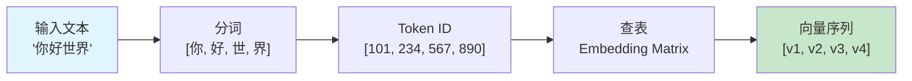
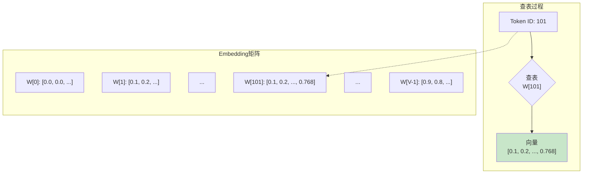
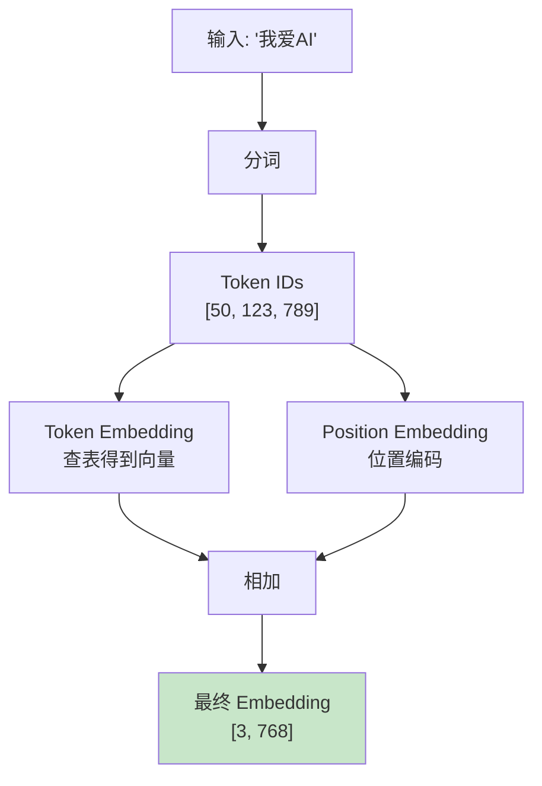
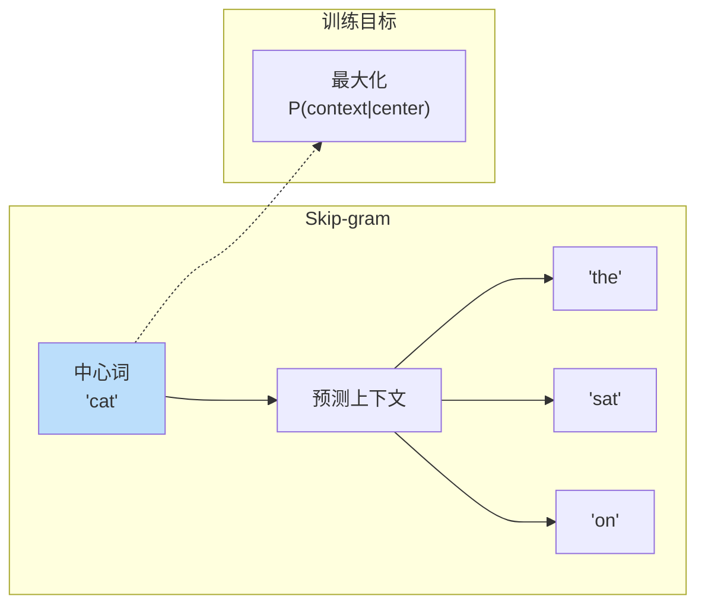
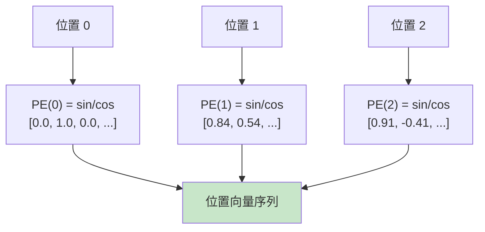
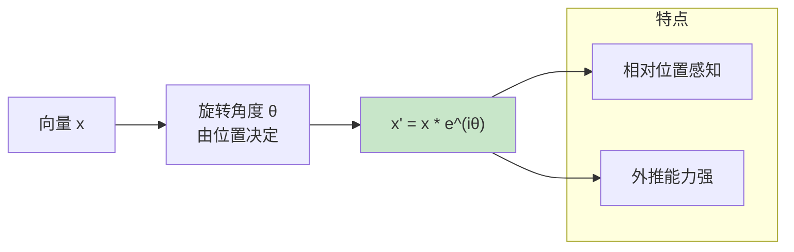

# Embedding 流程图解

> 通过可���化图表理解 Embedding 的工作流程

## Token Embedding 流程

## Embedding 矩阵查表

## 完整 Embedding 流程

## Word2Vec 训练流程

## 位置编码流程

## RoPE 旋转位置编码

## 图解说明

### 关键概念

| 概念 | 说明 |
|------|------|
| Token Embedding | 将词 ID 映射为向量 |
| Position Embedding | 编码位置信息 |
| Embedding Matrix | 学习的查找表 |
| 维度 | 通常 768-4096 |

### 流程要点

1. **分词**：文本 → Token IDs
2. **查表**：ID → 向量
3. **位置编码**：加入位置信息
4. **输出**：送入 Transformer
