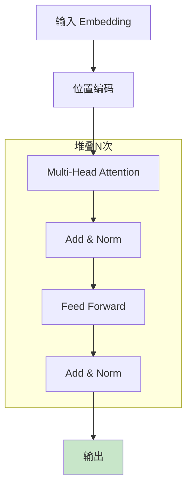
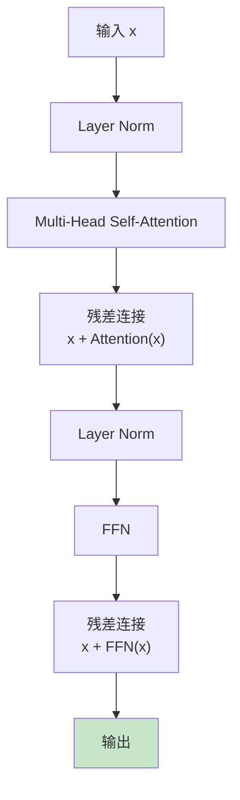
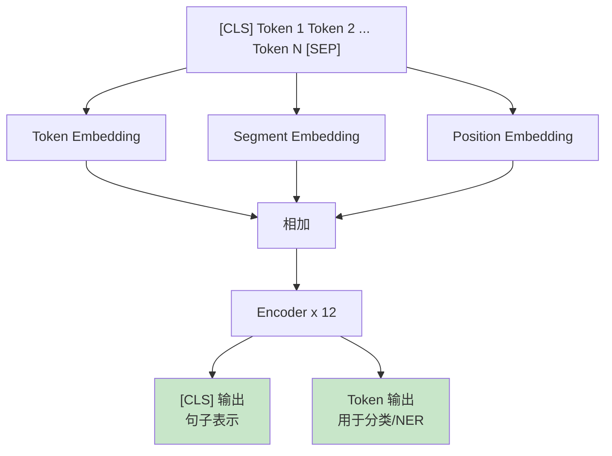
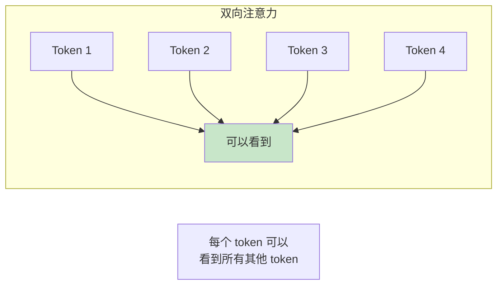
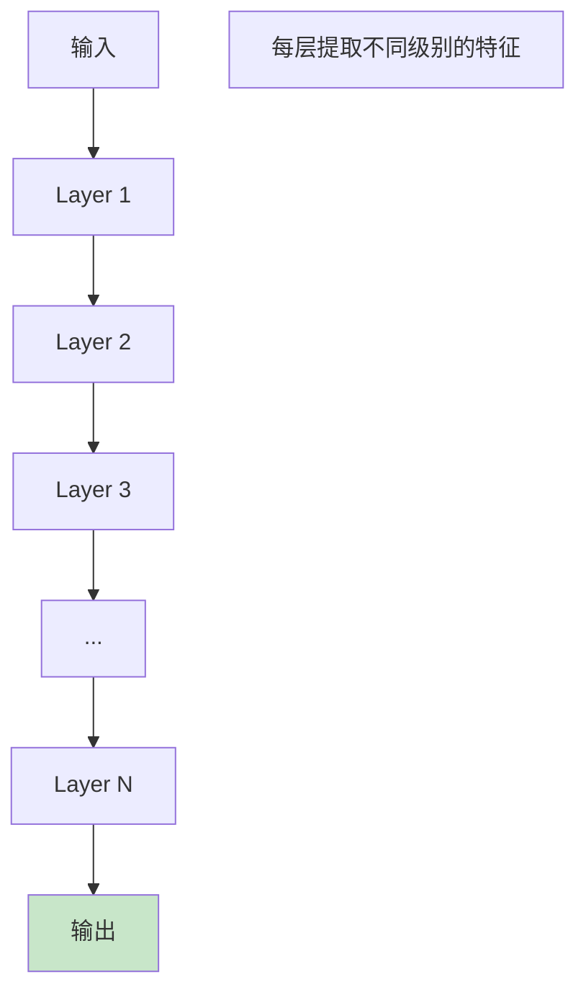
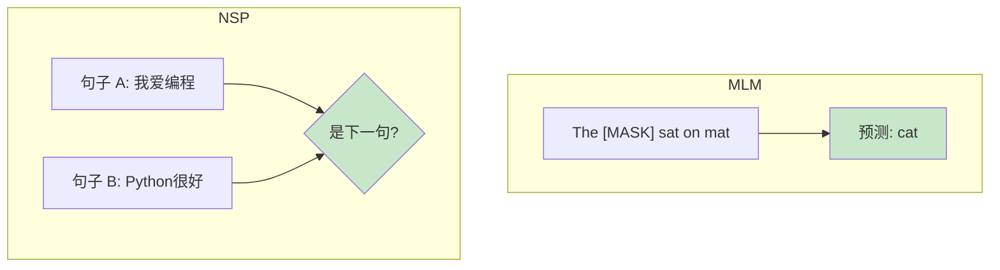

# Encoder 流程图解

> 通过可视化图表理解 Transformer Encoder 的工作流程

## Encoder 整体架构

## 单层 Encoder 详细流程

## BERT Encoder 结构

## Self-Attention 在 Encoder 中

## Encoder 堆叠

## BERT 预训练任务

## 图解说明

### 关键特性

| 特性 | 说明 |
|------|------|
| 双向注意力 | 可以看到所有位置 |
| 并行处理 | 所有 token 同时处理 |
| 位置编码 | 注入位置信息 |

### 典型配置

| 模型 | 层数 | 隐藏维度 | 注意力头 |
|------|------|----------|----------|
| BERT-Base | 12 | 768 | 12 |
| BERT-Large | 24 | 1024 | 16 |

### 应用场景

- 文本分类
- 命名实体识别
- 问答系统
- 语义相似度
