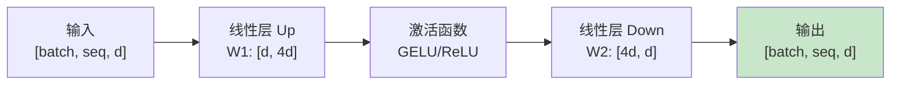
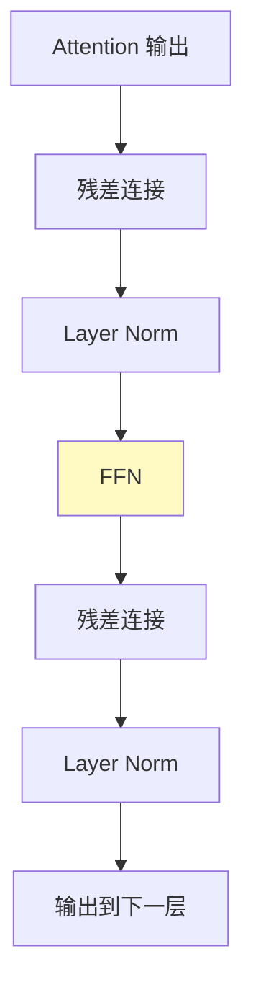
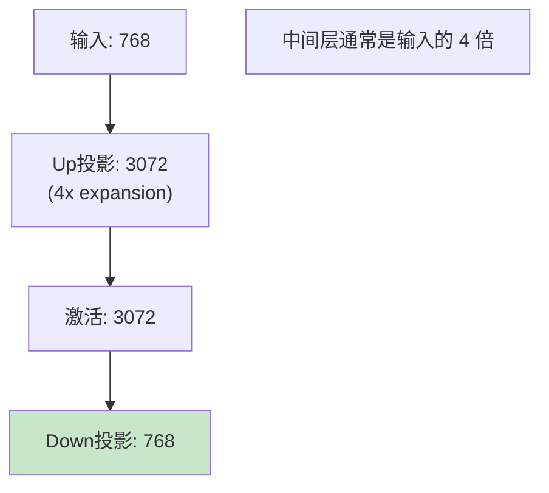
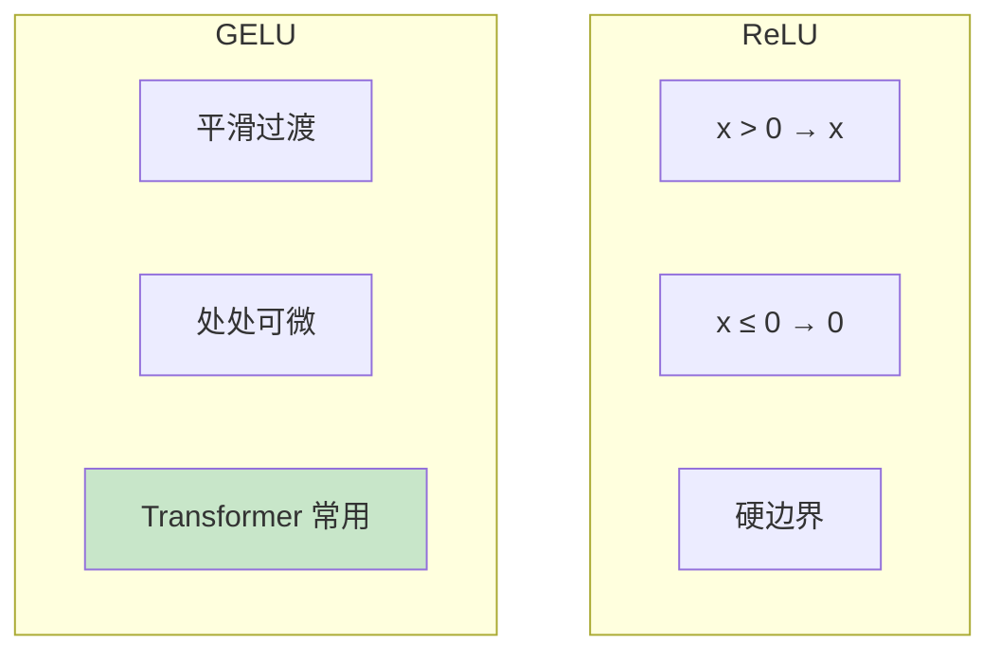
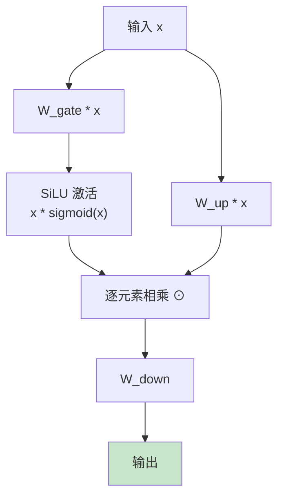
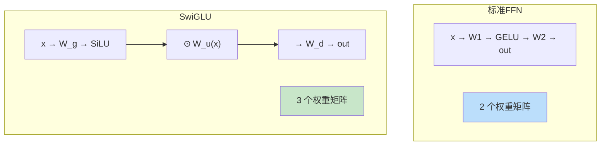
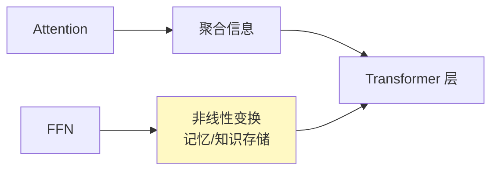

# FFN (Feed-Forward Network) 流程图解

> 通过可视化图表理解前馈网络的工作流程

## FFN 基本结构

## FFN 在 Transformer 中的位置

## 维度变化

## GELU vs ReLU

## SwiGLU 结构

## 标准 FFN vs SwiGLU FFN

## FFN 的作用

## 图解说明

### 关键参数

| 参数 | 说明 | 典型值 |
|------|------|--------|
| 扩展比 | 中间层/输入维度 | 4x |
| 激活函数 | 非线性 | GELU/SwiGLU |
| Dropout | 正则化 | 0.1 |

### 参数量估算

对于隐藏维度 $d$：
- 标准 FFN: $2 \times d \times 4d = 8d^2$
- SwiGLU: $3 \times d \times \frac{4d}{3} \times 2 = 8d^2$

### 激活函数选择

| 激活函数 | 模型 | 特点 |
|----------|------|------|
| ReLU | 早期 | 简单 |
| GELU | BERT, GPT | 平滑 |
| SwiGLU | LLaMA | 性能最好 |
