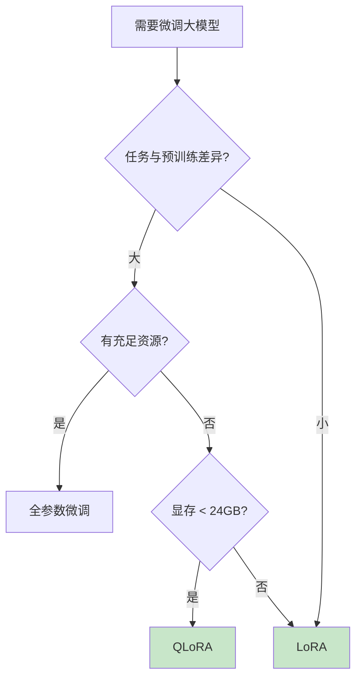

# Fine-tuning（微调）

微调是在预训练模型基础上，使用特定领域数据进一步训练，使模型适应特定任务或领域的技术。

## 模块结构

```
fine-tuning/
├── lora-finetune/      # LoRA/QLoRA 参数高效微调
│   ├── beginner-guide.md
│   ├── advanced-guide.md
│   ├── diagram.md
│   └── examples/
└── full-finetune/      # 全参数微调
    ├── beginner-guide.md
    ├── advanced-guide.md
    ├── diagram.md
    └── examples/
```

## 学习路径

### 1. LoRA 微调（推荐入门）

LoRA 是目前最流行的微调方法，只训练 ~1% 的参数就能达到接近全参数微调的效果。

- **科普版**: [beginner-guide.md](lora-finetune/beginner-guide.md) - 理解 LoRA 的"便利贴"类比
- **深入版**: [advanced-guide.md](lora-finetune/advanced-guide.md) - 低秩分解的数学原理
- **流程图**: [diagram.md](lora-finetune/diagram.md) - 可视化理解 LoRA 流程

### 2. 全参数微调

全参数微调效果最好，但需要大量计算资源。

- **科普版**: [beginner-guide.md](full-finetune/beginner-guide.md) - 何时选择全参数微调
- **深入版**: [advanced-guide.md](full-finetune/advanced-guide.md) - 训练技巧与优化
- **流程��**: [diagram.md](full-finetune/diagram.md) - 完整微调流程

## 方法对比

| 特性 | LoRA | QLoRA | 全参数微调 |
|------|------|-------|-----------|
| 可训练参数 | ~1% | ~1% | 100% |
| 显存需求 | 低 | 最低 | 高 |
| 训练速度 | 快 | 快 | 慢 |
| 效果上限 | 接近全参数 | 接近 LoRA | 最高 |
| 存储成本 | 小（~200MB） | 小（~200MB） | 大（~14GB） |

## 快速选择指南



## 代码示例

| 示例 | 说明 |
|------|------|
| [lora_example.py](lora-finetune/examples/lora_example.py) | LoRA 微调完整流程 |
| [qlora_example.py](lora-finetune/examples/qlora_example.py) | QLoRA 4-bit 量化微调 |
| [full_finetune_example.py](full-finetune/examples/full_finetune_example.py) | 全参数微调示例 |

## 学习建议

1. **从 LoRA 开始**：大多数场景 LoRA 足够
2. **理解 QLoRA**：资源有限时的最佳选择
3. **谨慎使用全参数微调**：仅在必要时使用

## 前置知识

- 科普版：无需基础
- 深入版：线性代数、深度学习基础
- 代码示例：Python、PyTorch、Hugging Face
