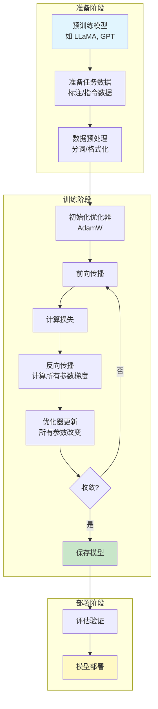
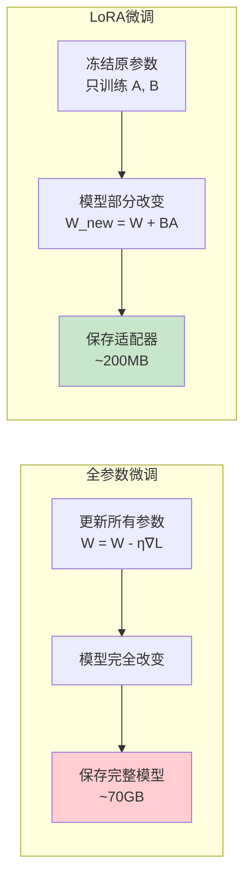
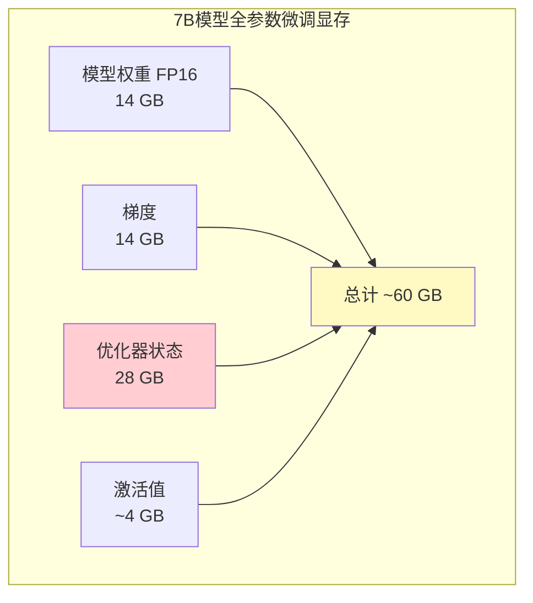
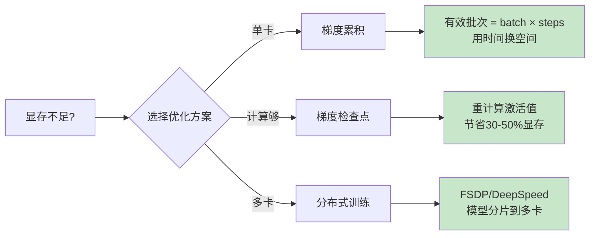
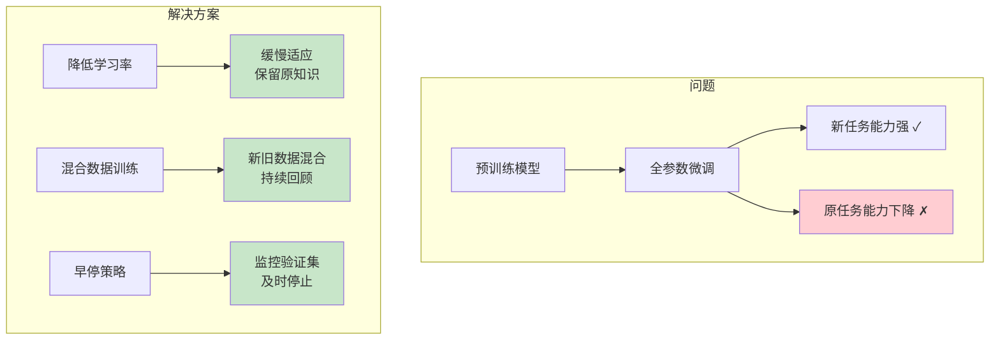
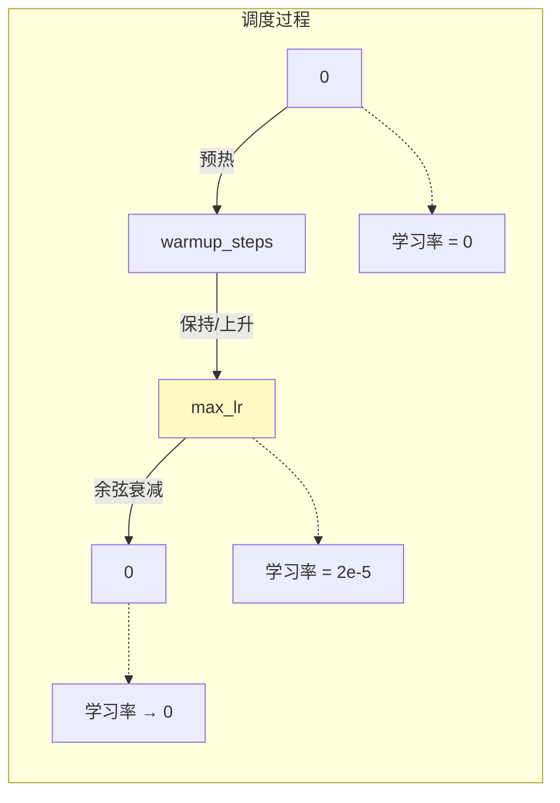
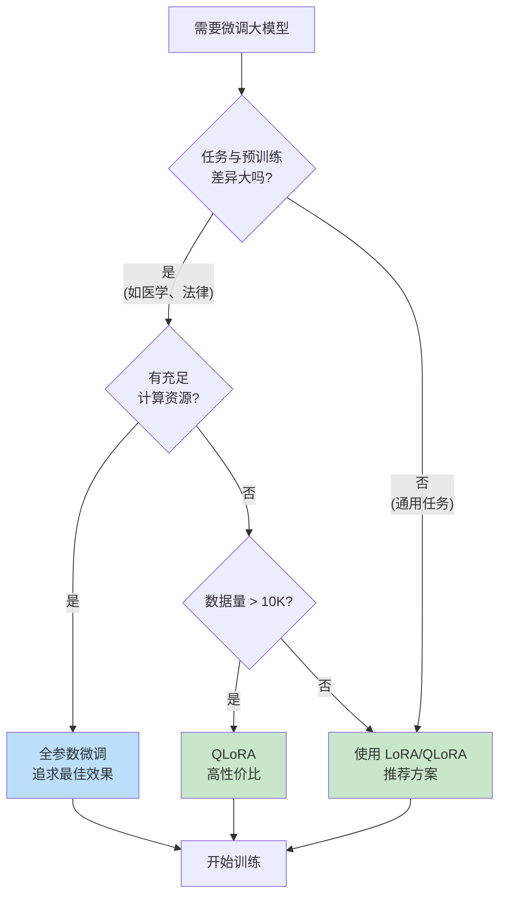

# 全参数微调流程图解

> 通过可视化图表理解全参数微调的完整工作流程

## 全参数微调总体流程

## 全参数微调 vs LoRA 对比

## 显存使用分析

## 训练优化技术

## 灾难性遗忘问题

## 学习率调度

## 决策树：选择微调方法

## 图解说明

### 关键概念

| 概念 | 说明 | 推荐值 |
|------|------|--------|
| 学习率 | 参数更新步长 | 1e-5 ~ 5e-5 |
| 批次大小 | 一次训练的样本数 | 尽可能大 |
| 梯度累积 | 模拟大批次 | 4-16 步 |
| 预热步数 | 学习率预热 | 总步数的 3-10% |

### 显存优化技巧

1. **梯度检查点**：省 30-50% 显存，慢 20%
2. **混合精度**：FP16/BF16，省 50% 模型显存
3. **梯度累积**：用时间换空间
4. **DeepSpeed ZeRO**：多卡分片，适合超大模型

### 何时选择全参数微调

- ✅ 任务与预训练差异大
- ✅ 有充足的计算资源
- ✅ 追求极致效果
- ✅ 数据量充足（>10K 样本）
