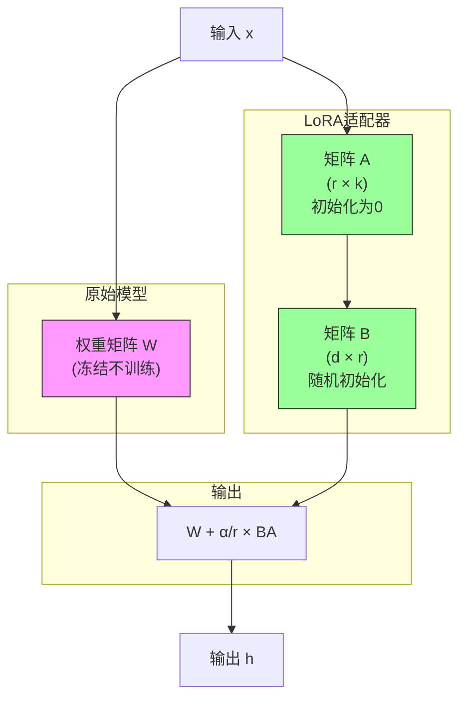
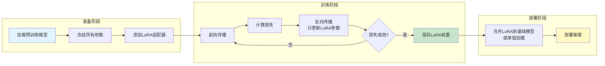
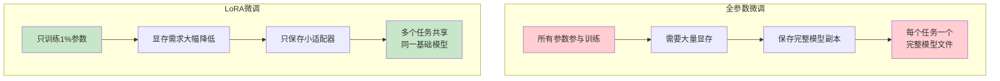
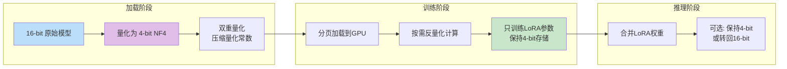
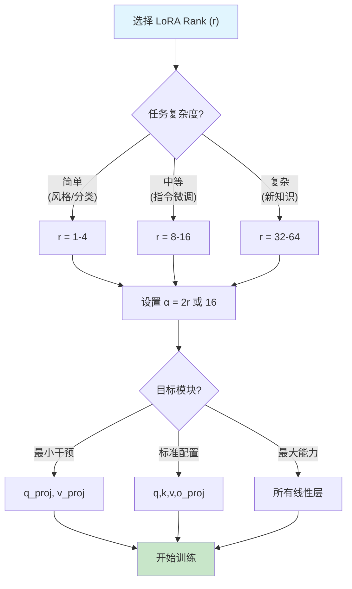

# LoRA 微调流程图解

> 通过可视化图表理解 LoRA 微调的完整工作流程

## LoRA 核心原理图

## LoRA 微调完整流程

## LoRA vs 全参数微调对比

## QLoRA 量化流程

## LoRA 参数选择决策树

## 图解说明

### 核心原理图
- **蓝色框**：原始冻结权重，不参与训练
- **绿色框**：LoRA 可训练参数，只有原模型的 0.1%-1%
- **数学公式**：$W_{new} = W + \frac{\alpha}{r} BA$

### 关键概念

| 概念 | 说明 | 推荐值 |
|------|------|--------|
| Rank (r) | 低秩维度，决定表达能力 | 8-16 |
| Alpha (α) | 缩放因子，控制影响强度 | 16-32 |
| Target Modules | 应用 LoRA 的层 | q_proj, v_proj |

### 流程要点

1. **准备**：加载模型 → 冻结参数 → 注入 LoRA
2. **训练**：只更新 $A$ 和 $B$ 矩阵，其他不变
3. **部署**：可合并到原模型，或单独加载适配器
