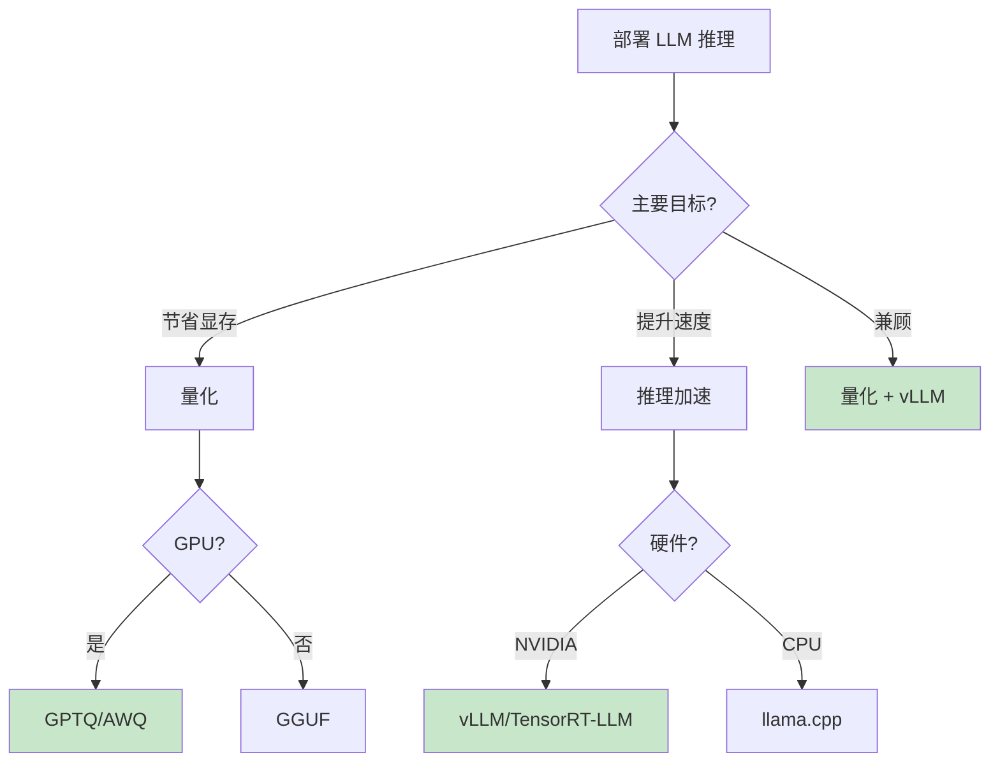

# Inference（推理优化）

推理优化关注如何高效地部署和运行大语言模型，包括模型压缩、加速技术和部署策略。

## 模块结构

```
inference/
├── quantization/           # 模型量化
│   ├── beginner-guide.md
│   ├── advanced-guide.md
│   ├── diagram.md
│   └── examples/
└── inference-acceleration/ # 推理加速
    ├── beginner-guide.md
    ├── advanced-guide.md
    ├── diagram.md
    └── examples/
```

## 学习路径

### 1. 量化技术（模型压缩）

量化是减少模型大小和显存需求的核心技术。

- **科普版**: [beginner-guide.md](quantization/beginner-guide.md) - 理解量化的"压缩"原理
- **深入版**: [advanced-guide.md](quantization/advanced-guide.md) - GPTQ、AWQ 算法详解
- **流程图**: [diagram.md](quantization/diagram.md) - 量化流程可视化

### 2. 推理加速（性能优化）

推理加速让模型"跑得更快"，提升吞吐量和降低延迟。

- **科普版**: [beginner-guide.md](inference-acceleration/beginner-guide.md) - 理解 KV Cache、批处理
- **深入版**: [advanced-guide.md](inference-acceleration/advanced-guide.md) - vLLM、Flash Attention
- **流程图**: [diagram.md](inference-acceleration/diagram.md) - 加速技术全景

## 技术对比

### 量化方法

| 方法 | 特点 | 适用场景 |
|------|------|----------|
| GPTQ | 精度高，量化慢 | 追求精度 |
| AWQ | 速度快，精度好 | 生产环境 |
| GGUF | CPU 友好 | 边缘设备 |

### 推理框架

| 框架 | 吞吐量 | 易用性 | 特点 |
|------|--------|--------|------|
| vLLM | 10-20x | ⭐⭐⭐⭐ | PagedAttention |
| TensorRT-LLM | 15-25x | ⭐⭐⭐ | NVIDIA 官方 |
| llama.cpp | 中等 | ⭐⭐⭐⭐⭐ | CPU/边缘 |

## 快速选择指南



## 代码示例

| 示例 | 说明 |
|------|------|
| [gptq_example.py](quantization/examples/gptq_example.py) | GPTQ 量化流程 |
| [awq_example.py](quantization/examples/awq_example.py) | AWQ 量化流程 |
| [vllm_example.py](inference-acceleration/examples/vllm_example.py) | vLLM 高性能推理 |
| [kv_cache_optimization.py](inference-acceleration/examples/kv_cache_optimization.py) | KV Cache 原理演示 |

## 效果参考

### 量化效果 (70B 模型)

| 精度 | 模型大小 | 质量损失 |
|------|----------|----------|
| FP16 | 140 GB | 基准 |
| INT8 | 70 GB | ~0% |
| INT4 | 35 GB | ~1% |

### 加速效果

| 优化 | 延迟降低 | 吞吐提升 |
|------|----------|----------|
| KV Cache | 50% | 2x |
| Flash Attention | 30% | 2x |
| vLLM | - | 10-20x |

## 学习建议

1. **先学量化**：理解如何压缩模型
2. **再学加速**：理解如何提升性能
3. **动手实践**：用量化模型跑 vLLM

## 前置知识

- 科普版：无需基础
- 深入版：深度学习、CUDA 基础
- 代码示例：Python、PyTorch
