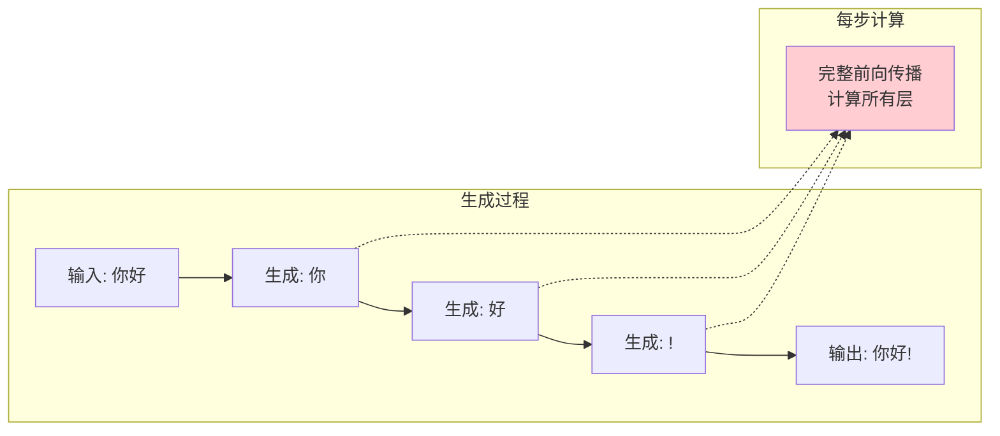
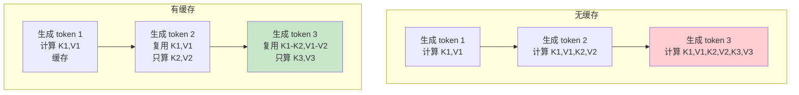
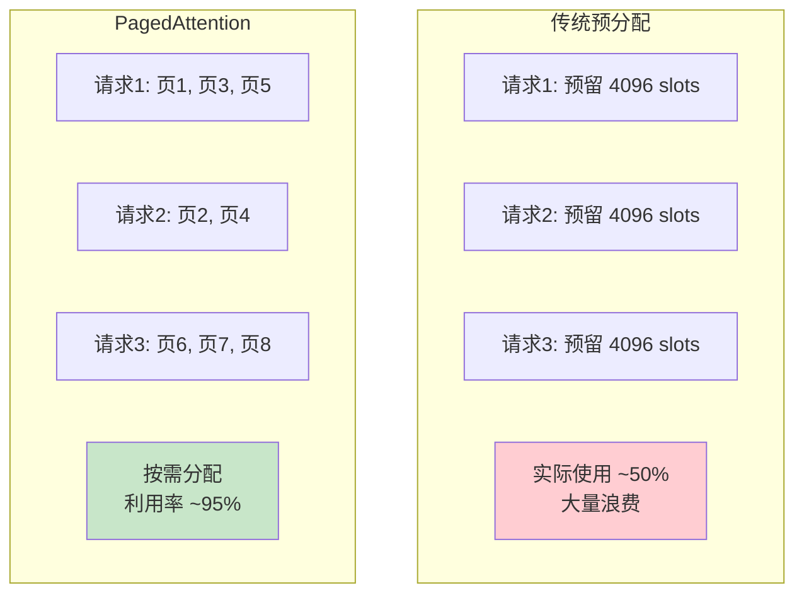
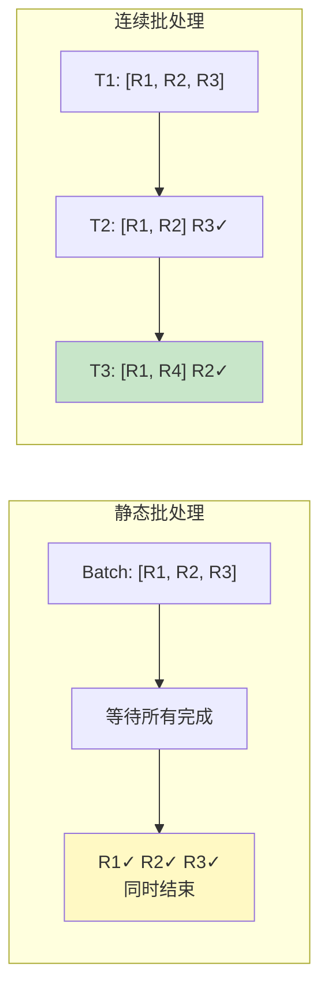
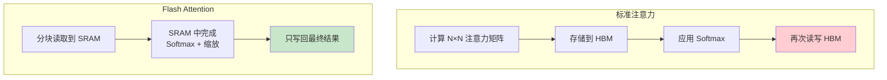
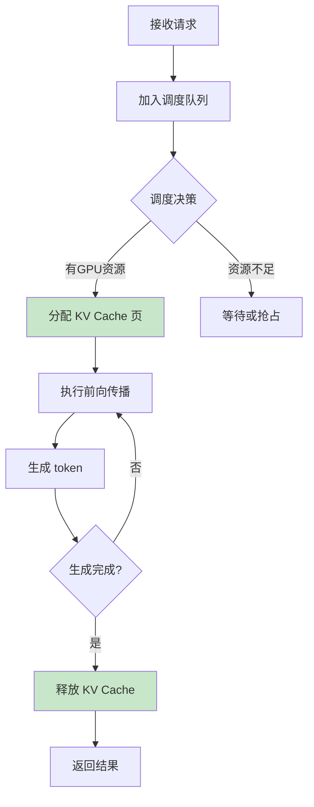
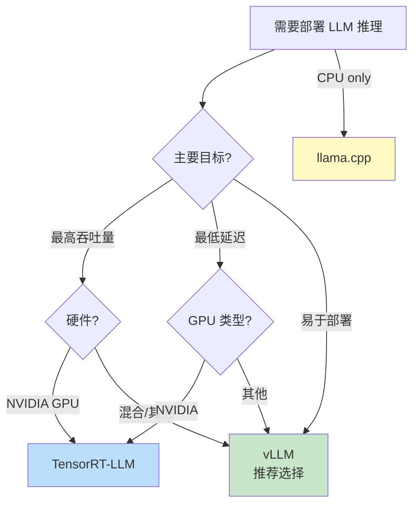
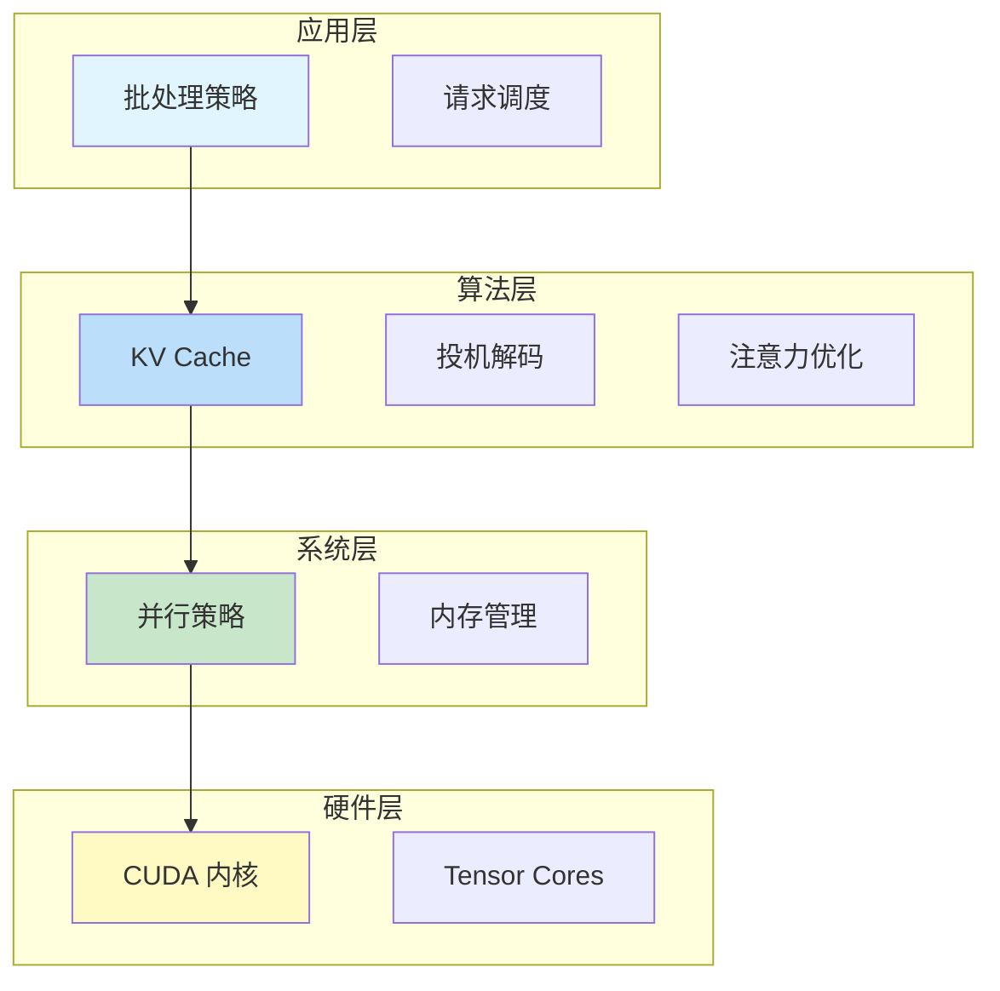

# 推理加速流程图解

> 通过可视化图表理解推理加速的完整工作流程

## 自回归生成过程



## KV Cache 原理



## PagedAttention 内存管理



## 连续批处理流程



## Flash Attention 优化



## vLLM 推理流程



## 框架选择决策树



## 性能优化层次



## 图解说明

### 关键技术收益

| 技术 | 延迟 | 吞吐量 | 内存 |
|------|------|--------|------|
| KV Cache | ↓50% | ↑2x | ↑使用 |
| PagedAttention | - | ↑4x | ↓50% |
| Flash Attention | ↓30% | ↑2x | ↓90% |
| 连续批处理 | - | ↑4x | - |

### 框架推荐

| 场景 | 推荐框架 |
|------|----------|
| 生产服务 | vLLM |
| NVIDIA 极致性能 | TensorRT-LLM |
| CPU/边缘部署 | llama.cpp |
| 研究原型 | HuggingFace |

### 性能瓶颈分析

```
推理时间分解:
├── 计算时间: 30%
│   └── GPU 利用率影响
├── 内存传输: 50%  ← 主要瓶颈!
│   └── 模型参数 + KV Cache
└── 调度开销: 20%
    └── 批处理效率
```
