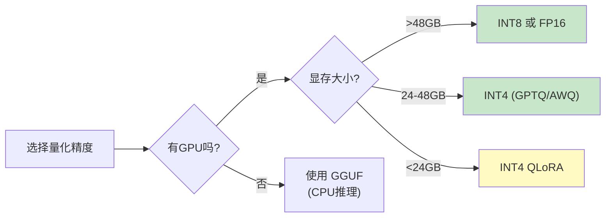

# 量化科普版

> 面向零基础读者的模型量化入门指南

## 一句话概括

**量化就是把模型的数字从"高精度"变成"低精度"，让模型变小、变快，但尽量保持聪明���**

## 从一个问题开始

你下载了一个 70GB 的大模型，想在自己的电脑上运行。但是：

- 你的显卡只有 24GB 显存
- 你的硬盘快满了
- 模型运行速度太慢

怎么办？**量化**就是解决方案！

## 什么是量化？

### 生活中的类比

想象你有一张超高清的 4K 照片（100MB）：
- **原始精度**：每个像素用 16 位数字描述，完美但占空间
- **量化后**：每个像素用 4 位数字描述，稍微模糊但只有 25MB

照片还是那张照片，只是细节稍微损失了一点，但文件小了很多！

### 模型量化

神经网络中的参数通常是 **16-bit 或 32-bit** 浮点数。量化���是把这些数变成 **4-bit 或 8-bit** 整数：

```
原始: 0.123456789012345 (16-bit)  →  量化: 0.125 (4-bit)
```

## 量化能带来什么？

| 好处 | 具体数值 |
|------|----------|
| 模型变小 | 70GB → 20GB (4-bit) |
| 显存降低 | 能在消费级显卡上运行 |
| 速度变快 | 计算、传输都更快 |
| 成本降低 | 用更便宜的硬件 |

## 精度对比

| 精度 | 每个参数 | 70B 模���大小 | 质量 |
|------|---------|-------------|------|
| FP32 | 4 字节 | 280 GB | 完美 |
| FP16 | 2 字节 | 140 GB | 几乎完美 |
| INT8 | 1 字节 | 70 GB | 很好 |
| INT4 | 0.5 字节 | 35 GB | 良好 |

## 常见量化方法

### 1. GPTQ

最流行的量化方法之一。

- **特点**：训练后量化，不需要重新训练
- **速度**：量化过程较慢，但推理快
- **质量**：INT4 下保持较好

### 2. AWQ (Activation-aware Weight Quantization)

- **特点**：考虑激活值的重要性
- **速度**：量化速度快
- **质量**：通常比 GPTQ 稍好

### 3. GGUF (llama.cpp)

- **特点**：专为 CPU 推理设计
- **适用**：没有 GPU 的设备
- **流行**：很多开源模型都提供 GGUF 版本

## 量化会有什么损失？

### 质量下降

量化会损失一些精度，就像压缩照片会模糊一样：

| 量化程度 | 质量影响 |
|----------|----------|
| INT8 | 几乎无损 |
| INT4 | 轻微损失，大部分任务可用 |
| INT3 | 明显损失，简单任务可用 |

### 什么时候不推荐量化？

- 任务需要最高精度（如医疗诊断）
- 模型本身就很复杂
- 有充足的硬件资源

## 实际选择建议



## 你需要记住的

| 概念 | 通俗理解 |
|------|----------|
| 量化 | 把数字精度降低，模型变小 |
| FP16/INT8/INT4 | 精度级别，数字越小越省空间 |
| GPTQ/AWQ | 常用的量化方法 |
| GGUF | 适合 CPU 的量化格式 |

## 下一步

- 想了解技术细节？阅读 [深入版](advanced-guide.md)
- 想看代码实现？查看 `examples/` 目录
- 想看流程图？查看 [流程图解](diagram.md)
