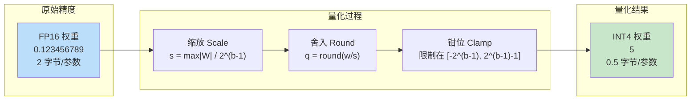
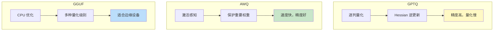
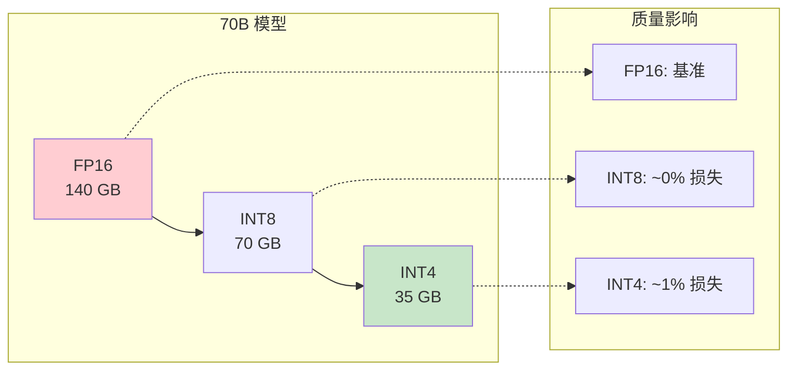
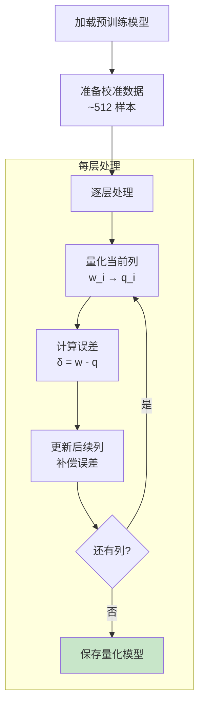
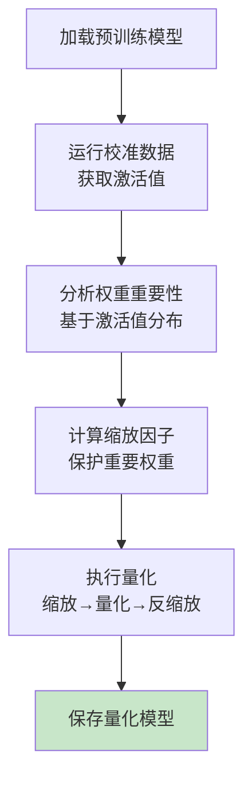
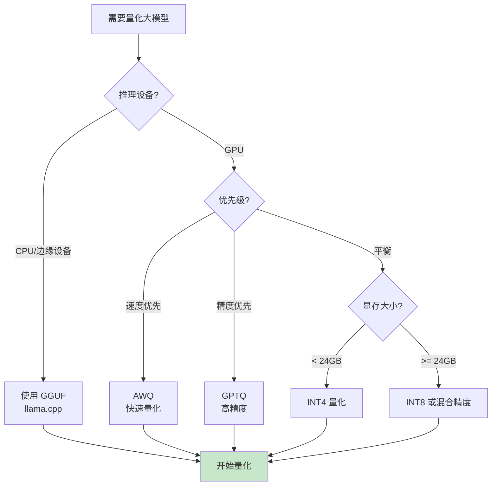
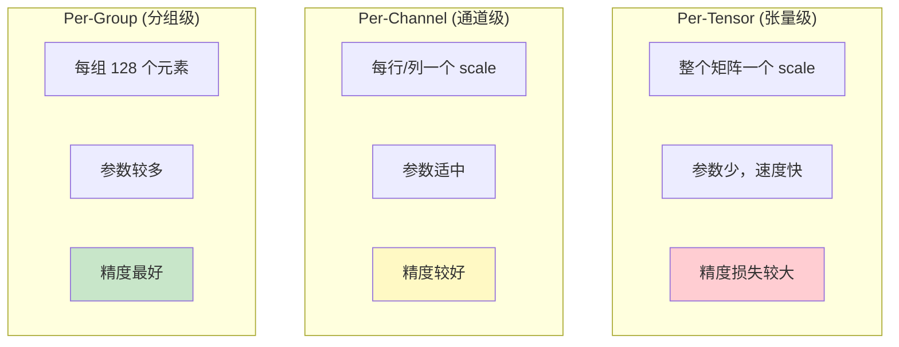

# 量化流程图解

> 通过可视化图表理解模型量化的完整工作流程

## 量化核心原理



## 量化方法对比



## 精度与大小关系



## GPTQ 量化流程



## AWQ 量化流程



## 选择量化方法决策树



## 量化粒度对比



## 图解说明

### 关键概念

| 概念 | 说明 | 推荐值 |
|------|------|--------|
| 位宽 (bits) | 每个参数的位数 | 4 或 8 |
| 分组大小 | Per-group 的组大小 | 128 |
| 校准数据 | 量化时的参考数据 | 512 样本 |

### 方法选择

| 方法 | 优点 | 缺点 | 适用场景 |
|------|------|------|----------|
| GPTQ | 精度高 | 量化慢 | 追求精度 |
| AWQ | 速度快 | 略低于 GPTQ | 生产环境 |
| GGUF | CPU 友好 | GPU 不最优 | 边缘设备 |

### 显存节省

```
70B 模型:
FP16:  140 GB  ████████████████████████████████████
INT8:   70 GB  ████████████████████
INT4:   35 GB  ██████████

节省 75% 显存！
```
