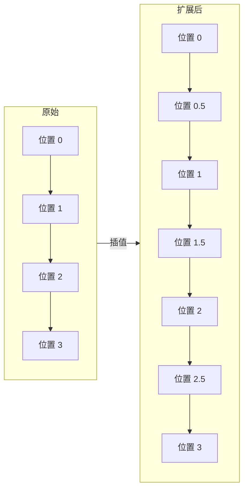

# 长上下文流程图解

## 上下文长度对比

```
┌─────────────────────────────────────────────────────────────────┐
│                      上下文长度对比                              │
├─────────────────────────────────────────────────────────────────┤
│                                                                 │
│  2K tokens                                                      │
│  ██ 约 1500 字                                                  │
│                                                                 │
│  4K tokens (LLaMA 原始)                                         │
│  ████ 约 3000 字                                                │
│                                                                 │
│  8K tokens                                                      │
│  ████████ 约 6000 字                                            │
│                                                                 │
│  32K tokens                                                     │
│  ████████████████████████████████ 约 24000 字                   │
│                                                                 │
│  128K tokens (GPT-4 Turbo)                                      │
│  ████████████████████████████████████████████████████████████   │
│  ████████████████████████████████████████████████████████████   │
│  约 100000 字                                                   │
│                                                                 │
│  200K tokens (Claude 3)                                         │
│  ████████████████████████████████████████████████████████████   │
│  ████████████████████████████████████████████████████████████   │
│  ████████████████████████████████████████████████████████████   │
│  ████████████████████████████████████ 约 150000 字              │
│                                                                 │
└─────────────────────────────────────────────────────────────────┘
```

## 位置插值原理



## RoPE 缩放可视化

```
┌─────────────────────────────────────────────────────────────────┐
│                    RoPE 位置编码缩放                             │
├─────────────────────────────────────────────────────────────────┤
│                                                                 │
│  原始 (训练长度 4K):                                             │
│  ┌────────────────────────────────────────┐                     │
│  │ ●  ●  ●  ●  ●  ●  ●  ●  ●  ●  ●  ●  │                     │
│  │ 0  1  2  3  4  5  6  7  8  9  10 11 │                     │
│  └────────────────────────────────────────┘                     │
│  位置间隔: 1                                                     │
│                                                                 │
│  线性缩放 (扩展到 8K):                                           │
│  ┌────────────────────────────────────────┐                     │
│  │ ●   ●   ●   ●   ●   ●   ●   ●   ●   ● │                     │
│  │ 0  0.5 1  1.5 2  2.5 3  3.5 4  4.5 5  │                     │
│  └────────────────────────────────────────┘                     │
│  位置间隔: 0.5 (压缩)                                            │
│                                                                 │
│  效果:                                                          │
│  - 原始 0-4K 位置被压缩到 0-2K                                   │
│  - 腾出 2K-4K 的位置空间                                        │
│  - 总共可以编码 0-8K 的内容                                      │
│                                                                 │
└─────────────────────────────────────────────────────────────────┘
```

## 不同缩放方法对比

```
┌─────────────────────────────────────────────────────────────────┐
│                    缩放方法对比                                  │
├─────────────────────────────────────────────────────────────────┤
│                                                                 │
│  线性插值 (Position Interpolation)                              │
│  ┌─────────────────────────────────────────────────────────┐   │
│  │ 优点: 简单、稳定                                         │   │
│  │ 缺点: 扩展倍数大时效果下降                               │   │
│  │ 适用: 2x-4x 扩展                                         │   │
│  └─────────────────────────────────────────────────────────┘   │
│                                                                 │
│  动态 NTK                                                       │
│  ┌─────────────────────────────────────────────────────────┐   │
│  │ 优点: 自适应、效果好                                      │   │
│  │ 缺点: 需要调整参数                                       │   │
│  │ 适用: 4x-8x 扩展                                         │   │
│  └─────────────────────────────────────────────────────────┘   │
│                                                                 │
│  YaRN                                                           │
│  ┌─────────────────────────────────────────────────────────┐   │
│  │ 优点: 效果最好、支持大倍数扩展                            │   │
│  │ 缺点: 实现复杂                                           │   │
│  │ 适用: 8x-32x+ 扩展                                       │   │
│  └─────────────────────────────────────────────────────────┘   │
│                                                                 │
│  ALiBi                                                          │
│  ┌─────────────────────────────────────────────────────────┐   │
│  │ 优点: 天然支持外推                                        │   │
│  │ 缺点: 需要从头训练                                       │   │
│  │ 适用: 新模型训练                                         │   │
│  └─────────────────────────────────────────────────────────┘   │
│                                                                 │
└─────────────────────────────────────────────────────────────────┘
```

## 注意力复杂度

```
┌─────────────────────────────────────────────────────────────────┐
│                    注意力复杂度                                  │
├─────────────────────────────────────────────────────────────────┤
│                                                                 │
│  标准注意力: O(n²)                                               │
│                                                                 │
│  序列长度 vs 计算量:                                             │
│                                                                 │
│  计算量                                                          │
│    │                                                            │
│    │                                        ╱                   │
│    │                                      ╱                     │
│    │                                    ╱                       │
│    │                                  ╱                         │
│    │                                ╱                           │
│    │                              ╱                             │
│    │                            ╱                               │
│    │                          ╱                                 │
│    │                        ╱                                   │
│    │                      ╱                                     │
│    │                    ╱                                       │
│    │                  ╱                                         │
│    │                ╱                                           │
│    │              ╱                                             │
│    │            ╱                                               │
│    └────────────────────────────────────────────▶ 序列长度      │
│         4K    8K    16K    32K    64K    128K                   │
│                                                                 │
│  这就是为什么长上下文需要特殊优化！                              │
│                                                                 │
└─────────────────────────────────────────────────────────────────┘
```

## 长上下文应用场景

```
┌─────────────────────────────────────────────────────────────────┐
│                    应用场景                                      │
├─────────────────────────────────────────────────────────────────┤
│                                                                 │
│  文档问答                                                        │
│  ┌─────────────────────────────────────────────────────────┐   │
│  │ 📄 完整技术文档 (50K tokens)                             │   │
│  │ + 问题: "第 5 章提到的配置参数是什么？"                   │   │
│  │ → 模型可以查找文档中的任意位置                            │   │
│  └─────────────────────────────────────────────────────────┘   │
│                                                                 │
│  代码分析                                                        │
│  ┌─────────────────────────────────────────────────────────���   │
│  │ 📁 完整代码仓库 (100K tokens)                            │   │
│  │ + 问题: "这个 bug 可能在哪里？"                          │   │
│  │ → 模型可以分析整个代码库                                  │   │
│  └─────────────────────────────────────────────────────────┘   │
│                                                                 │
│  长对话                                                          │
│  ┌─────────────────────────────────────────────────────────┐   │
│  │ 💬 多轮对话历史 (50K tokens)                             │   │
│  │ + 新问题: "根据我们之前的讨论..."                        │   │
│  │ → 模型记住之前说过的所有内容                              │   │
│  └─────────────────────────────────────────────────────────┘   │
│                                                                 │
│  多文档分析                                                      │
│  ┌─────────────────────────────────────────────────────────┐   │
│  │ 📚 多份研究报告 (200K tokens)                            │   │
│  │ + 问题: "这些报告的共识是什么？"                         │   │
│  │ → 模型可以跨文档比较和综合                                │   │
│  └─────────────────────────────────────────────────────────┘   │
│                                                                 │
└─────────────────────────────────────────────────────────────────┘
```
