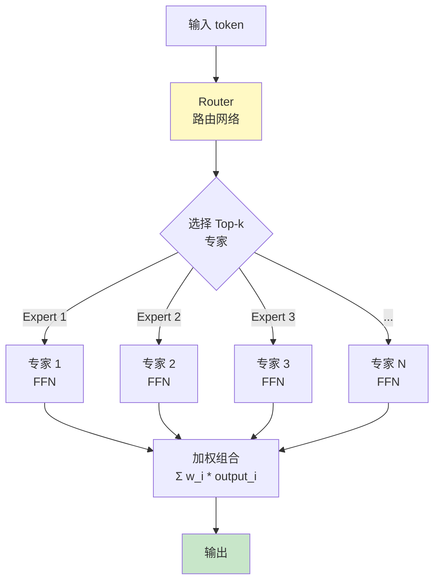
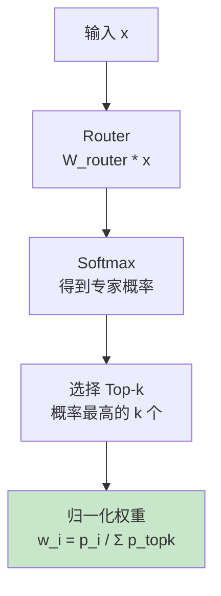
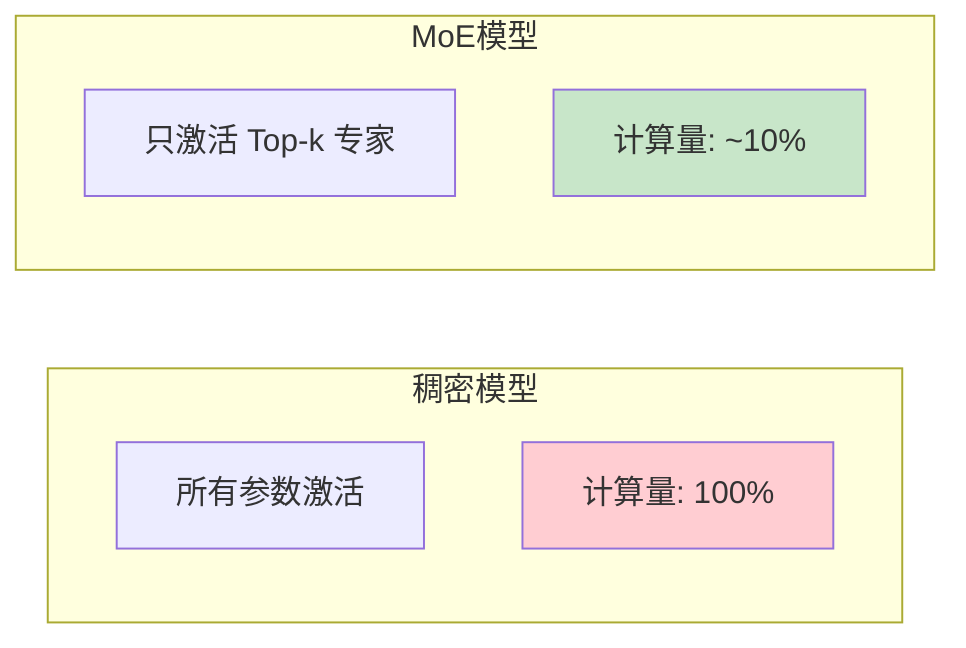
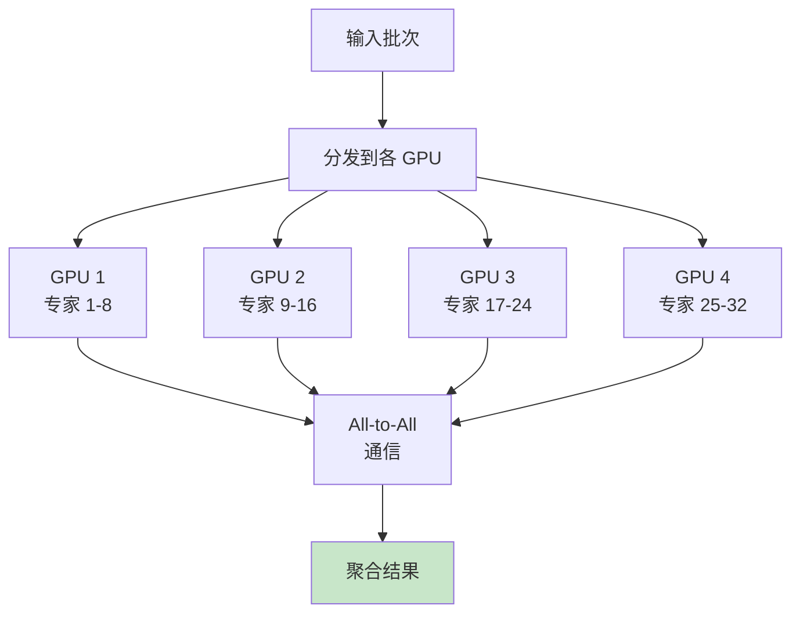
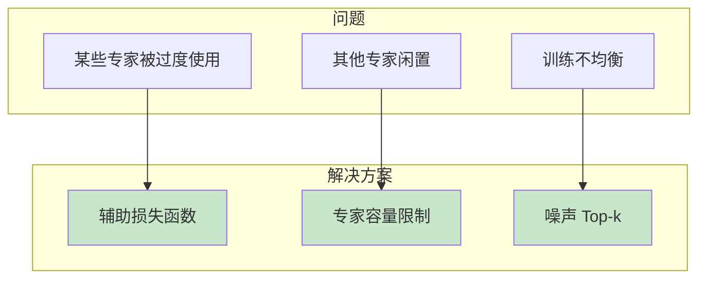
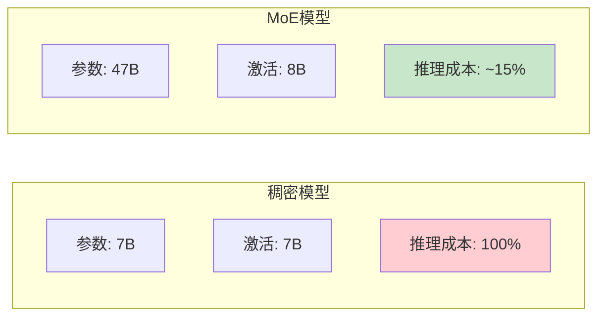

# MoE (Mixture of Experts) 流程图解

> 通过可视化图表理解混合专家模型的工作流程

## MoE 核心架构

## Router 工作流程

## 稀疏激活

## 专家并行

## 负载均衡

## MoE vs 稠密模型对比

## 图解说明

### 关键概念

| 概念 | 说明 | 典型值 |
|------|------|--------|
| 专家数 | FFN 的数量 | 8-128 |
| Top-k | 每次激活的专家数 | 1-2 |
| 容量因子 | 每专家最大处理量 | 1.25-2.0 |

### 著名 MoE 模型

| 模型 | 总参数 | 激活参数 | 专家数 |
|------|--------|----------|--------|
| Mixtral 8x7B | 47B | 13B | 8 |
| Switch Transformer | 1.6T | - | 2048 |
| GPT-4 | ? | ? | ? |

### 优势

- 更少的计算量
- 更大的知识容量
- 更好的专业化
