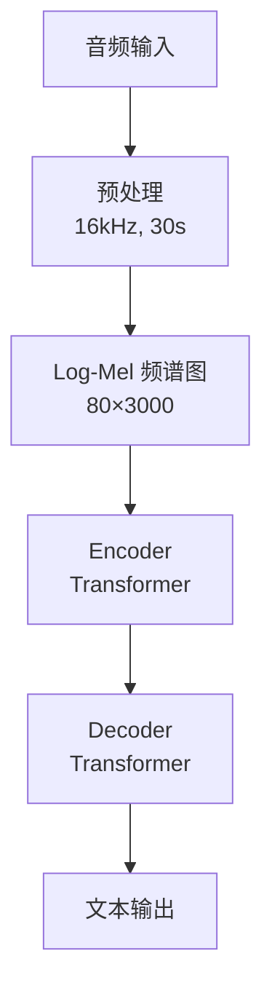

# 音频处理流程图

## Whisper 流程



## 语音助手完整流程

```
┌─────────────────────────────────────────────────────────────────┐
│                     语音助手完整流程                              │
├─────────────────────────────────────────────────────────────────┤
│                                                                 │
│   用户: 🗣️ "今天天气怎么样？"                                   │
│         │                                                       │
│         ▼                                                       │
│   ┌─────────────────────────────────────────────────────────┐   │
│   │  麦克风采集                                               │   │
│   │  模拟信号 → 数字信号                                      │   │
│   └─────────────────────────────────────────────────────────┘   │
│         │                                                       │
│         ▼                                                       │
│   ┌─────────────────────────────────────────────────────────┐   │
│   │  语音识别 (ASR)                                          │   │
│   │  ┌─────────────────────────────────────────────────┐    │   │
│   │  │ 音频 ───▶ 频谱图 ───▶ Whisper ───▶ 文字         │    │   │
│   │  └─────────────────────────────────────────────────┘    │   │
│   │  输出: "今天天气怎么样？"                                │   │
│   └─────────────────────────────────────────────────────────┘   │
│         │                                                       │
│         ▼                                                       │
│   ┌─────────────────────────────────────────────────────────┐   │
│   │  LLM 处理                                                 │   │
│   │  ┌─────────────────────────────────────────────────┐    │   │
│   │  │ 理解意图 ───▶ 调用天气 API ───▶ 生成回答        │    │   │
│   │  └─────────────────────────────────────────────────┘    │   │
│   │  输出: "今天天气晴朗，温度25度，适合出门。"              │   │
│   └─────────────────────────────────────────────────────────┘   │
│         │                                                       │
│         ▼                                                       │
│   ┌─────────────────────────────────────────────────────────┐   │
│   │  语音合成 (TTS)                                          │   │
│   │  ┌─────────────────────────────────────────────────┐    │   │
│   │  │ 文字 ───▶ 频谱图 ───▶ 声码器 ───▶ 音频          │    │   │
│   │  └─────────────────────────────────────────────────┘    │   │
│   │  输出: 🔊 音频                                           │   │
│   └─────────────────────────────────────────────────────────┘   │
│         │                                                       │
│         ▼                                                       │
│   🔊 播放: "今天天气晴朗，温度25度，适合出门。"                  │
│                                                                 │
└─────────────────────────────────────────────────────────────────┘
```

## 音频到频谱图

```
┌─────────────────────────────────────────────────────────────────┐
│                     音频特征提取                                  │
├─────────────────────────────────────────────────────────────────┤
│                                                                 │
│   原始音频 (时域波形)                                           │
│   ┌─────────────────────────────────────────────────────────┐   │
│   │    ∿∿∿∿∿∿∿∿∿∿∿∿∿∿∿∿∿∿∿∿∿∿∿∿∿∿∿∿∿                     │   │
│   │  ∿∿                                            ∿∿∿      │   │
│   │ ∿                                                 ∿∿     │   │
│   └─────────────────────────────────────────────────────────┘   │
│         │                                                       │
│         ▼ STFT (短时傅里叶变换)                                  │
│   ┌─────────────────────────────────────────────────────────┐   │
│   │                                                         │   │
│   │   频谱图 (时频域)                                        │   │
│   │   ┌─────────────────────────────────────────────────┐  │   │
│   │   │ 高频 │ ░░▓▓░░▓▓░░▓▓░░▓▓░░▓▓░░▓▓░░▓▓░░         │  │   │
│   │   │      │ ▓▓▓▓░░▓▓▓▓░░▓▓▓▓░░▓▓▓▓░░▓▓▓▓░░         │  │   │
│   │   │      │ ░░▓▓▓▓▓▓░░▓▓▓▓▓▓░░▓▓▓▓▓▓░░▓▓▓▓         │  │   │
│   │   │ 低频 │ ▓▓▓▓▓▓▓▓▓▓▓▓▓▓▓▓▓▓▓▓▓▓▓▓▓▓▓▓▓▓▓▓         │  │   │
│   │   │      └─────────────────────────────────────────┘  │   │
│   │   │              时间 →                                │   │
│   │   │  ▓ = 高能量, ░ = 低能量                            │   │
│   │   │                                                    │   │
│   └─────────────────────────────────────────────────────────┘   │
│         │                                                       │
│         ▼ 梅尔滤波器组                                          │
│   ┌─────────────────────────────────────────────────────────┐   │
│   │  Log-Mel 频谱图                                          │   │
│   │  80 个梅尔频带 × 时间帧                                  │   │
│   │  更符合人耳感知                                          │   │
│   └─────────────────────────────────────────────────────────┘   │
│                                                                 │
└─────────────────────────────────────────────────────────────────┘
```

## TTS 流程

```
┌─────────────────────────────────────────────────────────────────┐
│                     TTS 合成流程                                  │
├─────────────────────────────────────────────────────────────────┤
│                                                                 │
│   输入文本: "你好世界"                                          │
│         │                                                       │
│         ▼                                                       │
│   ┌─────────────────────────────────────────────────────────┐   │
│   │  文本分析                                                 │   │
│   │  ┌─────────────────────────────────────────────────┐    │   │
│   │  │ "你好世界" ───▶ 分词 ───▶ ["你","好","世","界"] │    │   │
│   │  │                │                                │    │   │
│   │  │                ▼                                │    │   │
│   │  │          音素转换                                │    │   │
│   │  │          ["n","i3","h","ao3","sh","i4","j","ie4"]│    │   │
│   │  └─────────────────────────────────────────────────┘    │   │
│   └─────────────────────────────────────────────────────────┘   │
│         │                                                       │
│         ▼                                                       │
│   ┌─────────────────────────────────────────────────────────┐   │
│   │  声学模型                                                 │   │
│   │  ┌─────────────────────────────────────────────────┐    │   │
│   │  │ 音素序列 ───▶ Duration Model ───▶ 频谱图        │    │   │
│   │  │                                                  │    │   │
│   │  │ 预测每个音素的持续时间                          │    │   │
│   │  │ 生成梅尔频谱图                                  │    │   │
│   │  └─────────────────────────────────────────────────┘    │   │
│   └─────────────────────────────────────────────────────────┘   │
│         │                                                       │
│         ▼                                                       │
│   ┌─────────────────────────────────────────────────────────┐   │
│   │  声码器 (Vocoder)                                         │   │
│   │  ┌─────────────────────────────────────────────────┐    │   │
│   │  │ 频谱图 ───▶ HiFi-GAN ───▶ 音频波形              │    │   │
│   │  │                                                  │    │   │
│   │  │ 把频谱图转换成可播放的音频                      │    │   │
│   │  └─────────────────────────────────────────────────┘    │   │
│   └─────────────────────────────────────────────────────────┘   │
│         │                                                       │
│         ▼                                                       │
│   输出: 🔊 "你好世界" 的语音                                    │
│                                                                 │
└─────────────────────────────────────────────────────────────────┘
```

## 端到端语音对话

```
┌─────────────────────────────────────────────────────────────────┐
│                     GPT-4o 语音对话                               │
├─────────────────────────────────────────────────────────────────┤
│                                                                 │
│   传统方式:                                                     │
│   ┌─────────────────────────────────────────────────────────┐   │
│   │  语音 ──▶ ASR ──▶ 文本 ──▶ LLM ──▶ 文本 ──▶ TTS ──▶ 语音│   │
│   │  延迟高，丢失情感                                         │   │
│   └─────────────────────────────────────────────────────────┘   │
│                                                                 │
│   GPT-4o 方式:                                                  │
│   ┌─────────────────────────────────────────────────────────┐   │
│   │                                                         │   │
│   │  用户语音 ───▶ 音频编码器 ───┐                          │   │
│   │                             │                          │   │
│   │                             ▼                          │   │
│   │                       ┌───────────┐                    │   │
│   │                       │  GPT-4o   │                    │   │
│   │                       │  统一模型 │                    │   │
│   │                       └───────────┘                    │   │
│   │                             │                          │   │
│   │                             ▼                          │   │
│   │  助手语音 ◀─── 音频解码器 ◀─── 多模态输出              │   │
│   │                                                         │   │
│   │  特点:                                                  │   │
│   │  - 直接音频到音频                                       │   │
│   │  - 保留情感、语调、停顿                                 │   │
│   │  - 低延迟（~300ms）                                     │   │
│   │  - 可生成非语音声音（笑声、叹气）                       │   │
│   │                                                         │   │
│   └─────────────────────────────────────────────────────────┘   │
│                                                                 │
└─────────────────────────────────────────────────────────────────┘
```
