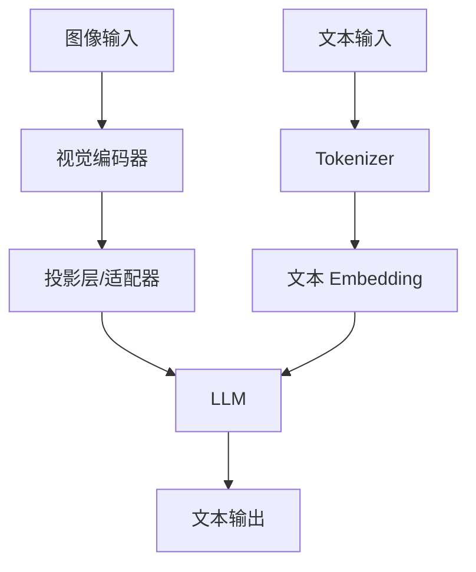

# 视觉语言模型流程图

## 基本架构



## LLaVA 架构

```
┌─────────────────────────────────────────────────────────────────┐
│                     LLaVA 完整流程                               │
├─────────────────────────────────────────────────────────────────┤
│                                                                 │
│   输入层                                                        │
│   ┌─────────────────────────────────────────────────────────┐   │
│   │                                                         │   │
│   │   图像 (336×336)              文本                      │   │
│   │        │                        │                        │   │
│   │        ▼                        ▼                        │   │
│   │   ┌─────────┐              ┌─────────┐                 │   │
│   │   │ CLIP    │              │Tokenizer│                 │   │
│   │   │ ViT-L   │              │         │                 │   │
│   │   └────┬────┘              └────┬────┘                 │   │
│   │        │                        │                        │   │
│   │        ▼                        ▼                        │   │
│   │   576×1024                  Text Embedding              │   │
│   │   视觉特征                   (4096-d)                   │   │
│   │                                                         │   │
│   └─────────────────────────────────────────────────────────┘   │
│                              │                                  │
│                              ▼                                  │
│   对齐层                                                        │
│   ┌─────────────────────────────────────────────────────────┐   │
│   │                                                         │   │
│   │        576×1024 ───▶ MLP ───▶ 576×4096                 │   │
│   │                         │                               │   │
│   │        视觉 Token 现在和文本 Token 同维度了              │   │
│   │                                                         │   │
│   └─────────────────────────────────────────────────────────┘   │
│                              │                                  │
│                              ▼                                  │
│   LLM 层                                                        │
│   ┌─────────────────────────────────────────────────────────┐   │
│   │                                                         │   │
│   │   输入序列:                                              │   │
│   │   [视觉Token×576][USER:描述图片][ASSISTANT:]            │   │
│   │                                                         │   │
│   │   ┌─────────────────────────────────────────────────┐  │   │
│   │   │              Vicuna-7B LLM                      │  │   │
│   │   │                                                 │  │   │
│   │   │   自回归生成，逐 Token 输出                     │  │   │
│   │   │                                                 │  │   │
│   │   └─────────────────────────────────────────────────┘  │   │
│   │                                                         │   │
│   └─────────────────────────────────────────────────────────┘   │
│                              │                                  │
│                              ▼                                  │
│   输出层                                                        │
│   ┌─────────────────────────────────────────────────────────┐   │
│   │                                                         │   │
│   │   "这是一张日落时分的海滩照片，天空呈现出美丽的...        │   │
│   │    海浪轻轻拍打着沙滩，远处有几只海鸥在飞翔..."          │   │
│   │                                                         │   │
│   └─────────────────────────────────────────────────────────┘   │
│                                                                 │
└─────────────────────────────────────────────────────────────────┘
```

## BLIP-2 Q-Former

```
┌─────────────────────────────────────────────────────────────────┐
│                     Q-Former 架构                                │
├─────────────────────────────────────────────────────────────────┤
│                                                                 │
│   输入: 图像特征 (196×1024)                                     │
│                                                                 │
│   ┌─────────────────────────────────────────────────────────┐   │
│   │                                                         │   │
│   │   可学习 Query (32 个，768 维)                          │   │
│   │   ┌───────────────────────────────────────────────┐    │   │
│   │   │ Q1, Q2, Q3, ..., Q32                          │    │   │
│   │   └───────────────────────────────────────────────┘    │   │
│   │                         │                               │   │
│   │                         ▼                               │   │
│   │   ┌───────────────────────────────────────────────┐    │   │
│   │   │           Transformer Layer × N               │    │   │
│   │   │  ┌─────────────────────────────────────────┐  │    │   │
│   │   │  │  Self-Attention (Query 之间交互)        │  │    │   │
│   │   │  └─────────────────────────────────────────┘  │    │   │
│   │   │  ┌─────────────────────────────────────────┐  │    │   │
│   │   │  │  Cross-Attention (Query ← 图像特征)    │  │    │   │
│   │   │  └─────────────────────────────────────────┘  │    │   │
│   │   │  ┌─────────────────────────────────────────┐  │    │   │
│   │   │  │  FFN                                    │  │    │   │
│   │   │  └─────────────────────────────────────────┘  │    │   │
│   │   └───────────────────────────────────────────────┘    │   │
│   │                         │                               │   │
│   │                         ▼                               │   │
│   │   输出: 32 个压缩的视觉 Token (768 维)                  │   │
│   │                                                         │   │
│   └─────────────────────────────────────────────────────────┘   │
│                                                                 │
│   优点: 压缩 196 → 32，减少 LLM 输入长度                        │
│                                                                 │
└─────────────────────────────────────────────────────────────────┘
```

## 视觉 Token 处理对比

```
┌─────────────────────────────────────────────────────────────────┐
│                     视觉 Token 处理方式                          │
├─────────────────────────────────────────────────────────────────┤
│                                                                 │
│   方式 1: 直接投影 (LLaVA)                                      │
│   ┌─────────────────────────────────────────────────────────┐   │
│   │  图像 → ViT → 576 patches → MLP → 576 visual tokens    │   │
│   │  优点: 简单，保留所有信息                                │   │
│   │  缺点: Token 数量多，计算量大                            │   │
│   └─────────────────────────────────────────────────────────┘   │
│                                                                 │
│   方式 2: Q-Former (BLIP-2)                                     │
│   ┌─────────────────────────────────────────────────────────┐   │
│   │  图像 → ViT → 196 patches → Q-Former → 32 visual tokens│   │
│   │  优点: 大幅压缩，高效                                    │   │
│   │  缺点: 可能有信息损失                                    │   │
│   └─────────────────────────────────────────────────────────┘   │
│                                                                 │
│   方式 3: Pixel Shuffle                                         │
│   ┌─────────────────────────────────────────────────────────┐   │
│   │  图像 → ViT → 196 patches → Reshape → 49 visual tokens │   │
│   │  优点: 简单压缩，保持空间关系                            │   │
│   │  缺点: 需要调整分辨率                                    │   │
│   └─────────────────────────────────────────────────────────┘   │
│                                                                 │
└─────────────────────────────────────────────────────────────────┘
```

## 对话流程

```
┌─────────────────────────────────────────────────────────────────┐
│                     多轮对话示例                                  │
├─────────────────────────────────────────────────────────────────┤
│                                                                 │
│   Round 1:                                                      │
│   ┌─────────────────────────────────────────────────────────┐   │
│   │ User: [图像🐱] 这是什么？                                │   │
│   │ Assistant: 这是一只橘色的猫，看起来很悠闲。              │   │
│   └─────────────────────────────────────────────────────────┘   │
│                                                                 │
│   Round 2:                                                      │
│   ┌─────────────────────────────────────────────────────────┐   │
│   │ User: 它在做什么？                                       │   │
│   │ Assistant: 这只猫正躺在沙发上，似乎在休息或小憩。        │   │
│   │           它的眼睛微微闭合，表情放松。                   │   │
│   └─────────────────────────────────────────────────────────┘   │
│                                                                 │
│   Round 3:                                                      │
│   ┌─────────────────────────────────────────────────────────┐   │
│   │ User: 背景有什么？                                       │   │
│   │ Assistant: 背景看起来是一个客厅，可以看到一些家具        │   │
│   │           的轮廓。光线柔和，可能是室内的自然光。         │   │
│   └─────────────────────────────────────────────────────────┘   │
│                                                                 │
│   注意: 所有对话都基于同一张图片                                │
│                                                                 │
└─────────────────────────────────────────────────────────────────┘
```
