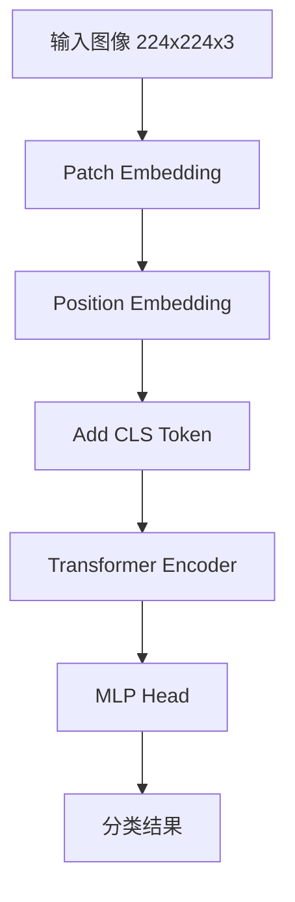

# 视觉编码器流程图

## ViT 架构



## Patch 切分

```
┌─────────────────────────────────────────────────────────────────┐
│                     Patch 切分过程                                │
├─────────────────────────────────────────────────────────────────┤
│                                                                 │
│   原始图像 (224×224×3)                                          │
│   ┌─────────────────────────────────────────────┐               │
│   │                                             │               │
│   │                                             │               │
│   │                                             │               │
│   │                                             │               │
│   │                                             │               │
│   │                                             │               │
│   └─────────────────────────────────────────────┘               │
│                              │                                  │
│                              ▼                                  │
│   切分成 14×14 = 196 个 Patch (每个 16×16)                      │
│   ┌───┬───┬───┬───┬───┬───┬───┬───┬───┬───┬───┬───┬───┬───┐   │
│   │ 1 │ 2 │ 3 │ 4 │ 5 │ 6 │ 7 │ 8 │ 9 │10 │11 │12 │13 │14 │   │
│   ├───┼───┼───┼───┼───┼───┼───┼───┼───┼───┼───┼───┼───┼───┤   │
│   │15 │16 │17 │18 │19 │20 │21 │22 │23 │24 │25 │26 │27 │28 │   │
│   ├───┼───┼───┼───┼───┼───┼───┼───┼───┼───┼───┼───┼───┼───┤   │
│   │...│...│...│...│...│...│...│...│...│...│...│...│...│...│   │
│   ├───┼───┼───┼───┼───┼───┼───┼───┼───┼───┼───┼───┼───┼───┤   │
│   │183│...│...│...│...│...│...│...│...│...│...│...│...│196│   │
│   └───┴───┴───┴───┴───┴───┴───┴───┴───┴───┴───┴───┴───┴───┘   │
│                              │                                  │
│                              ▼                                  │
│   每个 Patch → 768 维向量                                      │
│   ┌───────────────────────────────────────────────┐             │
│   │ Patch 1  → [0.1, 0.3, 0.5, ...] (768-d)       │             │
│   │ Patch 2  → [0.2, 0.1, 0.8, ...] (768-d)       │             │
│   │ ...                                           │             │
│   │ Patch 196→ [0.4, 0.6, 0.2, ...] (768-d)       │             │
│   └───────────────────────────────────────────────┘             │
│                                                                 │
└─────────────────────────────────────────────────────────────────┘
```

## CLIP 对比学习

```
┌─────────────────────────────────────────────────────────────────┐
│                     CLIP 训练                                    │
├─────────────────────────────────────────────────────────────────┤
│                                                                 │
│   Batch: N 个 (图像, 文本) 对                                   │
│                                                                 │
│   图像编码器                        文本编码器                   │
│   ┌───────────────┐                ┌───────────────┐           │
│   │  🐱  ───▶  v1 │                │ "cat"  ───▶ t1│           │
│   │  🐕  ───▶  v2 │                │ "dog"  ───▶ t2│           │
│   │  🚗  ───▶  v3 │                │ "car"  ───▶ t3│           │
│   └───────────────┘                └───────────────┘           │
│                                                                 │
│   相似度矩阵 (N×N):                                            │
│   ┌─────────────────────────────────────────────┐               │
│   │        t1     t2     t3                     │               │
│   │   v1 [0.95] [0.23] [0.12]  ← 猫应该和猫配对 │               │
│   │   v2 [0.18] [0.89] [0.15]  ← 狗应该和狗配对 │               │
│   │   v3 [0.11] [0.14] [0.92]  ← 车应该和车配对 │               │
│   └─────────────────────────────────────────────┘               │
│                              │                                  │
│                              ▼                                  │
│   目标: 对角线高，非对角线低                                    │
│   Loss = -log(exp(diagonal) / sum(all))                        │
│                                                                 │
└─────────────────────────────────────────────────────────────────┘
```

## 零样本分类

```
┌─────────────────────────────────────────────────────────────────┐
│                     零样本分类流程                               │
├─────────────────────────────────────────────────────────────────┤
│                                                                 │
│   输入: 🐱 图片                                                 │
│                                                                 │
│   Step 1: 编码图像                                              │
│   ┌─────────────────────────────────────────────────────────┐   │
│   │  图像 → CLIP Image Encoder → [0.2, 0.5, 0.1, ...]      │   │
│   └─────────────────────────────────────────────────────────┘   │
│                              │                                  │
│                              ▼                                  │
│   Step 2: 准备候选文本                                          │
│   ┌─────────────────────────────────────────────────────────┐   │
│   │  "a photo of a cat"                                     │   │
│   │  "a photo of a dog"                                     │   │
│   │  "a photo of a car"                                     │   │
│   │  "a photo of a bird"                                    │   │
│   └─────────────────────────────────────────────────────────┘   │
│                              │                                  │
│                              ▼                                  │
│   Step 3: 编码文本                                              │
│   ┌─────────────────────────────────────────────────────────┐   │
│   │  "cat"  → [0.19, 0.52, 0.09, ...]  sim = 0.95 ✓        │   │
│   │  "dog"  → [0.15, 0.31, 0.22, ...]  sim = 0.23          │   │
│   │  "car"  → [0.11, 0.14, 0.88, ...]  sim = 0.12          │   │
│   │  "bird" → [0.08, 0.21, 0.15, ...]  sim = 0.18          │   │
│   └─────────────────────────────────────────────────────────┘   │
│                              │                                  │
│                              ▼                                  │
│   Step 4: 选择最相似的                                          │
│   ┌─────────────────────────────────────────────────────────┐   │
│   │  最高相似度: "cat" (0.95)                               │   │
│   │  答案: 这是一只猫                                        │   │
│   └─────────────────────────────────────────────────────────┘   │
│                                                                 │
└─────────────────────────────────────────────────────────────────┘
```

## 注意力可视化

```
┌─────────────────────────────────────────────────────────────────┐
│                     注意力图示例                                  │
├─────────────────────────────────────────────────────────────────┤
│                                                                 │
│   原始图像:                    [CLS] 注意力图:                  │
│   ┌─────────────────┐         ┌─────────────────┐               │
│   │                 │         │     ░░░░░░░     │               │
│   │     🐱         │   ──▶   │   ░░██████░░   │               │
│   │                 │         │   ░░██████░░   │               │
│   │                 │         │     ░░░░░░░     │               │
│   └─────────────────┘         └─────────────────┘               │
│                               ██ = 高注意力                     │
│                               ░░ = 低注意力                     │
│                                                                 │
│   [CLS] Token 关注图像中的主要对象                              │
│                                                                 │
└─────────────────────────────────────────────────────────────────┘
```
