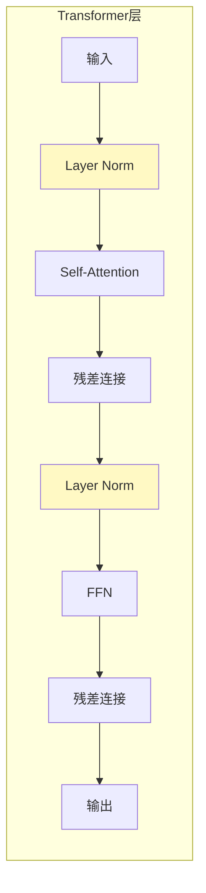
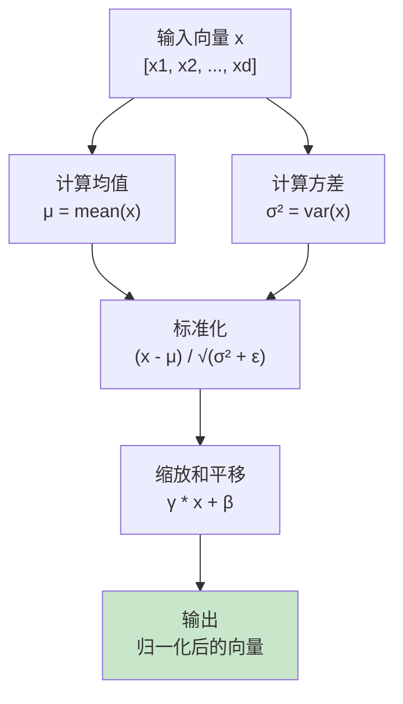
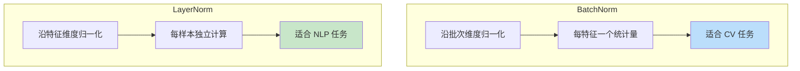
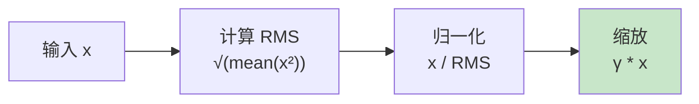
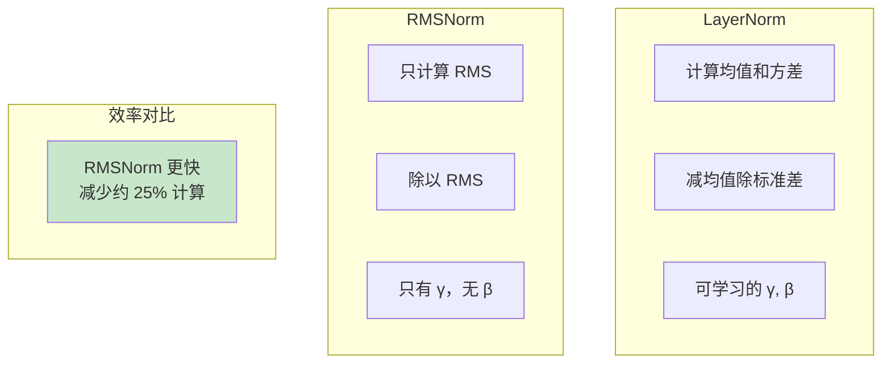
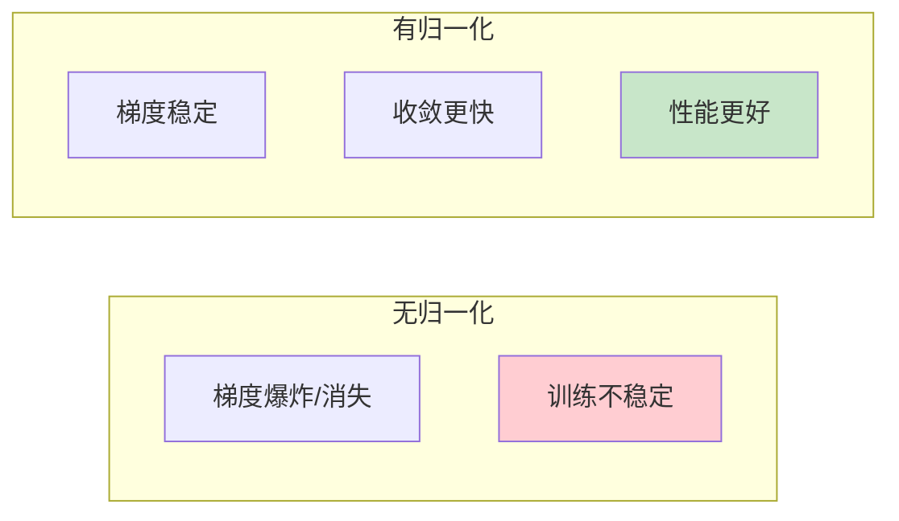

# Normalization 流程图解

> 通过可视化图表理解归一化的工作流程

## 归一化位置

## Layer Normalization 流程

## Batch Norm vs Layer Norm

## RMS Norm 简化流程

## 归一化对比

## 训练稳定性

## 图解说明

### 关键概念

| 方法 | 公式 | 特点 |
|------|------|------|
| Layer Norm | (x-μ)/σ * γ + β | NLP 常用 |
| RMS Norm | x/RMS * γ | LLaMA 使用 |
| Batch Norm | 沿批次归一化 | CV 常用 |

### 选择建议

- **Transformer NLP**: Layer Norm 或 RMS Norm
- **LLaMA 类模型**: RMS Norm（更快）
- **CNN 视觉**: Batch Norm
