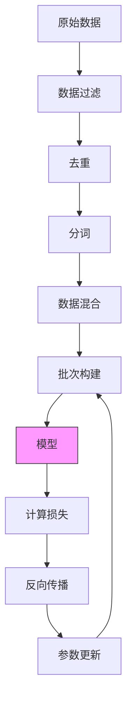

# 预训练流程图解

## 预训练整体流程



## 下一个词预测

```
┌─────────────────────────────────────────────────────────────────┐
│                    下一个词预测任务                               │
├─────────────────────────────────────────────────────────────────┤
│                                                                 │
│  输入序列:     今天  天气  真  __?__                             │
│               ────  ────  ──                                    │
│                 │     │    │                                    │
│                 ▼     ▼    ▼                                    │
│              ┌─────────────────┐                               │
│              │     模型        │                               │
│              │   (Transformer) │                               │
│              └─────────────────┘                               │
│                       │                                         │
│                       ▼                                         │
│              ┌─────────────────┐                               │
│              │ 概率分布         │                               │
│              │ 好: 0.45        │                               │
│              │ 棒: 0.20        │                               │
│              │ 差: 0.15        │                               │
│              │ 不错: 0.10      │                               │
│              │ ...            │                               │
│              └─────────────────┘                               │
│                       │                                         │
│                       ▼                                         │
│              目标: "好" → 计算损失                               │
│                                                                 │
└─────────────────────────────────────────────────────────────────┘
```

## 数据处理流程

```
┌─────────────────────────────────────────────────────────────────┐
│                      数据处理流水线                              │
├─────────────────────────────────────────────────────────────────┤
│                                                                 │
│  1. 原始数据                                                    │
│  ┌─────────────────────────────────────────────────────────┐   │
│  │ 网页 │ 维基 │ 书籍 │ 代码 │ 论文 │ 社交媒体 │ ...        │   │
│  └─────────────────────────────────────────────────────────┘   │
│                         │                                       │
│                         ▼                                       │
│  2. 过滤                                                        │
│  ┌─────────────────────────────────────────────────────────┐   │
│  │ - 移除低质量内容（广告、垃圾信息）                         │   │
│  │ - 移除有害内容（暴力、仇恨言论）                           │   │
│  │ - 移除格式错误的内容                                      │   │
│  └─────────────────────────────────────────────────────────┘   │
│                         │                                       │
│                         ▼                                       │
│  3. 去重                                                        │
│  ┌─────────────────────────────────────────────────────────┐   │
│  │ - 完全重复：移除                                          │   │
│  │ - 近似重复：保留一个                                      │   │
│  │ - 部分重复：标记或移除                                    │   │
│  └─────────────────────────────────────────────────────────┘   │
│                         │                                       │
│                         ▼                                       │
│  4. 分词                                                        │
│  ┌─────────────────────────────────────────────────────────┐   │
│  │ "今天天气真好" → [101, 456, 789, 102, 103]               │   │
│  └─────────────────────────────────────────────────────────┘   │
│                         │                                       │
│                         ▼                                       │
│  5. 混合与打乱                                                  │
│  ┌─────────────────────────────────────────────────────────┐   │
│  │ 按比例混合不同来源 → 随机打乱 → 构建批次                   │   │
│  └─────────────────────────────────────────────────────────┘   │
│                                                                 │
└─────────────────────────────────────────────────────────────────┘
```

## 缩放定律可视化

```
┌─────────────────────────────────────────────────────────────────┐
│                      缩放定律                                    │
├─────────────────────────────────────────────────────────────────┤
│                                                                 │
│  损失 vs 模型大小                                               │
│                                                                 │
│  Loss │                                                        │
│       │ ●                                                      │
│       │  ●                                                     │
│       │   ●                                                    │
│       │    ●                                                   │
│       │      ●                                                 │
│       │        ●                                               │
│       │           ●                                            │
│       │              ●                                         │
│       │                 ●                                      │
│       └─────────────────────────────────── Parameters          │
│            1B    7B    13B    70B    175B                      │
│                                                                 │
│  结论：模型越大，损失越低（幂次衰减）                             │
│                                                                 │
├─────────────────────────────────────────────────────────────────┤
│                                                                 │
│  Chinchilla 最优配置                                            │
│                                                                 │
│  ┌─────────────────────────────────────────────────────────┐   │
│  │  参数量 (N)  │  最优数据量 (D)  │  训练计算量 (C)        │   │
│  ├─────────────────────────────────────────────────────────┤   │
│  │  7B         │  140B tokens     │  6 × 7B × 140B         │   │
│  │  13B        │  260B tokens     │  6 × 13B × 260B        │   │
│  │  70B        │  1.4T tokens     │  6 × 70B × 1.4T        │   │
│  │  175B       │  3.5T tokens     │  6 × 175B × 3.5T       │   │
│  └─────────────────────────────────────────────────────────┘   │
│                                                                 │
│  规则：D ≈ 20 × N                                               │
│                                                                 │
└─────────────────────────────────────────────────────────────────┘
```

## 学习率调度

```
┌─────────────────────────────────────────────────────────────────┐
│                  学习率调度 (Warmup + Cosine Decay)              │
├─────────────────────────────────────────────────────────────────┤
│                                                                 │
���  Learning Rate                                                  │
│       │                                                         │
│  ηmax │     ╭────────────╮                                     │
│       │    ╱              ╲                                    │
│       │   ╱                ╲                                   │
│       │  ╱                  ╲                                  │
│       │ ╱                    ╲                                 │
│       │╱                      ╲                                │
│  ηmin │─────────────────────────╲────────────                  │
│       └──────────────────────────────────────────── Steps       │
│           Warmup                                               │
│                       Total Training                           │
│                                                                 │
│  - Warmup: 防止初期不稳定                                        │
│  - Cosine Decay: 后期平滑收敛                                   │
│                                                                 │
└─────────────────────────────────────────────────────────────────┘
```

## 模型规模对比

```
┌─────────────────────────────────────────────────────────────────┐
│                     模型规模对比                                 │
├─────────────────────────────────────────────────────────────────┤
│                                                                 │
│  参数量 (对数刻度)                                               │
│                                                                 │
│  1T   │                                            █ GPT-4 (?)  │
│       │                                                         │
│  100B │                               █ GPT-3 (175B)            │
│       │                                                         │
│  10B  │          █ LLaMA-7B                                     │
│       │          █ LLaMA-13B                                    │
│       │          █ Mistral-7B                                   │
│       │                                                         │
│  1B   │ █ GPT-2 (1.5B)                                          │
│       │ █ BERT-Large (340M)                                     │
│       │                                                         │
│  100M │ █ BERT-Base (110M)                                      │
│       │                                                         │
│  10M  │ █ Word2Vec                                              │
│       │                                                         │
│       └─────────────────────────────────────────────────         │
│                                                                 │
│  训练数据量对比                                                  │
│  ┌─────────────────────────────────────────────────────────┐   │
│  │ GPT-2:  40 GB    (WebText)                               │   │
│  │ GPT-3:  570 GB   (Filtered Common Crawl + ...)           │   │
│  │ LLaMA:  1.4 TB   (Mixed sources)                         │   │
│  │ GPT-4:  ~10+ TB  (推测)                                  │   │
│  └─────────────────────────────────────────────────────────┘   │
│                                                                 │
└─────────────────────────────────────────────────────────────────┘
```

## 涌现能力

```
┌─────────────────────────────────────────────────────────────────┐
│                      涌现能力                                    │
├─────────────────────────────────────────────────────────────────┤
│                                                                 │
│  模型规模 → 能力 "涌现"                                          │
│                                                                 │
│  性能                                                           │
│    │                                                            │
│    │                          ╭────────                         │
│    │                         ╱                                  │
│    │                        ╱                                   │
│    │    ──────────────────╱                                     │
│    │   ╱                                                        │
│    │  ╱                                                         │
│    │ ╱                                                          │
│    │╱                                                           │
│    └─────────────────────────────────────────── 模型规模         │
│              涌现阈值                                            │
│                                                                 │
│  涌现能力示例:                                                   │
│  ┌─────────────────────────────────────────────────────────┐   │
│  │ ~1B:  基础语言生成                                       │   │
│  │ ~7B:  翻译、摘要、简单推理                               │   │
│  │ ~70B: 复杂推理、编程、数学                               │   │
│  │ ~175B+: 少样本学习、跨领域泛化                           │   │
│  └─────────────────────────────────────────────────────────┘   │
│                                                                 │
└─────────────────────────────────────────────────────────────────┘
```
