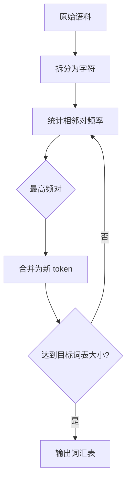
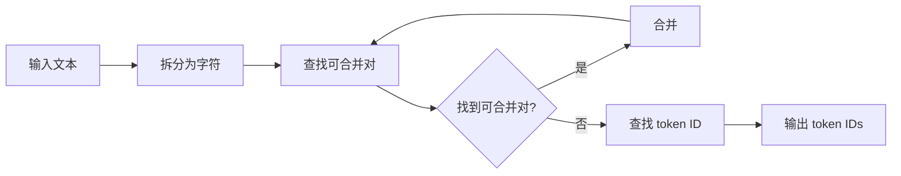
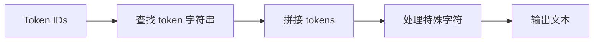
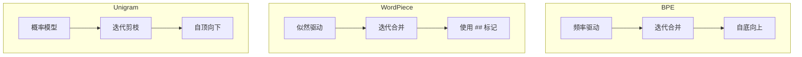
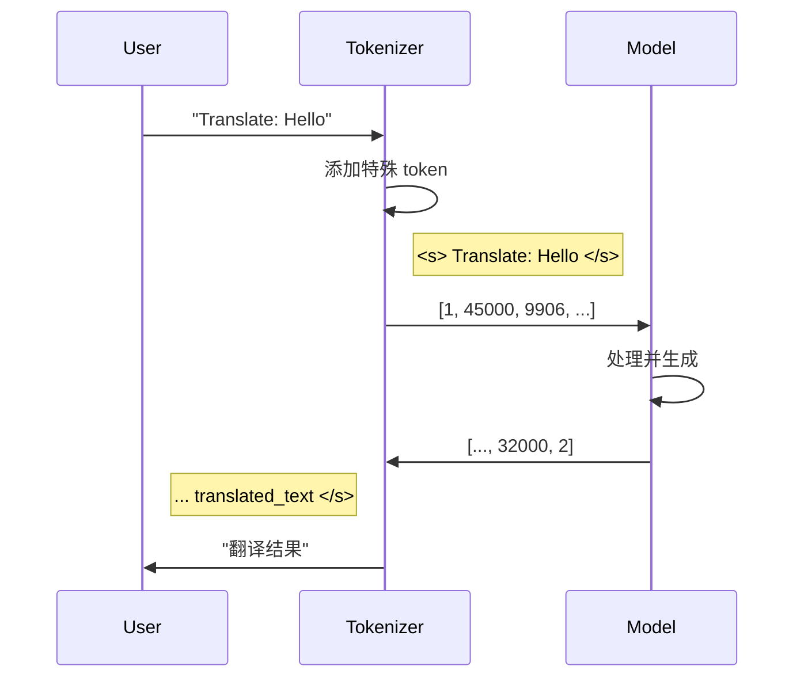

# 分词器流程图解

## BPE 训练流程



## 编码流程



## 解码流程



## 分词算法对比



## Tokenizer 在 LLM 中的位置

```
┌─────────────────────────────────────────────────────────────────┐
│                        LLM 推理流程                              │
├─────────────────────────────────────────────────────────────────┤
│                                                                 │
│   用户输入                模型处理                 输出         │
│   ┌───────┐              ┌───────┐              ┌───────┐      │
│   │ "你好" │───Tokenizer──▶│ [IDs] │───Model────▶│ [IDs] │      │
│   └───────┘              └───────┘              └───────┘      │
│       │                      │                      │          │
│       ▼                      ▼                      ▼          │
│   文本字符串            [101, 456, 789]        [202, 303]       │
│                                                 │              │
│                                                 ▼              │
│                                           ┌───────┐            │
│                                           │ "你好" │◀─Tokenizer│
│                                           └───────┘            │
│                                                                 │
└─────────────────────────────────────────────────────────────────┘
```

## BPE 合并示例

```
训练语料: "low lower newest widest"

初始状态 (字符级别):
┌─────────────────────────────────────┐
│ l o w (5次)                         │
│ l o w e r (2次)                     │
│ n e w e s t (6次)                   │
│ w i d e s t (3次)                   │
└─────────────────────────────────────┘

第1轮: 合并 "e" + "s" = "es" (9次)
┌─────────────────────────────────────┐
│ l o w (5次)                         │
│ l o w e r (2次)                     │
│ n e w es t (6次)                    │
│ w i d es t (3次)                    │
└─────────────────────────────────────┘

第2轮: 合并 "es" + "t" = "est" (9次)
┌─────────────────────────────────────┐
│ l o w (5次)                         │
│ l o w e r (2次)                     │
│ n e w est (6次)                     │
│ w i d est (3次)                     │
└─────────────────────────────────────┘

第3轮: 合并 "l" + "o" = "lo" (7次)
...
```

## 词汇表结构

```
┌───────────────────────────────────────────────────────────────┐
│                        词汇表 (Vocabulary)                     │
├───────────────────────────────────────────────────────────────┤
│                                                               │
│  ID     Token          类型           频率(训练时)            │
│  ───    ─────          ────           ───────────             │
│  0      <pad>          特殊           -                       │
│  1      <unk>          特殊           -                       │
│  2      <s>            特殊           -                       │
│  3      </s>           特殊           -                       │
│  ...                                                         │
│  256    a              字节           高                      │
│  257    b              字节           高                      │
│  ...                                                         │
│  1000   the            子词           极高                    │
│  1001   ing            子词           高                      │
│  ...                                                         │
│  50000  人工智能        子词           中                      │
│                                                               │
└───────────────────────────────────────────────────────────────┘
```

## 多语言分词对比

```
文本: "Hello 世界 🌍"

┌─────────────────────────────────────────────────────────────┐
│ tiktoken (GPT-4)                                            │
├─────────────────────────────────────────────────────────────┤
│ Tokens: ["Hello", " 世", "界", " 🌍"]                        │
│ IDs:    [9906,  16256, 244,  98320]                         │
│ Count:  4 tokens                                            │
└─────────────────────────────────────────────────────────────┘

┌─────────────────────────────────────────────────────────────┐
│ SentencePiece (LLaMA)                                       │
├─────────────────────────────────────────────────────────────┤
│ Tokens: ["▁Hello", "▁世界", "▁🌍"]                          │
│ IDs:    [15000,   32001,  45000]                            │
│ Count:  3 tokens                                            │
└─────────────────────────────────────────────────────────────┘
```

## 特殊 Token 的使用场景



## Token 长度与成本

```
┌────────────────────────────────────────────────────────────────┐
│              文本长度 vs Token 数量 vs API 成本                 │
├────────────────────────────────────────────────────────────────┤
│                                                                │
│  英文 (1 token ≈ 4 chars)                                      │
│  "The quick brown fox jumps over the lazy dog"                 │
│  Length: 44 chars → ~10 tokens                                 │
│                                                                │
│  中文 (1 token ≈ 1-2 chars)                                    │
│  "那只敏捷的棕色狐狸跳过了懒狗"                                   │
│  Length: 15 chars → ~12-15 tokens                              │
│                                                                │
│  代码 (tokenization 较差)                                       │
│  "def fibonacci(n): return n if n < 2 else ..."               │
│  可能有更多 tokens（取决于空格和符号）                            │
│                                                                │
│  ─────────────────────────────────────────────────────────────│
│                                                                │
│  成本计算 (假设 $0.01/1K tokens):                               │
│  1000 英文单词 ≈ 1300 tokens ≈ $0.013                          │
│  1000 中文字   ≈ 1500 tokens ≈ $0.015                          │
│                                                                │
└────────────────────────────────────────────────────────────────┘
```
